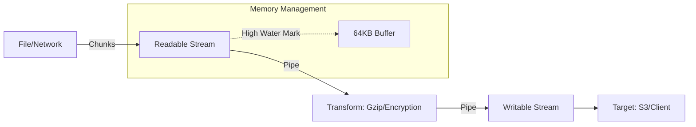

# 🌊 Streams and Buffers: Data Handling at Scale
> **Objective:** Master memory-efficient data processing in Node.js | **Language:** Hinglish | **Standard:** 2026 Expert Framework

---

## 🧭 1. Beginner-Friendly Hinglish Explanation
Streams aur Buffers ka kaam hai "Bada data" handle karna bina computer ko crash kiye.

- **The Buffer:** Sochiye Buffer ek "Chota Glass" hai. Jab aap balti se pani (Data) nikalte hain, toh glass mein thoda sa data bharte hain aur use process karte hain. Buffer raw binary data ka ek tukda hai.
- **The Stream:** Sochiye Stream ek "Paani ki Pipe" hai. Agar aapko 10GB ki movie dekhni hai, toh aap poori movie download hone ka wait nahi karte. Aap "Stream" karte hain—thoda data aata hai, aap dekhte hain, phir agla tukda aata hai.
- **The Problem:** Agar aap 2GB ki file `fs.readFileSync` se read karenge, toh aapka RAM 2GB bhar jayega (Server crash!).
- **The Solution:** Streams use karke file ko 64KB ke tukdon mein read karein.

---

## 🧠 2. Deep Technical Explanation
### 1. Buffers:
A `Buffer` is a fixed-size chunk of memory allocated outside the V8 heap. It represents raw bytes. In Node.js, strings are UTF-8 by default, but Buffers allow you to work with images, video files, and network packets.

### 2. Streams:
Streams are collections of data that might not be available all at once. There are 4 types:
- **Readable:** Data can be read (e.g., `fs.createReadStream`).
- **Writable:** Data can be written (e.g., `fs.createWriteStream`).
- **Duplex:** Both readable and writable (e.g., TCP sockets).
- **Transform:** A duplex stream that modifies data as it's written and read (e.g., `zlib.createGzip`).

### 3. Backpressure:
When a Readable stream is faster than the Writable stream (e.g., fast disk reading, slow network writing), data piles up in the buffer. Node.js handles this via **Backpressure**, telling the source to "Slow down" until the buffer is cleared.

---

## 🏗️ 3. Architecture Diagrams (The Pipeline)


---

## 💻 4. Production-Ready Examples (Efficient Copy)
```javascript
// 2026 Standard: Using Pipeline for Error Handling and Memory Efficiency

const fs = require('fs');
const zlib = require('zlib');
const { pipeline } = require('stream/promises');

async function compressFile(source, destination) {
  try {
    // Pipeline automatically handles backpressure and error cleanup
    await pipeline(
      fs.createReadStream(source), // 1. Read
      zlib.createGzip(),           // 2. Compress (Transform)
      fs.createWriteStream(destination + '.gz') // 3. Write
    );
    console.log('Pipeline succeeded');
  } catch (err) {
    console.error('Pipeline failed', err);
  }
}

compressFile('large-log.txt', 'archive');
```

---

## 🌍 5. Real-World Use Cases
- **Video Streaming:** Serving Netflix-style content where the client only gets the next 10 seconds.
- **CSV Processing:** Parsing 10-million-row CSVs line-by-line without filling up RAM.
- **Log Aggregation:** Real-time processing of server logs as they are generated.

---

## ❌ 6. Failure Cases
- **Memory Bloat:** Using `buffer.concat()` inside a loop for large data sets.
- **Pipe Memory Leaks:** Using `.pipe()` without proper error handling (the source stream might not close if the target fails). Always use `pipeline()`.
- **Ignoring Backpressure:** Manually pushing data to a stream without checking if `stream.write()` returned `false`.

---

## 🛠️ 7. Debugging Section
| Metric | Diagnostic | Fix |
| :--- | :--- | :--- |
| **RSS Memory Spike** | `process.memoryUsage()` | Switch to Streams. |
| **Stream Hanging** | Check `finish` vs `end` events | Ensure the stream is properly closed. |
| **Data Corruption** | Check Buffer Encoding | Use `buffer.toString('hex')` or `base64` for verification. |

---

## ⚖️ 8. Tradeoffs
- **Complexity vs Memory:** Streams are harder to write/debug but save massive amounts of RAM.
- **Buffer Size (HighWaterMark):** Larger buffers = Faster processing but higher memory usage. Default is 16KB (objects) or 64KB (bytes).

---

## 🛡️ 9. Security Concerns
- **Slowloris Attacks:** Keeping a stream open indefinitely to consume server connections. Use **Timeouts**.
- **Buffer Allocation:** `Buffer.allocUnsafe()` is faster but might contain old sensitive data. Always use `Buffer.alloc()` in production for safety.

---

## 📈 10. Scaling Challenges
- **Concurrent Streams:** Handling 10,000 concurrent file uploads requires tuning the OS file descriptor limits (`ulimit -n`).

---

## 💸 11. Cost Considerations
- **Compute Time:** Transforming streams (e.g., on-the-fly image resizing) is CPU intensive. Offload to **Worker Threads**.

---

## ✅ 12. Best Practices
- **Always use `stream/promises` and `pipeline`.**
- **Use `for await (const chunk of stream)` for simple readable streams.**
- **Set realistic `highWaterMark` for specific use cases.**

---

## ⚠️ 13. Common Mistakes
- **`fs.readFileSync` on large files.**
- **Thinking `.pipe()` is enough.** (It doesn't handle errors well).
- **Not destroying streams on early exit.**

---

## 📝 14. Interview Questions
1. "What is backpressure in Node.js streams and how do you handle it?"
2. "Difference between `Buffer.alloc()` and `Buffer.allocUnsafe()`?"
3. "How would you process a 50GB file in Node.js on a machine with 1GB RAM?"

---

## 🚀 15. Latest 2026 Production Patterns
- **Web Streams API:** Standardizing Node.js streams with browser streams for cross-platform code.
- **Async Iterators:** The modern way to consume streams using `for await`.
- **Zero-copy Buffers:** Using `SharedArrayBuffer` for sharing data between workers without copying.
