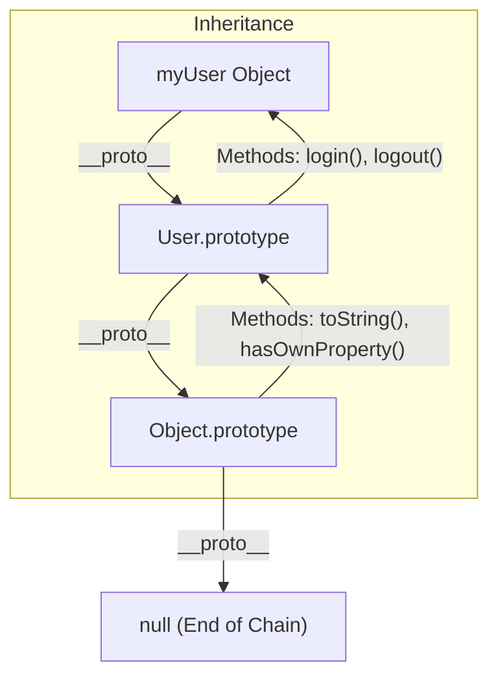

# 🚀 Advanced JavaScript: Beyond the Basics
> **Objective:** Master the sophisticated patterns of JS for high-performance backends | **Language:** Hinglish | **Standard:** 2026 Expert Framework

---

## 🧭 1. Beginner-Friendly Hinglish Explanation
Advanced JS ka matlab hai JS ki "Internal Mechanics" ko samajhna.

- **The Prototype Chain:** JS mein har cheez ek Object hai, aur har object apne "Baap" (Prototype) se gun (properties) inherit karta hai.
- **This Keyword:** Ye JS ka sabse bada confusion hai. `this` decide karta hai ki aap kis "Context" mein khade ho. 
- **Functional vs OOP:** JS dono ko support karta hai. Backend mein hume decide karna hota hai ki kab Classes use karni hain (Models ke liye) aur kab Functions (Business logic ke liye).
- **The Engine Logic:** JS "Single Threaded" hai par behaves like "Multi-threaded" due to the Event Loop.

---

## 🧠 2. Deep Technical Explanation
### 1. Prototypal Inheritance:
JavaScript uses prototype-based inheritance. When you access a property, JS looks at the object, then its `__proto__`, then the next `__proto__`, until it reaches `Object.prototype` (the root).

### 2. The 'this' Binding:
`this` is determined by **how** a function is called:
- **Default:** Global object (or `undefined` in strict mode).
- **Implicit:** The object before the dot (e.g., `user.getName()`).
- **Explicit:** Using `call`, `apply`, or `bind`.
- **Arrow Functions:** Inherit `this` from the lexical scope (where they were defined).

### 3. Memory Management:
JS uses a **Mark-and-Sweep** algorithm. It starts from "Roots" and marks everything reachable. Unmarked objects are swept (deleted).

---

## 🏗️ 3. Architecture Diagrams (The Prototype Chain)


---

## 💻 4. Production-Ready Examples (Functional Pattern)
```javascript
// 2026 Standard: Using Closures and Functional Patterns for Privacy

const createSecureUser = (name, initialBalance) => {
  // 'balance' is private due to closure scope
  let balance = initialBalance;

  return {
    getName: () => name,
    addFunds: (amount) => {
      if (amount > 0) balance += amount;
      console.log(`Updated balance for ${name}: ${balance}`);
    },
    getBalance: () => `Hidden (Security Protocol)`
  };
};

const user = createSecureUser("Aryan", 1000);
user.addFunds(500);
console.log(user.balance); // undefined (Private!)
```

---

## 🌍 5. Real-World Use Cases
- **Middlewares:** Using closures to store configuration (e.g., `app.use(limiter({ max: 100 }))`).
- **Database Models:** Using Classes/Prototypes to define schema and methods (like Mongoose).
- **Event Emitters:** Implementing custom pub-sub systems using the observer pattern.

---

## ❌ 6. Failure Cases
- **`this` context loss:** Passing a class method as a callback (e.g., in `setTimeout`) and losing the instance reference. **Fix:** Use `.bind(this)` or Arrow functions.
- **Memory Leaks:** Creating massive objects in the global scope or unclosed intervals.
- **Prototype Pollution:** When an attacker can inject properties into `Object.prototype`, affecting all objects in the system.

---

## 🛠️ 7. Debugging Section
| Tool | Feature | Action |
| :--- | :--- | :--- |
| **Console.dir()** | Object inspection | Use to see the `[[Prototype]]` chain. |
| **Heap Snapshot** | Memory analysis | Identify which objects are sticking around in RAM. |
| **'use strict'** | Strict mode | Catches common mistakes like accidental globals. |

---

## ⚖️ 8. Tradeoffs
- **Classes vs Factory Functions:** Classes are more memory efficient (methods are shared on prototype), but Factory Functions offer better privacy and fewer `this` headaches.

---

## 🛡️ 9. Security Concerns
- **Object.freeze():** Use to prevent modification of sensitive configuration objects.
- **JSON.parse() attacks:** Be careful with recursive parsing that can cause DoS.

---

## 📈 10. Scaling Challenges
- **Object creation overhead:** Creating millions of small objects can trigger frequent GC pauses. Use **Object Pooling** for extreme performance needs.

---

## 💸 11. Cost Considerations
- **Bundle Size:** While backend doesn't care about JS size as much as frontend, smaller code loads faster in Serverless/Lambda environments (Cold Start).

---

## ✅ 12. Best Practices
- **Prefer `const` over `let`.** Never use `var`.
- **Use Arrow functions for callbacks** to maintain lexical `this`.
- **Destructure objects** for cleaner and more readable code.

---

## ⚠️ 13. Common Mistakes
- **Modifying built-in prototypes:** `Array.prototype.myNewMethod = ...` (Don't do this!).
- **Assuming `typeof null` is correct:** It returns `"object"` (a legacy bug).
- **Deep Cloning with `JSON.parse(JSON.stringify())`:** It loses methods, dates, and circular references. Use `structuredClone()` (2026 standard).

---

## 📝 14. Interview Questions
1. "What is the difference between `call`, `apply`, and `bind`?"
2. "Explain Prototype Pollution and how to prevent it."
3. "How does the JS garbage collector decide which memory to free?"

---

## 🚀 15. Latest 2026 Production Patterns
- **Private Class Fields (`#`):** Native privacy in classes (e.g., `class User { #password }`).
- **Temporal API:** The modern replacement for the messy `Date` object.
- **SharedArrayBuffer:** For low-level memory sharing between main thread and workers.
漫
