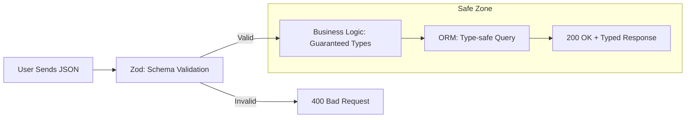

# 🛡️ Advanced TypeScript for Backend Engineers
> **Level:** Advanced | **Language:** Hinglish | **Goal:** Master the power of TypeScript in the backend, exploring Generics, Utility Types, Type Guards, and Zod validation to build "Bulletproof" systems that catch errors before they ever reach production in 2026.

---

## 🧭 1. Beginner-Friendly Hinglish Explanation
JavaScript mein ek badi problem hai: **"Undefined is not a function."** 

Aapne code likha, deploy kiya, aur achanak kisi user ne "Namak" ki jagah "Chini" daal di (Wrong data type), aur poori app crash ho gayi. 
**TypeScript** aapke liye ek "Checkpost" ki tarah hai. 
- Ye aapko "Coding" karte waqt hi bata deta hai ki: *"Bhai, tumne user ka naam manga tha, par yahan toh email aa raha hai!"*

2026 mein, pure JavaScript backend likhna "Risk" hai. TypeScript backend ko **"Type-Safe"** banata hai, jiska matlab hai ki aapka code khud "Documented" hota hai aur usme galtiyan hone ke chances $90\%$ kam ho jate hain.

---

## 🧠 2. Deep Technical Explanation
TypeScript is a **Static Type Checker** that disappears after compilation.

### 1. Generics (The 'Universal' Code):
- Generics allow you to write a function or class that works with ANY type, but still maintains safety.
- Example: A "Response Wrapper" that works for Users, Products, or Orders.

### 2. Utility Types (The 'Power' Tools):
- **Partial<T>:** Makes all fields optional.
- **Pick<T, 'id' | 'name'>:** Creates a new type with only specific fields.
- **Record<K, V>:** For objects with specific keys and values.

### 3. Discriminated Unions:
- Using a shared "Type" field (e.g., `kind: 'success' | 'error'`) to handle complex states in a clean, type-safe way.

### 4. Zod (The 'Runtime' Shield):
- TypeScript only checks types *at compile time*. 
- **Zod** checks types *at runtime* (when actual data comes from a user). It's the standard for backend validation in 2026.

---

## 🏗️ 3. TypeScript Backend Stack
| Feature | Tool / Technique | Purpose |
| :--- | :--- | :--- |
| **Validation** | Zod / Typebox | Validating user inputs (JSON) |
| **ORM** | Prisma / Drizzle | Type-safe Database queries |
| **Testing** | Vitest | Testing TS code at near-instant speed |
| **Architecture** | Inversify / NestJS | Dependency Injection with types |
| **Documentation** | Tsoa / TypeDoc | Auto-generating API docs from types |

---

## 📐 4. Mathematical Intuition
- **The "Safety-Speed" Curve:** 
  In the first 1 hour, TypeScript is "Slower" than JS (because you have to write types). 
  But after 100 hours, TypeScript is **$10x$ Faster** because you don't spend time debugging "Null pointer" errors.

---

## 📊 5. Type-Safe Data Flow (Diagram)


---

## 💻 6. Production-Ready Examples (Using Zod and Interfaces)
```typescript
// 2026 Pro-Tip: Never trust user data. Validate at the entry point.

import { z } from 'zod';

// 1. Define the Schema (The 'Rulebook')
const UserSchema = z.object({
    username: z.string().min(3).max(20),
    email: z.string().email(),
    age: z.number().optional(),
});

// 2. Extract the TypeScript Type automatically from the Schema
type User = z.infer<typeof UserSchema>;

// 3. Usage in an Express Controller
export const createUser = (req: any, res: any) => {
    // This 'safely' parses the data. If it's wrong, it throws an error.
    const result = UserSchema.safeParse(req.body);
    
    if (!result.success) {
        return res.status(400).json(result.error.format());
    }

    // Now 'userData' is 100% safe to use with IntelliSense
    const userData: User = result.data;
    console.log(`Creating user: ${userData.username}`);
};
```

---

## ❌ 7. Failure Cases
- **Using 'any' everywhere:** If you use `any`, you are just writing JavaScript in a `.ts` file. You lose all the benefits. **Fix: Use 'unknown' instead of 'any'.**
- **Type Casting (as any):** Forcing TypeScript to believe something is a type when it's not. This leads to "Runtime Crashes."
- **Deeply Nested Types:** Making types so complex that other developers can't read them. **Fix: Keep it simple and flat.**

---

## 🛠️ 8. Debugging Guide
- **Symptom:** "Property does not exist on type X."
- **Check:** **Interfaces**. Did you update the Interface after adding a new column in the database?
- **Symptom:** "TypeScript is slow in VS Code."
- **Check:** **Tsconfig**. Ensure you are not "watching" the `node_modules` folder.

---

## ⚖️ 9. Tradeoffs
- **Interfaces vs. Types:** 
  - Interfaces are better for "Object structures" and "Classes." 
  - Types are better for "Unions" and "Complex aliases."
- **Strict Mode:** Always keep `"strict": true` in your `tsconfig.json`. It's harder, but it's the only way to get real safety.

---

## 🛡️ 10. Security Concerns
- **Sensitive Data Leakage:** Returning the whole `User` object (including password) because the type didn't exclude it. **Fix: Use `Omit<User, 'password'>`.**

---

## 📈 11. Scaling Challenges
- **Monorepos:** Sharing Types between Frontend and Backend. Use tools like **Nx** or **Turborepo** so that when the Backend changes a field, the Frontend shows a "Red Error" instantly.

---

## 💸 12. Cost Considerations
- **Developer Productivity:** TypeScript reduces "Bug fixing time" by $40-60\%$, which is a massive saving for a startup.

---

## ✅ 13. Best Practices
- **Never use `any`.** Use `unknown` if you are not sure.
- **Use 'Record' for Dynamic Objects:** `Record<string, string>` instead of `{ [key: string]: any }`.
- **Custom Type Guards:** Write functions like `isUser(obj): obj is User` to help TypeScript narrow down types.

---

## ⚠️ 14. Common Mistakes
- **Forgetting 'await' in async types:** TypeScript won't always warn you if you return a `Promise<User>` instead of a `User`.
- **Ignoring Compiler Warnings:** "I'll fix this later." (Narrator: He never did).

---

## 📝 15. Interview Questions
1. **"Difference between 'unknown' and 'any'?"**
2. **"Explain 'Generics' with a real-world example."**
3. **"What is 'Type Inference' and how does it work?"**

---

## 🚀 15. Latest 2026 Industry Patterns
- **Template Literal Types:** Using types like `` type Email = `${string}@${string}.${string}` `` for advanced string validation.
- **Satisfies Operator:** Using `satisfies` to ensure an object matches a type without losing its specific properties.
- **AI-Generated Types:** AI tools that "read" your database schema and automatically generate $100\%$ accurate TypeScript types for you.
