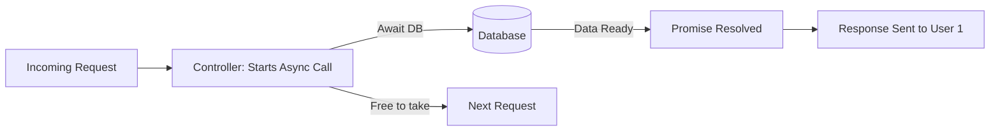

# ⏳ Async Programming & Error Handling: Mastering the Flow
> **Level:** Advanced | **Language:** Hinglish | **Goal:** Master the art of asynchronous execution in Node.js, exploring Promises, Async/Await, and robust error-handling patterns that keep your backend stable even when things go wrong in 2026.

---

## 🧭 1. Beginner-Friendly Hinglish Explanation
Backend mein sab kuch "Ruk-ruk kar" hota hai. 
- Maan lo aapne Database se data manga. Wo data aane mein $100ms$ lagte hain. 
- Agar aapka code wahan "Khada" (Wait) rahega, toh baki users line mein lage rahenge.

**Async Programming** ka matlab hai: "Database se bola—Bhai data de do, jab tak tum dhoondh rahe ho, main dusre user ka kaam karta hoon. Jab tum taiyar ho jao, mujhe 'Puchkara' (Callback/Signal) de dena."

Par isme ek problem aati hai: **Errors.**
Agar database down hai aur aapne error handle nahi kiya, toh poora server "Patakh" (Crash) ho jayega. 
Is module mein hum seekhenge ki kaise is "Asynchronous Flow" ko manage karein aur Errors ko "Professional" tareeqe se handle karein.

---

## 🧠 2. Deep Technical Explanation
Asynchronous code in Node.js has evolved from **Callbacks** $\to$ **Promises** $\to$ **Async/Await.**

### 1. The Promise (The 'Commitment'):
- An object representing the eventual completion (or failure) of an operation.
- **States:** `Pending`, `Fulfilled` (Resolved), `Rejected`.

### 2. Async/Await (The 'Syntactic Sugar'):
- It makes asynchronous code look like synchronous code, making it much easier to read and write.
- Under the hood, it's still just Promises.

### 3. Error Handling (The 'Safety Net'):
- **Try-Catch:** The standard for `async/await`.
- **Global Error Handlers:** Catching errors that "Escape" your `try-catch` blocks.
- **Custom Error Classes:** Creating errors like `DatabaseError`, `AuthError`, or `NotFoundError` to give specific status codes (404, 500, etc.).

---

## 🏗️ 3. Async Flow Cheat Sheet
| Technique | Code Style | Readability | Error Handling |
| :--- | :--- | :--- | :--- |
| **Callbacks** | Nested (Callback Hell) | Terrible | Hard (Error-first) |
| **Promises** | `.then().catch()` | Moderate | Better |
| **Async/Await**| `try { await ... }` | **Excellent** | Cleanest |
| **Generators** | `yield / next` | Advanced | Complex |

---

## 📐 4. Mathematical Intuition
- **The "Concurrency" Benefit:** 
  If 1 request takes 1 second, in a synchronous system, 100 requests take 100 seconds. 
  In an asynchronous system, if most of that 1 second is "Waiting," 100 requests can finish in **slightly more than 1 second.** 
  This is the magic of **Concurrent I/O.**

---

## 📊 5. The Async Pipeline (Diagram)


---

## 💻 6. Production-Ready Examples (Global Error Handler & Async Wrapper)
```typescript
// 2026 Pro-Tip: Use a 'CatchAsync' wrapper to avoid repetitive try-catch blocks.

// 1. A Wrapper to catch async errors automatically
export const catchAsync = (fn: Function) => {
    return (req: any, res: any, next: any) => {
        fn(req, res, next).catch(next); // Sends any error to the global handler
    };
};

// 2. Custom Error Class
class AppError extends Error {
    constructor(public message: string, public statusCode: number) {
        super(message);
        this.statusCode = statusCode;
    }
}

// 3. Usage in a Controller
export const getUser = catchAsync(async (req: any, res: any) => {
    const user = await DB.users.find(req.params.id);
    
    if (!user) {
        throw new AppError("User not found! 🕵️", 404);
    }

    res.status(200).json(user);
});
```

---

## ❌ 7. Failure Cases
- **Uncaught Exceptions:** A crash that happens outside a `try-catch`. The server dies instantly. **Fix: Use `process.on('uncaughtException')`.**
- **Unhandled Rejections:** A Promise failed but no `.catch()` was there. Node.js will warn you, and in the future, it will crash.
- **The "Awaited Loop" Mistake:** Using `await` inside a `for` loop for independent tasks. 
  - **Wrong:** Wait for user 1, then user 2, then user 3. 
  - **Right:** Start all 3, then wait for all of them using **`Promise.all()`**.

---

## 🛠️ 8. Debugging Guide
- **Symptom:** "The app is hanging."
- **Check:** **Missing 'await'**. Did you forget to `await` a database call? The function will continue before the data is ready.
- **Symptom:** "500 Internal Server Error" but no info.
- **Check:** **Error Object**. Ensure your global handler logs the `error.stack` so you can see which line failed.

---

## ⚖️ 9. Tradeoffs
- **Sequential vs. Parallel:** 
  - Sequential is safer if task B needs task A. 
  - Parallel (`Promise.all`) is much faster if tasks are independent.
- **Error Silencing vs. Loud Crashes:** It's often better to "Fail Fast" (Crash) during development but "Fail Gracefully" (500 error) in production.

---

## 🛡️ 10. Security Concerns
- **Error Information Leakage:** Sending the full "Stack Trace" to the user. This tells hackers exactly how your database and code work. **Only send 'Friendly Messages' to the user; log the details privately.**

---

## 📈 11. Scaling Challenges
- **Rate Limiting Third-Party APIs:** If you call 10,000 external APIs asynchronously, you might get blocked. **Solution: Use a 'Request Queue' (like BullMQ).**

---

## 💸 12. Cost Considerations
- **Resource Usage:** Async code uses very little CPU while waiting, allowing you to run a huge app on a tiny, cheap server.

---

## ✅ 13. Best Practices
- **Always use `Async/Await`** instead of `.then()`. It's cleaner.
- **Use `Promise.allSettled()`** if you want to run many tasks and don't want the whole thing to fail if only one task fails.
- **Centralized Error Logging:** Send your errors to a tool like **Sentry** or **LogRocket** instantly.

---

## ⚠️ 14. Common Mistakes
- **Nested `try-catch`:** It makes the code messy. Use the `catchAsync` wrapper instead.
- **Not returning the Response:** If an error happens, make sure you actually "send" the error response to the user, otherwise their browser will wait forever.

---

## 📝 15. Interview Questions
1. **"What is the difference between `Promise.all` and `Promise.allSettled`?"**
2. **"How do you catch an error in a `setTimeout` function?"** (Hint: You can't with a standard try-catch).
3. **"What is 'Callback Hell' and how did Promises solve it?"**

---

## 🚀 15. Latest 2026 Industry Patterns
- **Top-level Await:** Using `await` outside of a function (at the top of your file). Now standard in Node.js 20+.
- **AbortController:** The ability to "Cancel" an ongoing asynchronous task (like a slow database query) if the user cancels their request.
- **AI-Powered Error Correction:** Middleware that detects an error and "Suggests" the fix to the developer in the logs instantly.
