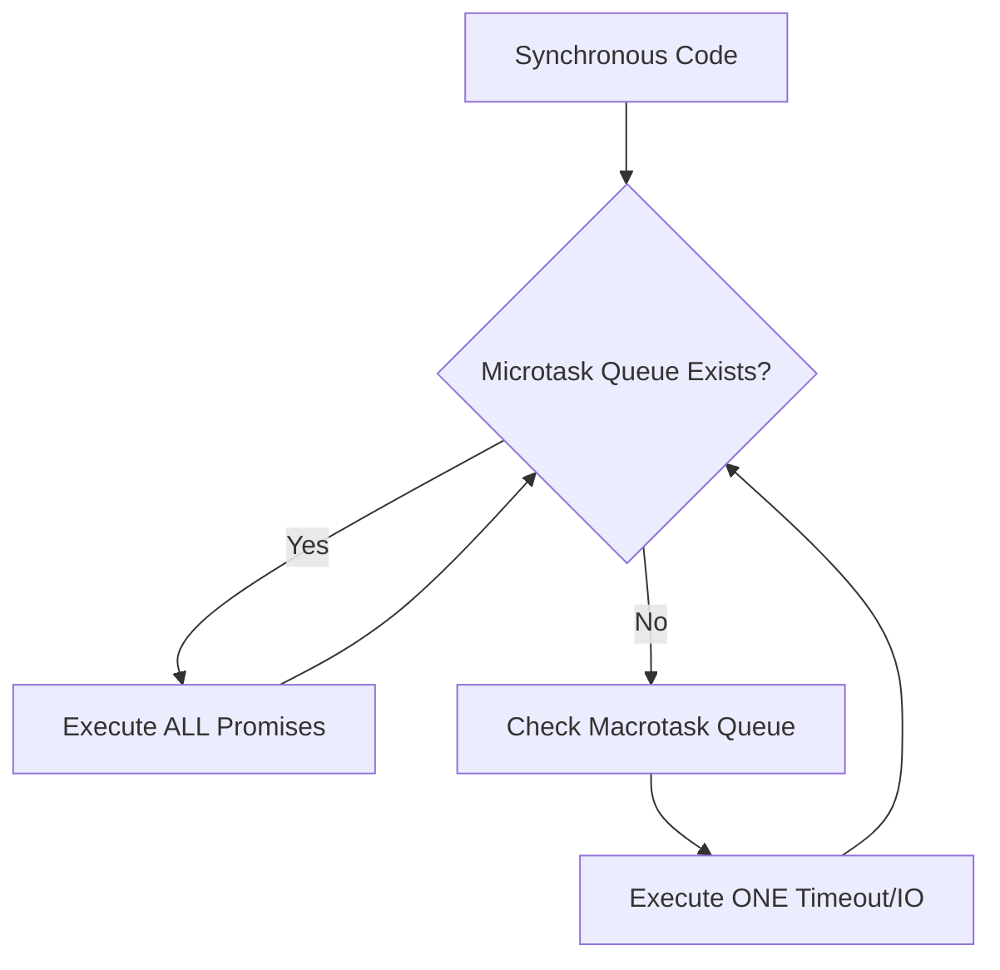

# ⚡ Async JavaScript Deep Dive: Mastery beyond Await
> **Objective:** Master the underlying mechanisms of JS concurrency | **Language:** Hinglish | **Standard:** 2026 Expert Framework

---

## 🧭 1. Beginner-Friendly Hinglish Explanation
Async JS sirf `await` likhna nahi hai. Ye samajhna hai ki "Piche kya chal raha hai".

- **The Illusion:** JS single-threaded hai, par ye "Multi-tasking" karta hai. Ye kaise?
- **The Call Stack:** Ye "Current Kaam" hai jo CPU kar raha hai.
- **The Event Loop:** Ye "Manager" hai jo check karta hai ki kya Call Stack khali hai? Agar haan, toh wo agla task (Microtask/Macrotask) uthakar wahan daal deta hai.
- **Microtasks (VIPs):** Promises aur `queueMicrotask`. Ye queue sabse pehle clear hoti hai.
- **Macrotasks:** `setTimeout`, Network calls. Ye line mein wait karte hain.

---

## 🧠 2. Deep Technical Explanation
### 1. The Event Loop Lifecycle:
The loop follows a strict order:
1.  **Call Stack:** Execute all synchronous code.
2.  **Microtask Queue:** Run ALL microtasks (Promises). If a microtask adds another microtask, it runs that too (Recursive exhaustion).
3.  **Render Phase:** (Browser only) Update UI.
4.  **Macrotask Queue:** Run ONE macrotask (setTimeout/IO).
5.  **Go to Step 2.**

### 2. Promise Internals:
When you create a `new Promise`, the executor runs **synchronously**. Only the `.then()` or `await` resolution is asynchronous.

### 3. Concurrency Limits:
Running 1000 network requests in parallel isn't always good. It can lead to **Socket Exhaustion** or DB timeouts. You need a way to process them in chunks.

---

## 🏗️ 3. Architecture Diagrams (Task Prioritization)


---

## 💻 4. Production-Ready Examples (Concurrency Control)
```javascript
// 2026 Standard: Handling Batch Processing with Concurrency Limits

const processInChunks = async (items, limit) => {
  const results = [];
  const activeTasks = new Set();

  for (const item of items) {
    const task = (async () => {
      // Execute the async work
      const result = await someDBTask(item);
      results.push(result);
    })();

    activeTasks.add(task);
    task.finally(() => activeTasks.delete(task));

    // Wait if we reached the limit
    if (activeTasks.size >= limit) {
      await Promise.race(activeTasks);
    }
  }

  await Promise.all(activeTasks);
  return results;
};

// Use Case: Scraping 1000 pages but only 5 at a time
```

---

## 🌍 5. Real-World Use Cases
- **Data Migration:** Moving millions of records from MongoDB to Postgres in parallel chunks.
- **Web Crawlers:** Fetching data from multiple APIs without getting rate-limited.
- **Complex UI Sync:** Ensuring that multiple async state updates happen in the correct order.

---

## ❌ 6. Failure Cases
- **The Microtask Loop:** A `then()` that recursively adds another `then()`. This will **Freeze** the server because the Macrotask queue (I/O) will never get a chance to run.
- **Starvation:** Heavy CPU work on the main thread preventing the Event Loop from processing high-priority network callbacks.
- **Race Conditions:** Two async functions updating the same shared object simultaneously.

---

## 🛠️ 7. Debugging Section
| Method | Purpose | Tip |
| :--- | :--- | :--- |
| **`process.hrtime()`** | Precise timing | Use to measure exact async latency. |
| **Async Stack Traces** | Error tracking | Enabled by default in 2026 Node.js to see "Who called this async function?". |
| **Node.js `--trace-warnings`** | Promise debugging | Identifies unhandled rejections instantly. |

---

## ⚖️ 8. Tradeoffs
- **Sequential (`await`) vs Parallel (`Promise.all`):** Readability/Safety vs Maximum Throughput.
- **Recursion vs Loops:** Recursive async calls use more memory than `while` loops with `await`.

---

## 🛡️ 9. Security Concerns
- **Timing Side-Channels:** Avoid revealing processing time through variable async delays.
- **Resource Exhaustion:** Not capping parallel promises can allow an attacker to trigger an OOM (Out of Memory) crash.

---

## 📈 10. Scaling Challenges
- **Event Loop Lag:** If your event loop takes $>50ms$ to complete a cycle, your backend is officially "Overloaded".
- **Garbage Collection Pauses:** GC running during a heavy async batch can cause "Stuttering" in real-time systems.

---

## 💸 11. Cost Considerations
- **Token Efficiency:** In AI backends, waiting sequentially for LLM responses is expensive (Idle time). Streaming or Parallelization is key.

---

## ✅ 12. Best Practices
- **Never block the event loop.** Use `Worker Threads` for CPU work.
- **Use `Promise.allSettled()`** for independent tasks to avoid "Fail Fast" behavior.
- **Implement Timeouts** for every single external network call.

---

## ⚠️ 13. Common Mistakes
- **Mixing `async` with `forEach`:** `forEach` does not wait for promises. Use `for...of` or `Promise.all`.
- **Assuming `Promise.race` cancels the slow task:** It only ignores the result; the slow task still runs to completion and consumes resources!

---

## 📝 14. Interview Questions
1. "How does `await` actually pause a function? (Hint: Generators/State Machines)"
2. "Explain the difference between the Task Queue and the Microtask Queue."
3. "How would you handle a memory leak caused by un-resolved Promises?"

---

## 🚀 15. Latest 2026 Production Patterns
- **AbortSignal.timeout():** Standardized way to cancel async work after a specific time.
- **AsyncIterators:** Using `for await...of` to consume streams of data (like LLM tokens) as they arrive.
- **Top-Level Await:** Simplifies server setup and module loading.
漫
