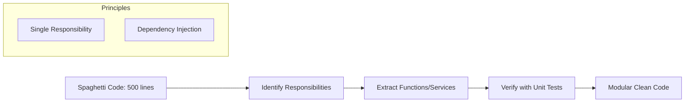

# 🧼 Clean Code and Best Practices: Writing Professional Backends
> **Objective:** Write code that humans can read and systems can scale | **Language:** Hinglish | **Standard:** 2026 Expert Framework

---

## 🧭 1. Beginner-Friendly Hinglish Explanation
Clean Code ka matlab hai "Aisa code jo aapka dost (ya aapka future self) bina gusse ke samajh sake".

- **The Problem:** Software "likhna" asan hai, par use "Maintain" karna mushkil hai. Ganda code ek "Karz" (Debt) ki tarah hota hai jo baad mein bahut mehnga padta hai.
- **The Solution:** 
  - **Meaningful Names:** Function ka naam `doWork()` nahi, `calculateUserDiscount()` hona chahiye.
  - **Small Functions:** Ek function ko sirf ek kaam karna chahiye (Single Responsibility).
  - **No Comments:** Code itna saaf ho ki comments ki zaroorat na pade.
- **The Goal:** Code ko "Readable," "Testable," aur "Scalable" banana.

---

## 🧠 2. Deep Technical Explanation
Professional backend engineering relies on **SOLID Principles** and **Design Patterns**.

### 1. SOLID Principles:
- **S - Single Responsibility:** A class/function should have one reason to change.
- **O - Open/Closed:** Open for extension, closed for modification.
- **L - Liskov Substitution:** Subclasses should be replaceable by their base classes.
- **I - Interface Segregation:** Don't force dependencies on methods they don't use.
- **D - Dependency Inversion:** Depend on abstractions, not concretions.

### 2. DRY (Don't Repeat Yourself) vs WET (Write Everything Twice):
Don't abstract too early! Sometimes a little duplication is better than the wrong abstraction.

### 3. KISS (Keep It Simple, Stupid):
Avoid over-engineering. If a simple `if` statement works, don't build a complex Factory Pattern.

---

## 🏗️ 3. Architecture Diagrams (The Refactoring Flow)


---

## 💻 4. Production-Ready Examples (Refactoring Pattern)
```typescript
// ❌ BAD: The 'God' Function
async function handleUser(req, res) {
  const user = await db.query("SELECT * FROM users WHERE id = " + req.body.id);
  if (user) {
    // 50 lines of logic...
    await mailer.send("Welcome!");
    res.send(user);
  }
}

// ✅ GOOD: Clean, Decoupled Code (2026 Standard)
class UserService {
  constructor(private userRepository: UserRepository, private mailService: MailService) {}

  async registerUser(userData: UserDto) {
    const user = await this.userRepository.create(userData);
    await this.mailService.sendWelcomeEmail(user.email);
    return user;
  }
}

// Insight: Dependency Injection makes this code TESTABLE 
// because we can mock the MailService easily.
```

---

## 🌍 5. Real-World Use Cases
- **Legacy Migrations:** Gradually cleaning up old codebases using the "Boy Scout Rule" (Leave the code cleaner than you found it).
- **Team Collaboration:** Standardizing linting rules (ESLint/Prettier) so everyone's code looks identical.
- **Audit Compliance:** Clean code with clear naming makes security audits much faster and cheaper.

---

## ❌ 6. Failure Cases
- **Premature Abstraction:** Creating 10 interfaces for a feature that might change tomorrow.
- **The "Clever" Coder:** Using obscure JS tricks (like one-liners) that no one else can understand.
- **Deep Nesting:** Having 5 levels of `if/else` inside a loop (The "Pyramid of Doom").

---

## 🛠️ 7. Debugging Section
| Problem | Diagnostic | Tool |
| :--- | :--- | :--- |
| **Spaghetti Logic** | High Cyclomatic Complexity | **ESLint (complexity rule)**. |
| **Hard to Test** | Tight Coupling | Check for `new` keyword inside functions. |
| **Slow Code** | Unnecessary Re-calculations | Memoization or Refactoring loops. |

---

## ⚖️ 8. Tradeoffs
- **Cleanliness vs Performance:** Sometimes highly optimized code (like bitwise ops) is "Dirty" but necessary. In those cases, use **Comments**.
- **Time vs Quality:** Clean code takes longer today but saves weeks tomorrow.

---

## 🛡️ 9. Security Concerns
- **Security by Obscurity is NOT security.** Clean, transparent code is easier to secure than complex, "Magic" code.
- **Hardcoded Secrets:** Never put API keys in code—even if it's "Private".

---

## 📈 10. Scaling Challenges
- **Technical Debt:** If not managed, technical debt grows exponentially, eventually slowing down feature development to a crawl.

---

## 💸 11. Cost Considerations
- **Total Cost of Ownership (TCO):** $80\%$ of software cost is maintenance. Clean code directly reduces TCO.

---

## ✅ 12. Best Practices
- **Use meaningful variable names.** `const d = 86400` vs `const SECONDS_IN_A_DAY = 86400`.
- **Follow a consistent Style Guide (Airbnb/Google).**
- **Refactor mercilessly.**

---

## ⚠️ 13. Common Mistakes
- **Giant Files:** Files over 300 lines should probably be split.
- **Functions with too many arguments:** If you have more than 3 arguments, pass an **Object**.
- **Inconsistent Naming:** Mixing `camelCase` and `snake_case`.

---

## 📝 14. Interview Questions
1. "What are the SOLID principles and why are they important for backend development?"
2. "Explain the difference between Composition and Inheritance."
3. "How do you decide when to refactor a piece of code?"

---

## 🚀 15. Latest 2026 Production Patterns
- **Functional Core, Imperative Shell:** Keeping business logic pure and functional while handling side effects (I/O) at the edges.
- **Domain Driven Design (DDD):** Aligning code structure with business domains.
- **Automated Refactoring Tools:** Using AI agents to identify and suggest clean-code improvements in PR reviews.
漫
