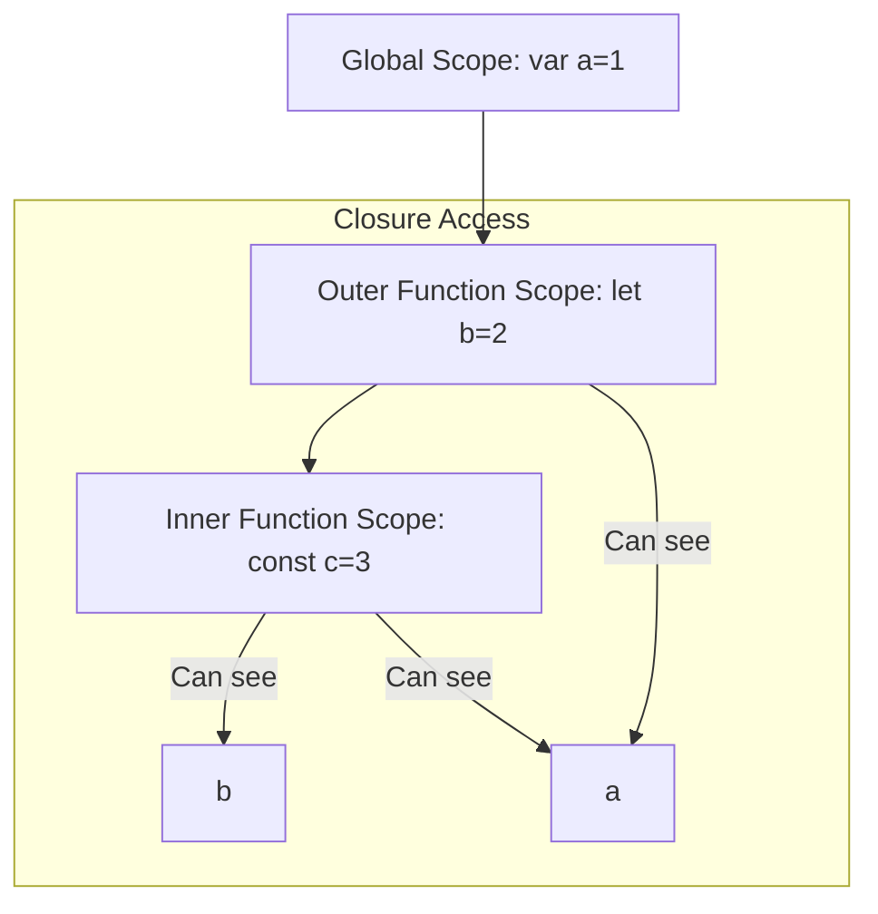

# 🔒 Closures and Scope: Mastering Privacy and Life-cycles
> **Objective:** Master variable accessibility and persistent state | **Language:** Hinglish | **Standard:** 2026 Expert Framework

---

## 🧭 1. Beginner-Friendly Hinglish Explanation
Scope aur Closures decide karte hain ki aapka "Variable" kahan se "Accessible" hai aur kab tak "Zinda" rahega.

- **Scope:** Ye "Boundary" hai. 
  - **Global Scope:** Variable poori duniya (file) ke liye available hai.
  - **Block Scope:** Variable sirf `{ }` ke andar available hai (e.g., `if` condition ya `for` loop).
- **Closure:** Ye JS ka "Magic" hai. Jab ek function apne "Bahari" (Parent) variables ko "Yaad" rakhta hai, bhale hi parent function khatam ho chuka ho, use **Closure** kehte hain.
- **Intuition:** Closure ek "Gajni" ka opposite hai—ise sab yaad rehta hai!

---

## 🧠 2. Deep Technical Explanation
### 1. Lexical Scoping:
JavaScript uses Lexical Scoping, meaning the scope is determined by the physical location of the code during development. A function can access variables in its parent scope.

### 2. The Execution Context:
When a function runs, an Execution Context is created. It contains:
- **Variable Environment:** Where `let`, `const`, and `var` live.
- **Scope Chain:** Links to parent environments.
- **`this` binding.**

### 3. Closure Mechanics:
A Closure is a function bundled together with its lexical environment. When an inner function is returned, it carries a reference to the outer variables in its **[[Scopes]]** property. This prevents the garbage collector from deleting those variables.

---

## 🏗️ 3. Architecture Diagrams (The Scope Chain)


---

## 💻 4. Production-Ready Examples (Stateful Middleware)
```javascript
// 2026 Standard: Using Closures for Private Counters/State

const createRateLimiter = (limit) => {
  // 'count' is private and PERSISTS between calls
  let count = 0;

  return (req, res, next) => {
    count++;
    if (count > limit) {
      console.log(`Rate limit exceeded: ${count} requests`);
      return res.status(429).send("Too Many Requests");
    }
    console.log(`Request #${count}`);
    next();
  };
};

// Usage: Every 'app.use' gets its OWN private 'count' closure
app.use(createRateLimiter(100)); 
```

---

## 🌍 5. Real-World Use Cases
- **Data Privacy:** Creating objects with private variables that cannot be modified from the outside.
- **Memoization:** Storing the results of expensive function calls to avoid re-calculation.
- **Partial Application/Currying:** Creating specialized versions of functions (e.g., `logger("ERROR")("DB Connection Failed")`).

---

## ❌ 6. Failure Cases
- **The Loop Problem:** Using `var` inside a `for` loop with `setTimeout`. All timeouts will log the final value of the variable because `var` is function-scoped, not block-scoped. **Fix:** Use `let`.
- **Memory Leaks:** Large objects stuck in a closure that is still referenced by a long-running timer or global event listener.
- **Over-use:** Using closures for everything can make code hard to read and increase memory consumption.

---

## 🛠️ 7. Debugging Section
| Problem | Diagnostic | Tool |
| :--- | :--- | :--- |
| **Variable is undefined** | Check if it's within the current scope | `console.log(this)` or Scope Tab in Debugger. |
| **Unexpected Value** | Scope Shadowing (same name in inner/outer) | Rename variables to avoid confusion. |
| **Closure Memory Leak** | Search for large unreferenced closures | **Memory Tab** -> Heap Snapshot -> Search for "closure". |

---

## ⚖️ 8. Tradeoffs
- **Globals vs Closures:** Globals are easy but risky (collision). Closures are safe but use more memory because variables stay alive.

---

## 🛡️ 9. Security Concerns
- **Sensitive Closures:** Don't store passwords or private keys in long-lived closures that might be exposed via debugging tools or memory dumps.

---

## 📈 10. Scaling Challenges
- **Garbage Collection:** Deeply nested closures with many variables can increase the time it takes for V8 to perform full mark-and-sweep cycles.

---

## 💸 11. Cost Considerations
- **Memory Footprint:** Each closure instance takes a bit of RAM. In a system with millions of active closures (e.g., one per active socket), this adds up.

---

## ✅ 12. Best Practices
- **Prefer Block Scope:** Always use `const` and `let` to minimize scope size.
- **Minimize Closure Surface:** Only keep the variables you actually need inside the closure.
- **Clear References:** If a closure is no longer needed (e.g., after an event), nullify the reference.

---

## ⚠️ 13. Common Mistakes
- **Assuming closures copy values:** Closures store **references** to variables. If the variable changes in the outer scope, the inner function sees the new value.
- **Polluting Global Scope:** Forgetting `let/const` and creating accidental globals.

---

## 📝 14. Interview Questions
1. "What is the difference between Block Scope, Function Scope, and Global Scope?"
2. "How can you use a closure to create a private variable in JavaScript?"
3. "Explain the 'Temporal Dead Zone' in relation to scoping."

---

## 🚀 15. Latest 2026 Production Patterns
- **Module Scoping (ESM):** Every file is its own scope by default, eliminating the need for IIFEs (Immediately Invoked Function Expressions).
- **ShadowRealm API:** (Proposed/Experimental) For creating even stricter isolated execution environments.
- **Auto-cleaning Closures:** Using `WeakRef` to allow the garbage collector to clean up objects even if they are referenced in a closure.
漫
