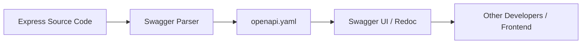

# 📖 API Documentation: The Developer Experience (DX)
> **Objective:** Build self-documenting APIs that other developers love to use | **Language:** Hinglish | **Standard:** 2026 Expert Framework

---

## 🧭 1. Beginner-Friendly Hinglish Explanation
API Documentation ka matlab hai "Aapke API ka User Manual".

- **The Problem:** Agar aapne ek bahut badhiya API banaya par kisi ko pata hi nahi ki use use kaise karna hai (Kaunse headers bhejne hain? Response kya aayega?), toh wo API bekaar hai.
- **The Solution:** Humein **Swagger** (OpenAPI) jaise tools use karne chahiye jo automatically ek "Interactive Website" bana dete hain jahan se koi bhi aapka API test kar sakta hai.
- **The Result:** Aapko baar-baar developers ke sawalon ka jawab nahi dena padega: "Bhai, signup ke liye kya bhejte hain?"

---

## 🧠 2. Deep Technical Explanation
### 1. OpenAPI Specification (OAS):
The standard machine-readable format for describing REST APIs. It's usually a YAML or JSON file.

### 2. Swagger UI:
A collection of HTML/JS/CSS assets that dynamically generate a beautiful webpage from an OpenAPI file.

### 3. Approaches:
- **Code-First:** You write your Express routes and add JSDoc comments or decorators. A library then generates the YAML from the code.
- **Design-First:** You write the YAML file first in an editor (like Stoplight or Swagger Editor) and then generate the code/stubs.

---

## 🏗️ 3. Architecture Diagrams (The Doc Flow)


---

## 💻 4. Production-Ready Examples (Swagger + Express)
```typescript
// 2026 Standard: Automatic Doc Generation from JSDoc

import swaggerJsdoc from 'swagger-jsdoc';
import swaggerUi from 'swagger-ui-express';

const options = {
  definition: {
    openapi: '3.0.0',
    info: {
      title: 'SusaGPT API',
      version: '1.0.0',
      description: 'API for AI Agent Orchestration',
    },
    servers: [{ url: 'http://localhost:3000/api/v1' }],
  },
  apis: ['./src/routes/*.ts'], // Path to the API docs
};

const specs = swaggerJsdoc(options);

// Serve the UI
app.use('/api-docs', swaggerUi.serve, swaggerUi.setup(specs));

/**
 * @openapi
 * /users:
 *   get:
 *     description: Get all users
 *     responses:
 *       200:
 *         description: Success
 */
app.get('/users', (req, res) => {
  res.json({ users: [] });
});
```

---

## 🌍 5. Real-World Use Cases
- **Stripe/Twilio Docs:** The gold standard of API documentation.
- **Internal Microservices:** Helping the "Orders" team understand how to talk to the "Payments" team.
- **Client Handover:** Giving a clean link to the client so their frontend team can start work instantly.

---

## ❌ 6. Failure Cases
- **Outdated Docs:** Code change ho gaya par docs purane hain. This is worse than no docs. (Solution: Use **Auto-generation**).
- **Missing Authentication Info:** Forgetting to document that an API needs a `Bearer` token.
- **No Examples:** Not showing a sample request/response body.

---

## 🛠️ 7. Debugging Section
| Problem | Diagnostic | Solution |
| :--- | :--- | :--- |
| **UI shows 404** | Check mount path | Ensure `app.use('/api-docs', ...)` is correct. |
| **Empty Routes** | Check glob pattern | Verify the `apis` array points to the right files. |
| **YAML Syntax Error** | Red error bar in UI | Use a YAML linter. |

---

## ⚖️ 8. Tradeoffs
- **Swagger vs ReDoc:** Swagger is interactive (can try requests); ReDoc is more beautiful and readable for long docs.
- **JSDoc vs YAML file:** JSDoc keeps docs close to code; a separate YAML file is cleaner but gets out of sync easily.

---

## 🛡️ 9. Security Concerns
- **Sensitive Endpoints:** Ensure your admin-only endpoints are not public in the documentation unless restricted by IP or password.
- **Hiding Swagger in Prod:** Many companies disable the UI in production to avoid revealing their internal API structure to hackers.

---

## 📈 10. Scaling Challenges
- **Massive Specs:** For 500+ endpoints, the Swagger UI can become slow. Split your docs into "Tags" or multiple files.

---

## 💸 11. Cost Considerations
- **Developer Time:** Good docs save thousands of dollars in "Meeting Time" and "Support Requests".

---

## ✅ 12. Best Practices
- **Use Tags** to group endpoints (e.g., `Auth`, `Users`, `Payments`).
- **Include Success and Error codes.**
- **Provide "Try it out" functionality.**
- **Keep it updated in every PR.**

---

## ⚠️ 13. Common Mistakes
- **No Description:** Just having the URL without explaining what it does.
- **Inconsistent Naming:** Using camelCase in code but snake_case in docs.

---

## 📝 14. Interview Questions
1. "What is the difference between OpenAPI and Swagger?"
2. "How do you ensure your API documentation stays in sync with your code?"
3. "What are the benefits of a Design-First approach to API development?"

---

## 🚀 15. Latest 2026 Production Patterns
- **Typescript-to-OpenAPI:** Using decorators (like in NestJS) or libraries (like `ts-rest`) to generate documentation automatically from TS types.
- **Interactive Playgrounds:** Integrating with tools like **Postman Interceptor** or **Runkit** for live code execution in docs.
- **AI-Enhanced Search:** Adding a chat-bot to your documentation that can answer questions like "How do I create a recurring subscription?".
漫
