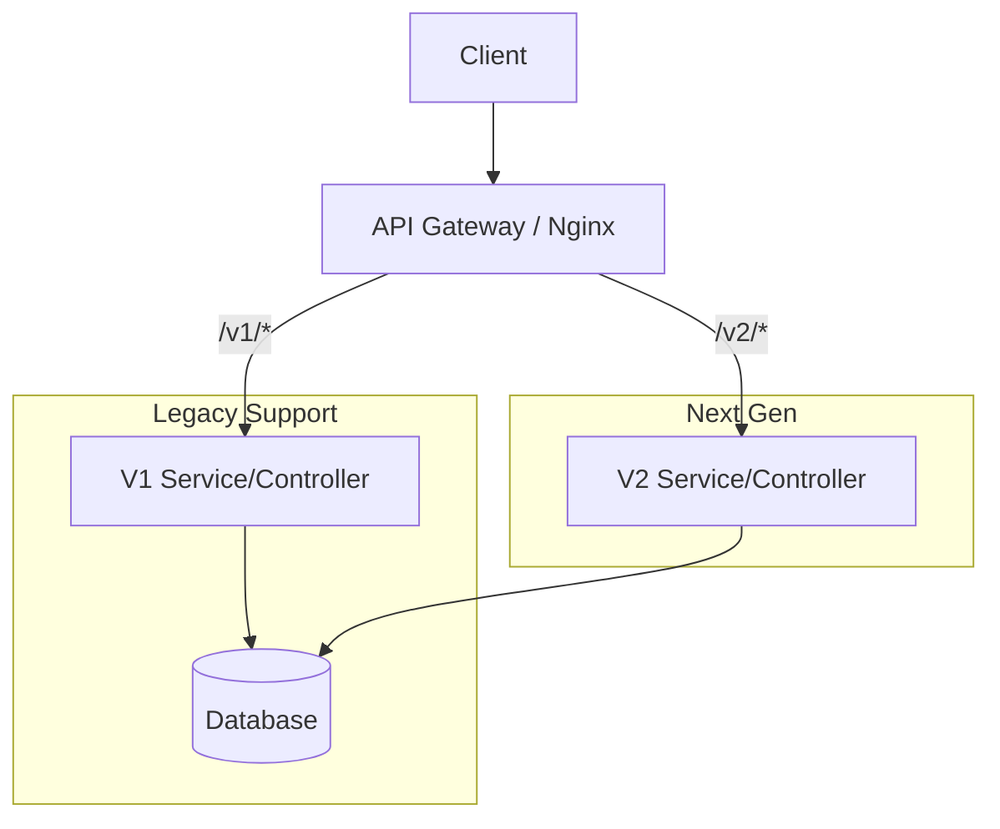

# 🔄 API Versioning: Handling Change without Breaking
> **Objective:** Evolve your API while maintaining backward compatibility | **Language:** Hinglish | **Standard:** 2026 Expert Framework

---

## 🧭 1. Beginner-Friendly Hinglish Explanation
API Versioning ka matlab hai "Purane users ko bina pareshan kiye naye features lana".

- **The Problem:** Maan lijiye aapka API change ho gaya aur aapne `user_name` field ko `fullName` kar diya. Agar aapne purana API band kar diya, toh hazaron mobile apps jo `user_name` use kar rahi thi, wo crash ho jayengi.
- **The Solution:** Hum versioning use karte hain taaki purane apps `v1` use karein aur naye apps `v2`.
- **The Goal:** Backward Compatibility. Naya version launch karo, par purane ko tab tak support karo jab tak saare users migrate na ho jayein.

---

## 🧠 2. Deep Technical Explanation
### 1. Versioning Strategies:
1.  **URI Versioning (Most Popular):** `/api/v1/users`. Explicit, easy to route, and visible in logs.
2.  **Header Versioning:** `Accept: application/vnd.myapi.v1+json`. Cleaner URLs but harder to test in the browser.
3.  **Query Parameter Versioning:** `/users?version=1`. Flexible but can clutter the URL.

### 2. Semantic Versioning (SemVer) for APIs:
- **Major (v1, v2):** Breaking changes.
- **Minor:** New features (Backward compatible).
- **Patch:** Bug fixes.

### 3. Sunset Policy:
Always define a "Sunset" period (e.g., 6 months) after which an old version will be officially retired. Notify users via the `Sunset` HTTP header.

---

## 🏗️ 3. Architecture Diagrams (The Routing Layer)


---

## 💻 4. Production-Ready Examples (Express Routing)
```typescript
// 2026 Standard: Organized Versioned Routes

import express from 'express';
const app = express();

// 📂 routes/v1/user.ts
const v1Router = express.Router();
v1Router.get('/', (req, res) => res.json({ name: "User (Legacy)" }));

// 📂 routes/v2/user.ts
const v2Router = express.Router();
v2Router.get('/', (req, res) => res.json({ fullName: "User (Modern)" }));

// 🔗 Mounting Routes
app.use('/api/v1', v1Router);
app.use('/api/v2', v2Router);

// 💡 Pro Tip: Use a 'Deprecated' header for v1
v1Router.use((req, res, next) => {
  res.setHeader('Warning', '299 - "This version is deprecated. Please migrate to v2"');
  next();
});
```

---

## 🌍 5. Real-World Use Cases
- **Mobile Apps:** Since users don't update apps immediately, backends must support `v1` for months/years.
- **Third-party Integrations:** If companies like Zapier or Shopify use your API, you cannot break their code without warning.
- **A/B Testing:** Running two versions of an algorithm side-by-side.

---

## ❌ 6. Failure Cases
- **The "Breaking" Update:** Renaming a field in a single version and breaking production.
- **Zombie Versions:** Keeping `v1` alive for 10 years and wasting server resources.
- **Lack of Documentation:** Not telling users what changed between `v1` and `v2`.

---

## 🛠️ 7. Debugging Section
| Problem | Diagnostic | Solution |
| :--- | :--- | :--- |
| **Route Conflict** | `GET /users` vs `GET /v1/users` | Use strict versioned prefixes. |
| **Database Migrations** | Field renamed in DB but needed in V1 | Use **Database Views** or **Model Mapping** in the code. |
| **Broken Links** | Internal links pointing to wrong version | Always use relative paths or version-aware helpers. |

---

## ⚖️ 8. Tradeoffs
- **URI vs Headers:** URI is easier for developers/debugging. Headers follow the "Resource should have one URL" philosophy of REST.
- **Maintenance Cost:** Every active version increases testing time and technical debt.

---

## 🛡️ 9. Security Concerns
- **Forgotten Versions:** Old versions often have security vulnerabilities that developers forgot to patch. Always apply security fixes to ALL active versions.

---

## 📈 10. Scaling Challenges
- **Code Duplication:** How to share logic between `v1` and `v2` without "Spaghetti Code". (Solution: Extract core logic into a **Service Layer**).

---

## 💸 11. Cost Considerations
- **Resource Usage:** Running multiple versions might require more memory/instances if they are separate microservices.

---

## ✅ 12. Best Practices
- **Version from day one** (even if it's just `v1`).
- **Use URI versioning for public APIs.**
- **Provide a migration guide.**
- **Use deprecation headers.**

---

## ⚠️ 13. Common Mistakes
- **Versioning too frequently:** Making `v2` for every tiny change.
- **No versioning strategy:** Randomly changing the API whenever needed.

---

## 📝 14. Interview Questions
1. "How would you handle a database schema change that breaks a legacy API version?"
2. "What are the pros and cons of URI versioning vs Header versioning?"
3. "Explain the concept of 'Graceful Deprecation'."

---

## 🚀 15. Latest 2026 Production Patterns
- **Evolutionary APIs:** Using GraphQL to avoid versioning (clients just ask for the fields they need).
- **Feature Flags:** Enabling new "Versions" of logic for specific users without changing the URL.
- **Proxy-based Versioning:** Handling the routing and response transformation at the API Gateway level (e.g., Kong/Apigee).
漫
