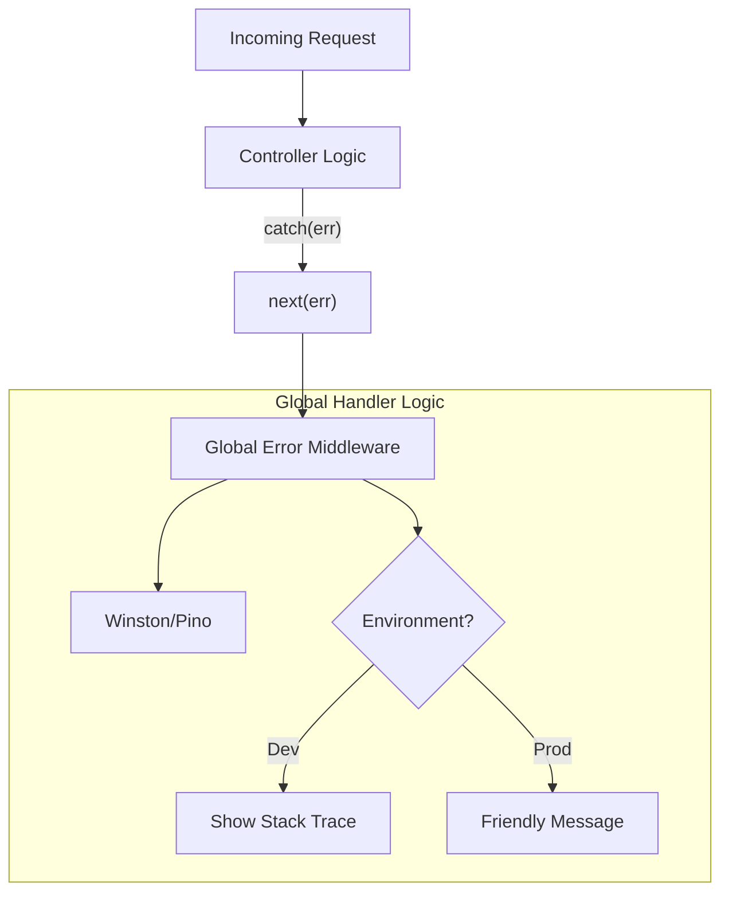

# 🚨 Error Handling Middleware: The Centralized Command Center
> **Objective:** Handle all API failures in a single, secure, and structured way | **Language:** Hinglish | **Standard:** 2026 Expert Framework

---

## 🧭 1. Beginner-Friendly Hinglish Explanation
Error Handling Middleware ka matlab hai aapke server ka "ICU".

- **The Problem:** Agar har route mein `try-catch` likhenge aur wahan se `res.status(500).send()` karenge, toh code bahut "Ganda" (Messy) ho jayega.
- **The Solution:** Express humein ek special middleware deta hai jo poore app ke saare errors ko ek jagah catch kar sakta hai.
- **The Flow:** 
  1. Route mein koi error aaya.
  2. Wo `next(err)` se global handler ke paas gaya.
  3. Global handler decide karta hai: "Ye validation error hai (400) ya database crash (500)?"
- **The Result:** DRY (Don't Repeat Yourself) code aur consistent error responses.

---

## 🧠 2. Deep Technical Explanation
### 1. Arity (The 4 Arguments):
Express error handlers MUST have exactly 4 arguments: `(err, req, res, next)`. This is how Express distinguishes them from normal middlewares.

### 2. Operational vs Programmer Errors:
- **Operational:** Trusted errors that we can show to the user (e.g., 404, 401).
- **Programmer:** Bugs that we should hide from the user and log for ourselves (e.g., `TypeError`, `ReferenceError`).

### 3. Async Error Catching:
In Express 4, `async` errors are NOT caught automatically. You must either:
- Wrap every route in a `try-catch`.
- Use a higher-order function (`asyncHandler`).
- Use `express-async-errors` library.

---

## 🏗️ 3. Architecture Diagrams (The Error Pipeline)


---

## 💻 4. Production-Ready Examples (The Ultimate Handler)
```typescript
// 2026 Standard: Robust Centralized Error Handling

import { Request, Response, NextFunction } from 'express';

// 1. Custom Error Class
class AppError extends Error {
  statusCode: number;
  isOperational: boolean;

  constructor(message: string, statusCode: number) {
    super(message);
    this.statusCode = statusCode;
    this.isOperational = true; // Mark as 'handled' error
    Error.captureStackTrace(this, this.constructor);
  }
}

// 2. Global Error Middleware
const globalErrorHandler = (err: any, req: Request, res: Response, next: NextFunction) => {
  const statusCode = err.statusCode || 500;
  const status = `${statusCode}`.startsWith('4') ? 'fail' : 'error';

  // Log everything for developers
  console.error('🔥 ERROR:', err);

  if (process.env.NODE_ENV === 'development') {
    // Show full details in development
    res.status(statusCode).json({
      status,
      error: err,
      message: err.message,
      stack: err.stack
    });
  } else {
    // Hide details in production
    res.status(statusCode).json({
      status,
      message: err.isOperational ? err.message : 'Something went very wrong!'
    });
  }
};

export { AppError, globalErrorHandler };
```

---

## 🌍 5. Real-World Use Cases
- **Database Timeouts:** Catching a slow DB query and returning a 504.
- **Unauthorized Access:** Catching a failed JWT check and returning a 401.
- **File System Errors:** Handling "Permission Denied" when trying to save an upload.

---

## ❌ 6. Failure Cases
- **Leaking Stack Traces:** Sending your file paths and code logic to hackers via error messages.
- **Generic 500s:** Returning "Internal Server Error" for everything, making it impossible for the user to know what they did wrong.
- **Empty Catch Blocks:** Catching an error and doing nothing (`catch(e) {}`), causing the request to hang.

---

## 🛠️ 7. Debugging Section
| Method | Purpose | Tip |
| :--- | :--- | :--- |
| **`next(err)`** | Trigger error handler | Always pass the error object, not just a string. |
| **Sentry / Bugsnag** | Error Monitoring | Integrate these into your global handler to get email alerts. |
| **Pino / Winston** | Logging | Log the `req.id` so you can correlate errors with requests. |

---

## ⚖️ 8. Tradeoffs
- **One Large Handler vs Multiple Small Ones:** One handler is easier to maintain but can become a massive `switch-case` block.

---

## 🛡️ 9. Security Concerns
- **Sensitive Data in Logs:** Ensure your error logs don't contain passwords, credit card numbers, or PII (Personally Identifiable Information).

---

## 📈 10. Scaling Challenges
- **Error Spikes:** If your system starts failing at scale, your logging service might get overwhelmed and crash. Use **Rate Limiting** for your logs.

---

## 💸 11. Cost Considerations
- **Log Storage Costs:** High volumes of error logs can be expensive on platforms like Datadog or AWS CloudWatch.

---

## ✅ 12. Best Practices
- **Always extend the `Error` class.**
- **Use different levels of logging** (info, warn, error, fatal).
- **Distinguish between handled (4xx) and unhandled (5xx) errors.**

---

## ⚠️ 13. Common Mistakes
- **Putting Error Handler at the top.** (It MUST be the last middleware in `app.ts`).
- **Forgetting `next` in normal middlewares.**

---

## 📝 14. Interview Questions
1. "Why must an Express error handler have 4 arguments?"
2. "How do you ensure that your API doesn't leak sensitive information in production errors?"
3. "What is the role of `Error.captureStackTrace`?"

---

## 🚀 15. Latest 2026 Production Patterns
- **Standardized Problem Details (RFC 7807):** Returning errors in a standardized format that all clients can understand.
- **Distributed Tracing (OpenTelemetry):** Attaching a `traceId` to every error response so developers can find the exact log in their dashboard.
- **Graceful Shutdown:** Listening for fatal errors and closing DB connections before the process dies.
漫
