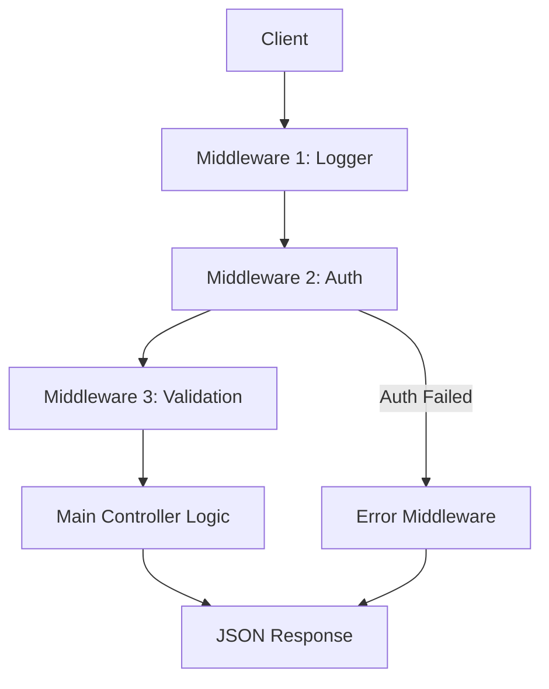

# 🚂 Express.js Complete Guide: The Industry Workhorse
> **Objective:** Master the most popular Node.js web framework | **Language:** Hinglish | **Standard:** 2026 Expert Framework

---

## 🧭 1. Beginner-Friendly Hinglish Explanation
Express.js ek "Minimalist" framework hai jo Node.js ke upar ek layer ki tarah kaam karta hai.

- **The Problem:** Raw Node.js (`http` module) se server banana bahut mehnat ka kaam hai. Aapko har route, har header, aur har error manually handle karna padta hai.
- **The Solution:** Express aapko "Middlewares" aur "Routing" provide karta hai.
- **Middlewares:** Sochiye ye "Chunghatis" (Checkpoints) hain. Jab request aati hai, wo in checkpoints se guzarti hai (e.g., Auth check -> Logging -> Validation) aur phir asli logic tak pahunchti hai.
- **Why it matters:** Fast, simple, aur duniya ka har 2nd backend Express par bana hai.

---

## 🧠 2. Deep Technical Explanation
Express is essentially a **Routing and Middleware web framework**.

### 1. Middleware Lifecycle:
Every request passes through a stack of functions. Each function has access to `req` (Request), `res` (Response), and `next` (the next function in the stack). If a middleware doesn't call `next()`, the request hangs.

### 2. The Request-Response Cycle:
1.  **Receive:** Node.js HTTP server receives the packet.
2.  **Parsing:** Middlewares like `express.json()` parse the body.
3.  **Routing:** Express matches the URL and Method (GET/POST) to a handler.
4.  **Execution:** Controller logic runs.
5.  **Termination:** `res.send()` or `res.json()` closes the connection.

### 3. Error Handling:
A specialized middleware with 4 arguments `(err, req, res, next)`. Express identifies this by the arity (number of arguments).

---

## 🏗️ 3. Architecture Diagrams (The Middleware Stack)


---

## 💻 4. Production-Ready Examples (Modern App Setup)
```typescript
// 2026 Standard: Scalable Express Setup with TypeScript

import express, { Request, Response, NextFunction } from 'express';
import helmet from 'helmet';
import cors from 'cors';

const app = express();

// 1. Essential Security & Parsing Middlewares
app.use(helmet()); // Sets security headers
app.use(cors());   // Enables CORS
app.use(express.json({ limit: '10kb' })); // Body parsing with size limit

// 2. Sample Route with Middleware
const authGuard = (req: Request, res: Response, next: NextFunction) => {
  const token = req.headers.authorization;
  if (token === 'secret') return next();
  next(new Error("Unauthorized")); // Passing error to global handler
};

app.get('/api/v1/data', authGuard, (req, res) => {
  res.json({ message: "Success" });
});

// 3. Global Error Handler (Must be at the end)
app.use((err: any, req: Request, res: Response, next: NextFunction) => {
  res.status(err.status || 500).json({ error: err.message });
});

export default app;
```

---

## 🌍 5. Real-World Use Cases
- **Blogging APIs:** Handling CRUD for posts and users.
- **Real-time Dashboards:** Serving as the HTTP entry point before upgrading to WebSockets.
- **Proxy Servers:** Using `express-http-proxy` to route requests to other microservices.

---

## ❌ 6. Failure Cases
- **Not calling `next()`:** Request hangs until timeout.
- **Order of Middlewares:** Putting the Error Handler at the top (it won't catch anything).
- **Synchronous Errors in Async Handlers:** Errors in `async` functions won't be caught by Express automatically unless you use a wrapper or `express-async-errors`.

---

## 🛠️ 7. Debugging Section
| Tool | Purpose | Tip |
| :--- | :--- | :--- |
| **DEBUG=express:*** | Internal Express logs | `DEBUG=express:* node app.js` to see routing logic. |
| **Morgan** | Request logging | Use `:method :url :status :response-time ms` format. |
| **Postman** | API Testing | Verify status codes and headers. |

---

## ⚖️ 8. Tradeoffs
- **Express vs Fastify:** Simplicity/Ecosystem vs Performance/Speed.
- **Express vs NestJS:** Unstructured/Flexible vs Opinionated/Structured.

---

## 🛡️ 9. Security Concerns
- **X-Powered-By:** Always hide this header (`app.disable('x-powered-by')`) to avoid leaking that you use Express.
- **Parameter Pollution:** Using `hpp` middleware to prevent attacks like `?user=1&user=2`.

---

## 📈 10. Scaling Challenges
- **Statelessness:** Ensure your routes don't rely on local variables so you can run 10 instances of the server.

---

## 💸 11. Cost Considerations
- **Memory Usage:** Express is lightweight, but adding 50 heavy middlewares can increase RAM usage per request.

---

## ✅ 12. Best Practices
- **Use a Router:** Keep your `app.ts` clean by using `express.Router()`.
- **Environment Config:** Use different middlewares for `dev` vs `prod`.
- **Validation:** Always validate `req.body`, `req.params`, and `req.query`.

---

## ⚠️ 13. Common Mistakes
- **Mutating `req` incorrectly:** Accidentally overwriting built-in properties.
- **Multiple responses:** Trying to `res.send()` twice in one route (Throws "Headers already sent" error).

---

## 📝 14. Interview Questions
1. "How does middleware work in Express? Explain with a diagram."
2. "What is the difference between `app.use()` and `app.get()`?"
3. "How do you handle errors in asynchronous Express routes?"

---

## 🚀 15. Latest 2026 Production Patterns
- **Express 5.0 (Native Async):** Finally supporting async handlers without extra wrappers.
- **Zod-Express-Middleware:** Direct integration of Zod for request validation.
- **Edge Deployment:** Running Express-compatible apps on Cloudflare Workers/Edge.
漫
