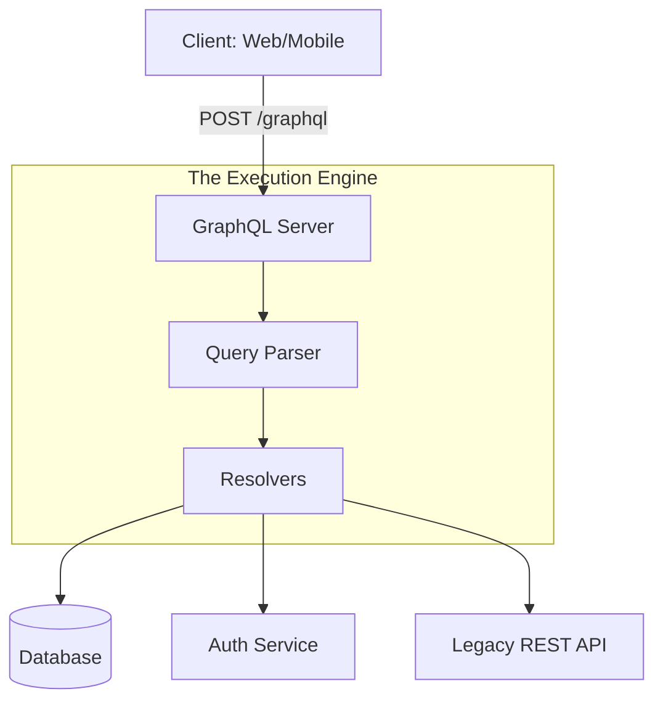

# 🕸️ GraphQL Basics: The Future of Data Fetching
> **Objective:** Understand how to build flexible, efficient APIs with GraphQL | **Language:** Hinglish | **Standard:** 2026 Expert Framework

---

## 🧭 1. Beginner-Friendly Hinglish Explanation
GraphQL ek modern query language hai jo REST ki "Over-fetching" problem ko solve karti hai.

- **The Problem:** REST mein agar aapko sirf user ka "Name" chahiye, toh `/users/1` aapko uska address, phone, aur 50 aur cheezein bhej dega (Over-fetching).
- **The Solution:** GraphQL mein aap decide karte hain ki aapko kya chahiye. 
  - **Client:** "Mujhe sirf Name aur Email bhej do."
  - **Server:** "Ye lo sirf Name aur Email."
- **The Difference:** 
  - REST: Har resource ka alag URL hota hai (`/users`, `/posts`).
  - GraphQL: Poore app ke liye sirf **EK URL** hota hai (`/graphql`).

---

## 🧠 2. Deep Technical Explanation
### 1. The Schema (SDL):
Everything in GraphQL starts with a **Schema**. You define types, queries (Read), and mutations (Write).

### 2. Resolvers:
A Resolver is a function that fetches the data for a specific field in the schema. Resolvers can fetch data from a DB, another API, or a cache.

### 3. The Type System:
GraphQL is strongly typed. If you define a field as an `Int`, it can never return a `String`.

### 4. Query Execution:
1.  **Validation:** The server checks if the query matches the schema.
2.  **Execution:** The server calls the relevant resolvers.
3.  **Aggregation:** The server bundles the results into the exact JSON shape requested.

---

## 🏗️ 3. Architecture Diagrams (Single Endpoint)


---

## 💻 4. Production-Ready Examples (Apollo Server + Express)
```typescript
// 2026 Standard: Defining Types and Resolvers

import { ApolloServer, gql } from 'apollo-server-express';

// 1. Define the Schema (Type Definitions)
const typeDefs = gql`
  type User {
    id: ID!
    name: String!
    email: String!
  }

  type Query {
    getUser(id: ID!): User
  }
`;

// 2. Define the Resolvers
const resolvers = {
  Query: {
    getUser: async (_parent, args, context) => {
      // Logic to fetch user from DB
      return await db.user.findUnique({ where: { id: args.id } });
    },
  },
};

// 3. Setup Server
const server = new ApolloServer({ typeDefs, resolvers });
// await server.start();
// server.applyMiddleware({ app });
```

---

## 🌍 5. Real-World Use Cases
- **Mobile Apps:** Reducing data usage by only fetching essential fields.
- **Microservices Orchestration:** Using **Federation** to combine multiple microservices into one single GraphQL graph.
- **Complex Data Graphs:** Platforms like Facebook or Pinterest where data is highly interconnected.

---

## ❌ 6. Failure Cases
- **N+1 Problem:** If you fetch 10 posts and their authors, a naive resolver will call the DB 10 times for authors. (Solution: Use **DataLoader**).
- **Overly Complex Queries:** A client can request a very deep query (User -> Posts -> Comments -> Users -> ...) that crashes the server. (Solution: Use **Query Depth Limiting**).
- **Caching Challenges:** Since it's a POST request to a single endpoint, standard browser caching doesn't work.

---

## 🛠️ 7. Debugging Section
| Tool | Purpose | Tip |
| :--- | :--- | :--- |
| **Apollo Sandbox** | Interactive Testing | The modern replacement for GraphiQL. |
| **DataLoader** | Batching & Caching | Essential for fixing N+1 issues. |
| **GraphQL Inspector** | Schema Diffing | Ensure your changes don't break existing clients. |

---

## ⚖️ 8. Tradeoffs
- **GraphQL vs REST:** Flexibility vs Simplicity and standard caching.
- **Schema-First vs Code-First:** Writing SDL manually vs generating it from TS classes.

---

## 🛡️ 9. Security Concerns
- **Introspection:** Attackers can query `__schema` to see your entire API structure. Disable this in production.
- **Batching Attacks:** Sending thousands of queries in a single request.

---

## 📈 10. Scaling Challenges
- **Schema Registry:** In a large company, managing a massive shared schema requires specialized tools (like Apollo Studio/GraphOS).

---

## 💸 11. Cost Considerations
- **Bandwidth Savings:** Less data transferred out means lower cloud costs.

---

## ✅ 12. Best Practices
- **Use meaningful Type names.**
- **Implement Pagination using the Connection pattern (Relay).**
- **Use DataLoaders for all nested relations.**
- **Versioning is not needed; just add new fields.**

---

## ⚠️ 13. Common Mistakes
- **Trying to use GraphQL for everything** (Simple CRUD might be faster with REST).
- **Putting too much logic in Resolvers.** (Resolvers should just call the Service layer).

---

## 📝 14. Interview Questions
1. "What is the N+1 problem in GraphQL and how do you solve it?"
2. "Compare GraphQL with REST in terms of caching and performance."
3. "What are Mutations and how do they differ from Queries?"

---

## 🚀 15. Latest 2026 Production Patterns
- **GraphQL Federation 2.0:** Composing subgraphs into a unified supergraph.
- **Subscriptions over WebSockets/SSE:** Real-time data updates directly through GraphQL.
- **Automatic Persisted Queries (APQ):** Sending a hash instead of the full query string to save bandwidth and improve performance.
漫
