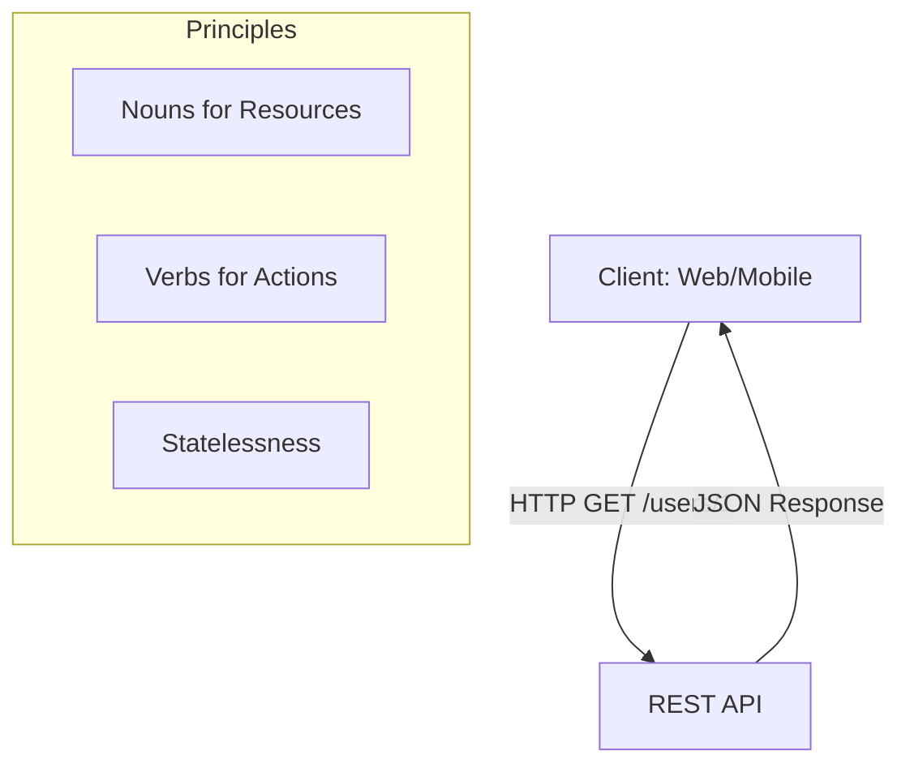

# 🛣️ REST API Design: The Architectural Blueprint
> **Objective:** Build predictable, scalable, and intuitive APIs | **Language:** Hinglish | **Standard:** 2026 Expert Framework

---

## 🧭 1. Beginner-Friendly Hinglish Explanation
REST (Representational State Transfer) ka matlab hai APIs likhne ka ek "Standard Tareeka".

- **The Problem:** Agar main `GET /get_all_users` likhun aur aap `POST /fetchUsers` likhein, toh doosre developers confuse ho jayenge.
- **The Solution:** REST kehta hai ki URLs mein "Nouns" (Resources) hone chahiye aur "Actions" ke liye HTTP Methods (Verbs) use karein.
  - `GET /users` -> Saare users dikhao.
  - `POST /users` -> Naya user banao.
  - `GET /users/1` -> ID 1 wala user dikhao.
  - `DELETE /users/1` -> ID 1 wala user delete karo.
- **The Result:** Aapka API "Predictable" ban jata hai. Kisi ko documentation padhne ki zaroorat nahi padti guess karne ke liye.

---

## 🧠 2. Deep Technical Explanation
### 1. The 6 Constraints of REST:
1.  **Client-Server:** Decoupled frontend and backend.
2.  **Stateless:** No client context is stored on the server between requests.
3.  **Cacheable:** Responses must define themselves as cacheable or not.
4.  **Uniform Interface:** Consistent URLs, methods, and media types (JSON).
5.  **Layered System:** Client doesn't know if it's connected directly to the server or an intermediate (Load Balancer).
6.  **Code on Demand (Optional):** Server can send executable code (like JS).

### 2. Resource Naming:
- Use **Plural Nouns**: `/products` instead of `/product`.
- Use **Sub-resources** for relationships: `/users/123/posts`.

### 3. HATEOAS (Hypermedia as the Engine of Application State):
The idea that an API response should include links to other related actions.

---

## 🏗️ 3. Architecture Diagrams (The REST Triangle)


---

## 💻 4. Production-Ready Examples (Clean REST Pattern)
```typescript
// 2026 Standard: Implementing RESTful endpoints

// 1. GET /api/v1/posts (List with Filtering/Pagination)
app.get('/posts', async (req, res) => {
  const { limit = 10, page = 1, category } = req.query;
  // Implementation...
  res.json({ data: [], meta: { page, limit, total: 100 } });
});

// 2. POST /api/v1/posts (Create)
app.post('/posts', async (req, res) => {
  const post = await PostService.create(req.body);
  res.status(201).json(post); // 201 Created
});

// 3. PATCH /api/v1/posts/:id (Partial Update)
app.patch('/posts/:id', async (req, res) => {
  const updated = await PostService.update(req.params.id, req.body);
  res.json(updated);
});
```

---

## 🌍 5. Real-World Use Cases
- **Public APIs (Stripe/GitHub):** Highly consistent REST APIs that millions of developers use.
- **Mobile Backends:** Providing a stable interface for iOS/Android apps.
- **Internal Microservices:** Using REST for communication where gRPC might be over-kill.

---

## ❌ 6. Failure Cases
- **Verbs in URLs:** `/deleteUser?id=1` — This is RPC, not REST.
- **Inconsistent Status Codes:** Returning `200 OK` when an error occurred.
- **Deep Nesting:** `/users/1/posts/2/comments/3/likes` — Hard to maintain. Limit nesting to 2 levels.

---

## 🛠️ 7. Debugging Section
| Tool | Feature | Action |
| :--- | :--- | :--- |
| **Swagger/OpenAPI** | Interactive Docs | Test every endpoint visually. |
| **JSONLint** | Validation | Ensure your responses are valid JSON. |
| **Httpie** | CLI Testing | `http GET :3000/users` for clean output. |

---

## ⚖️ 8. Tradeoffs
- **REST vs GraphQL:** Predictable/Cached vs Flexible/Efficient (No over-fetching).
- **PUT vs PATCH:** Full replace vs Partial update.

---

## 🛡️ 9. Security Concerns
- **Sensitive IDs:** Avoid using auto-incrementing IDs in URLs (e.g., `/users/1`). Use **UUIDs** or **ULIDs** to prevent enumeration attacks.
- **Rate Limiting:** Protect your endpoints from being scraped or brute-forced.

---

## 📈 10. Scaling Challenges
- **Over-fetching:** REST often returns more data than the client needs (e.g., full profile when only name is needed).
- **Multiple Round-trips:** To get a user and their posts, you might need 2 requests.

---

## 💸 11. Cost Considerations
- **Payload Size:** Large JSON responses increase bandwidth costs. Use **Compression** and **Field Filtering** (`?fields=name,email`).

---

## ✅ 12. Best Practices
- **Version your API:** `/api/v1/...`
- **Use standard HTTP Methods.**
- **Return structured errors.**
- **Support Pagination from day one.**

---

## ⚠️ 13. Common Mistakes
- **Mixing Nouns and Verbs:** `/users/list`.
- **Not handling 404s correctly.**
- **Using query params for sensitive data.**

---

## 📝 14. Interview Questions
1. "What are the core constraints of REST architecture?"
2. "Explain the difference between idempotent and non-idempotent methods."
3. "What is HATEOAS and why is it useful?"

---

## 🚀 15. Latest 2026 Production Patterns
- **JSON:API Specification:** A highly structured way to build REST APIs.
- **Spec-First Development:** Writing the OpenAPI file first, then generating the server code.
- **Conditional GETs (E-Tags):** Reducing bandwidth by only sending data if it has changed.
漫
