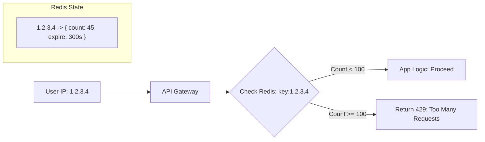

# 🧱 Rate Limiting: Protecting your Server from Overload
> **Objective:** Prevent abuse and ensure fair usage of your API | **Language:** Hinglish | **Standard:** 2026 Expert Framework

---

## 🧭 1. Beginner-Friendly Hinglish Explanation
Rate Limiting ka matlab hai "Limit lagana" ki ek user kitni baar aapka API call kar sakta hai.

- **The Problem:** Maan lijiye aapka ek "Login" API hai. Agar koi hacker script likh kar har second mein 1000 baar login try kare (Brute Force), toh aapka server crash ho jayega aur password chori hone ka dar bhi hai.
- **The Solution:** Hum ek limit set karte hain: "Ek IP address se sirf 5 requests per minute allowed hain".
- **The Result:** Aapka server "Bad Actors" se surakshit rehta hai aur asli users ko bandwidth milti hai.

---

## 🧠 2. Deep Technical Explanation
### 1. Algorithms:
- **Fixed Window:** Reset after a set time (e.g., 100 req per hour). Simple but has "Burst" issues at the window boundary.
- **Sliding Window:** More precise, tracks the exact time of each request.
- **Token Bucket:** Allows short bursts of traffic while maintaining a steady average rate.
- **Leaky Bucket:** Constant output rate regardless of input bursts.

### 2. Storage:
- **In-Memory:** Fast but resets when the server restarts and doesn't work across multiple servers.
- **Distributed (Redis):** The industry standard. All server instances check a single Redis store to see if a user has exceeded their limit.

---

## 🏗️ 3. Architecture Diagrams (The Limit Check)


---

## 💻 4. Production-Ready Examples (Redis + Express)
```typescript
// 2026 Standard: Distributed Rate Limiting

import rateLimit from 'express-rate-limit';
import RedisStore from 'rate-limit-redis';
import { createClient } from 'redis';

const redisClient = createClient({ url: 'redis://localhost:6379' });
redisClient.connect();

const limiter = rateLimit({
  windowMs: 15 * 60 * 1000, // 15 minutes
  max: 100, // Limit each IP to 100 requests per window
  standardHeaders: true, // Return rate limit info in the `RateLimit-*` headers
  legacyHeaders: false, // Disable the `X-RateLimit-*` headers
  
  // Use Redis for distributed tracking
  store: new RedisStore({
    sendCommand: (...args: string[]) => redisClient.sendCommand(args),
  }),
  
  message: {
    status: 429,
    message: "Too many requests from this IP, please try again after 15 minutes"
  }
});

// Apply to all routes or specific ones
app.use('/api/auth/', limiter);
```

---

## 🌍 5. Real-World Use Cases
- **Public APIs:** GitHub limits unauthenticated requests to 60 per hour.
- **Login/Register:** Preventing bots from creating thousands of fake accounts.
- **Search Endpoints:** Preventing scrapers from stealing your database content.

---

## ❌ 6. Failure Cases
- **Shared IP Problems:** Blocking an entire office or university because one person was abusing the API. (Solution: Use **API Keys** instead of just IP).
- **Redis Down:** If Redis crashes, your rate limiter might block everyone or allow everyone. (Solution: Fail-open strategy).
- **Ignoring Headers:** Not telling the client *when* they can try again, causing them to keep spamming.

---

## 🛠️ 7. Debugging Section
| Status Code | Meaning | Tip |
| :--- | :--- | :--- |
| **429 Too Many Requests** | Limit hit | Check `Retry-After` header. |
| **Reset Header** | `RateLimit-Reset` | Tells the client exactly how many seconds to wait. |
| **Redis Latency** | Slow limit checks | Ensure Redis is in the same region as the app. |

---

## ⚖️ 8. Tradeoffs
- **IP-based vs User-based:** IP is easy but imprecise. User-based is precise but requires authentication.
- **Global vs Route-specific:** Global is easier; route-specific is more secure (e.g., lower limit for `/login`).

---

## 🛡️ 9. Security Concerns
- **DDoS Protection:** Rate limiting at the app level is good for small attacks, but for massive DDoS, you need **Cloudflare** or **AWS Shield**.
- **WAF (Web Application Firewall):** Integrating rate limits with WAF to auto-ban malicious IPs.

---

## 📈 10. Scaling Challenges
- **Multiple Load Balancers:** Ensure the IP address passed to Node.js is the real client IP, not the LB IP (Use `trust proxy` in Express).

---

## 💸 11. Cost Considerations
- **Saving CPU:** Rate limiting blocks requests before they reach your expensive DB or AI processing logic, saving money.

---

## ✅ 12. Best Practices
- **Use different limits for different tiers** (Free vs Pro).
- **Always provide clear feedback** in the headers.
- **Implement Tiered Limits:** (e.g., 100/min, 1000/hour, 5000/day).

---

## ⚠️ 13. Common Mistakes
- **Setting limits too low** and blocking real users.
- **Not exclusion list:** Forgetting to exclude your own internal monitoring tools or developers.

---

## 📝 14. Interview Questions
1. "What is the difference between Token Bucket and Fixed Window algorithms?"
2. "How would you implement rate limiting in a distributed microservices environment?"
3. "What does HTTP Status 429 mean and what headers should it include?"

---

## 🚀 15. Latest 2026 Production Patterns
- **Adaptive Rate Limiting:** Using ML to analyze traffic patterns and automatically lower limits for suspicious users.
- **Edge Rate Limiting:** Performing the limit check at the Edge (CDN) level so the request never even reaches your server infrastructure.
- **Quotas vs Limits:** Managing long-term usage (monthly quota) alongside short-term spikes (rate limits).
漫
