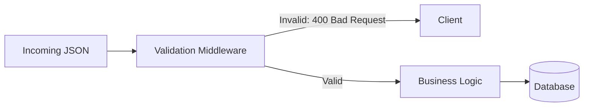

# 🛡️ Request Validation: The First Line of Defense
> **Objective:** Ensure data integrity and security at the API entry point | **Language:** Hinglish | **Standard:** 2026 Expert Framework

---

## 🧭 1. Beginner-Friendly Hinglish Explanation
Request Validation ka matlab hai "Kachre (Bad Data) ko server ke andar na aane dena".

- **The Problem:** Agar user ne "Age" field mein string bhej diya, ya "Email" ke bina form submit kar diya, toh backend crash ho sakta hai ya database corrupt ho sakta hai.
- **The Solution:** Humein server ke darwaze par ek "Security Guard" (Validation Library) baithana chahiye.
- **Zod:** 2026 mein Zod sabse popular guard hai. Ye check karta hai ki data ka "Shape" wahi hai jo humne maanga hai.
- **The Rule:** **"Never Trust the Client"**. Bhale hi frontend ne validation kiya ho, backend par validation **MANDATORY** hai.

---

## 🧠 2. Deep Technical Explanation
### 1. Schema-based Validation:
Defining the "Contract" of the data using a schema library (Zod, Joi, Yup).
- **Type Checking:** Is it a string/number?
- **Constraints:** Is the string a valid email? Is the number between 1 and 100?
- **Coercion:** Converting "1" (string) to 1 (number) automatically.

### 2. Validation Layers:
- **Syntactic Validation:** Checking format (e.g., is this a valid JSON?).
- **Semantic Validation:** Checking context (e.g., does this user ID exist in our DB?).

### 3. Fail-Fast Strategy:
Stop processing the request as soon as a validation error is found to save CPU and DB resources.

---

## 🏗️ 3. Architecture Diagrams (The Validation Gate)


---

## 💻 4. Production-Ready Examples (Zod + Express)
```typescript
// 2026 Standard: Type-Safe Validation Middleware

import { z } from 'zod';
import { Request, Response, NextFunction } from 'express';

// 1. Define the Schema
const UserSignupSchema = z.object({
  email: z.string().email("Invalid email address"),
  password: z.string().min(8, "Password too short"),
  age: z.number().int().min(18).optional(),
});

// 2. Generic Validation Middleware
const validate = (schema: z.AnyZodObject) => 
  (req: Request, res: Response, next: NextFunction) => {
    const result = schema.safeParse(req.body);
    if (!result.success) {
      // 400: Bad Request
      return res.status(400).json({
        error: "Validation Failed",
        details: result.error.errors.map(e => ({ path: e.path, message: e.message }))
      });
    }
    // Attach validated data back to req for safety
    req.body = result.data;
    next();
  };

// 3. Usage in Route
app.post('/signup', validate(UserSignupSchema), (req, res) => {
  res.json({ message: "Data is safe!" });
});
```

---

## 🌍 5. Real-World Use Cases
- **User Registration:** Ensuring emails are unique and passwords are strong.
- **E-commerce Checkout:** Validating that the product quantities are positive integers.
- **Payment Gateways:** Checking that the card expiry date is in the future.

---

## ❌ 6. Failure Cases
- **Bypassing Validation:** Forgetting to apply the middleware to a new route.
- **Weak Schemas:** Only checking if it's a string but not checking if it's an empty string (`""`).
- **Incorrect Error Messages:** Sending technical Zod errors to the user instead of friendly messages.

---

## 🛠️ 7. Debugging Section
| Symptom | Cause | Diagnostic |
| :--- | :--- | :--- |
| **Validation fails for valid data** | Unexpected data types (e.g., Date strings) | Log `req.body` before validation. |
| **Silent Failures** | Incorrectly handled `safeParse` | Ensure you're returning a 400 status. |
| **Regex Overload** | Too complex regex for email/phone | Use built-in Zod helpers like `.email()`. |

---

## ⚖️ 8. Tradeoffs
- **Sync vs Async Validation:** Checking a format is sync; checking if a username is taken is async (requires DB call). **Tip:** Keep the format validation in a middleware and context validation in the Service layer.

---

## 🛡️ 9. Security Concerns
- **ReDoS (Regular Expression Denial of Service):** Attackers sending inputs that cause regex validation to hang the server.
- **Mass Assignment:** Validating exactly what you need so users can't inject extra fields like `role: 'admin'`.

---

## 📈 10. Scaling Challenges
- **Heavy Schemas:** Very large Zod schemas can add a few milliseconds to every request. Optimize by splitting schemas.

---

## 💸 11. Cost Considerations
- **Compute Savings:** Catching an error at the validation layer prevents expensive DB queries or AI model calls from running.

---

## ✅ 12. Best Practices
- **Define schemas in a separate file.**
- **Use `strip` in Zod** to remove any un-requested fields from the body.
- **Return all errors at once**, not one by one.

---

## ⚠️ 13. Common Mistakes
- **Validation only on Frontend.** (Easy to bypass with Postman).
- **Not using TypeScript types inferred from the schema.**
- **Allowing `null` where it shouldn't be.**

---

## 📝 14. Interview Questions
1. "Why should you perform validation on the backend even if the frontend has it?"
2. "What is the difference between `parse` and `safeParse` in Zod?"
3. "How do you handle validation for nested objects and arrays?"

---

## 🚀 15. Latest 2026 Production Patterns
- **Edge Validation:** Running validation scripts on Cloudflare Workers/Edge to block bad requests before they even reach your main server.
- **Zod-to-TypeScript Automation:** Automatically syncing frontend and backend types via shared schema packages.
- **AI-Generated Schemas:** Using agents to analyze your API usage and suggest better constraints.
漫
