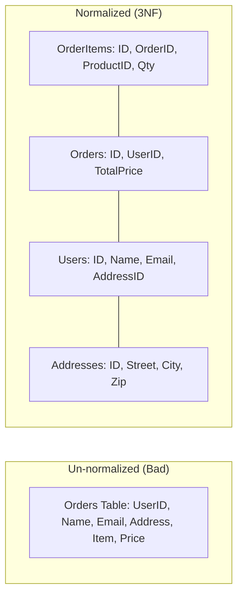

# 📐 Database Normalization: Structuring Data for Integrity
> **Objective:** Reduce redundancy and improve data consistency | **Language:** Hinglish | **Standard:** 2026 Expert Framework

---

## 🧭 1. Beginner-Friendly Hinglish Explanation
Normalization ka matlab hai "Data ko sahi dabbaon (Tables) mein bantna".

- **The Problem:** Agar aap ek hi table mein User ka naam, Address, aur har Order ki details bar-bar likhenge, toh "Redundancy" (Repetition) badh jayegi. Agar user ka address change hua, toh aapko 100 jagah update karna padega (Update Anomaly).
- **The Solution:** Data ko chote tables mein split karo aur unhe "IDs" se connect karo.
- **The Goal:** Ek baat ek hi jagah likhi honi chahiye.

Sochiye normalization ek "Almirah" organize karne jaisa hai—kapde alag, joote alag, aur files alag.

---

## 🧠 2. Deep Technical Explanation
### 1. Normal Forms (The Steps):
1.  **1NF (First Normal Form):** No multi-valued attributes (har cell mein ek hi value honi chahiye) and each row is unique.
2.  **2NF (Second Normal Form):** Must be in 1NF + All non-key columns must depend on the ENTIRE primary key (Fixes issues with composite keys).
3.  **3NF (Third Normal Form):** Must be in 2NF + No transitive dependencies (e.g., column A depends on B, and B depends on the Primary Key. Solution: Move A and B to a new table).

### 2. Denormalization:
In high-performance systems, we sometimes **intentionally** break normalization rules (e.g., storing a pre-calculated total in an Order table) to speed up reads. This is a tradeoff between "Consistency" and "Performance".

---

## 🏗️ 3. Architecture Diagrams (Normalizing User Data)


---

## 💻 4. Production-Ready Examples (Split Logic)
```sql
-- 2026 Standard: Refactoring a 'Messy' Table

-- ❌ Before (1NF only)
-- users: id, name, city_name, city_zip, city_country

-- ✅ After (3NF)
CREATE TABLE cities (
    id SERIAL PRIMARY KEY,
    name VARCHAR(100),
    zip VARCHAR(10),
    country VARCHAR(100)
);

CREATE TABLE users (
    id SERIAL PRIMARY KEY,
    name VARCHAR(100),
    city_id INTEGER REFERENCES cities(id)
);

-- Advantage: If a city's zip code changes, we update it ONCE 
-- in the 'cities' table, and it reflects for all users.
```

---

## 🌍 5. Real-World Use Cases
- **Banking:** Ensuring that a customer's balance and transaction history are perfectly consistent across multiple tables.
- **Inventory Management:** Keeping products, categories, and suppliers in separate tables to avoid redundant updates.
- **Billing Systems:** Separating tax rates and regional configurations into their own tables.

---

## ❌ 6. Failure Cases
- **Over-Normalization:** Splitting data into so many tables that you need 15 `JOINs` for a simple profile page, making the API very slow.
- **Update Anomalies:** Forgetting to normalize and updating the "City Name" for 99 users but forgetting the 100th one.
- **Delete Anomalies:** Deleting a user and accidentally losing the record of the "City" because the city data only existed inside the user row.

---

## 🛠️ 7. Debugging Section
| Symptom | Cause | Solution |
| :--- | :--- | :--- |
| **Data Mismatch** | Duplicated data in multiple tables | Normalize the redundant columns into a new table. |
| **Slow Reads** | Too many JOINs | Use **Denormalization** or **Materialized Views**. |
| **Complex Logic** | Data split incorrectly | Re-draw your ER (Entity Relationship) diagram. |

---

## ⚖️ 8. Tradeoffs
- **Normalized (Consistency):** Less disk space, no update errors, but slower reads (due to Joins).
- **Denormalized (Performance):** Faster reads, but more disk space and risk of data going out of sync.

---

## 🛡️ 9. Security Concerns
- **Data Leakage:** If you don't normalize correctly, a user might accidentally see someone else's address if IDs are mixed in a messy table.

---

## 📈 10. Scaling Challenges
- **Join Latency:** As tables grow to millions of rows, `JOIN` operations become a bottleneck. This is when **Denormalization** or **Caching** becomes mandatory.

---

## 💸 11. Cost Considerations
- **Disk Space:** Normalization saves money on disk storage by removing duplicate strings.
- **Compute:** Denormalization saves money on CPU by reducing complex query processing.

---

## ✅ 12. Best Practices
- **Aim for 3NF** in most relational database designs.
- **Document your Schema** using ER diagrams.
- **Only denormalize when you have a proven performance bottleneck.**

---

## ⚠️ 13. Common Mistakes
- **Storing multiple values in one column** (e.g., tags as `"tech,ai,web"`). (Solution: Use a Join Table).
- **Not defining Foreign Key constraints.**

---

## 📝 14. Interview Questions
1. "Explain the three normal forms (1NF, 2NF, 3NF) with a real-world example."
2. "When is it acceptable to denormalize a database?"
3. "What is an Update Anomaly?"

---

## 🚀 15. Latest 2026 Production Patterns
- **Database-per-Service:** In microservices, each service has its own normalized database.
- **CQRS (Command Query Responsibility Segregation):** Using a normalized DB for "Writes" (Consistency) and a denormalized DB/Cache for "Reads" (Speed).
- **Graph Databases:** Using Neo4j when relationships are so complex that standard SQL normalization becomes impossible.
漫
