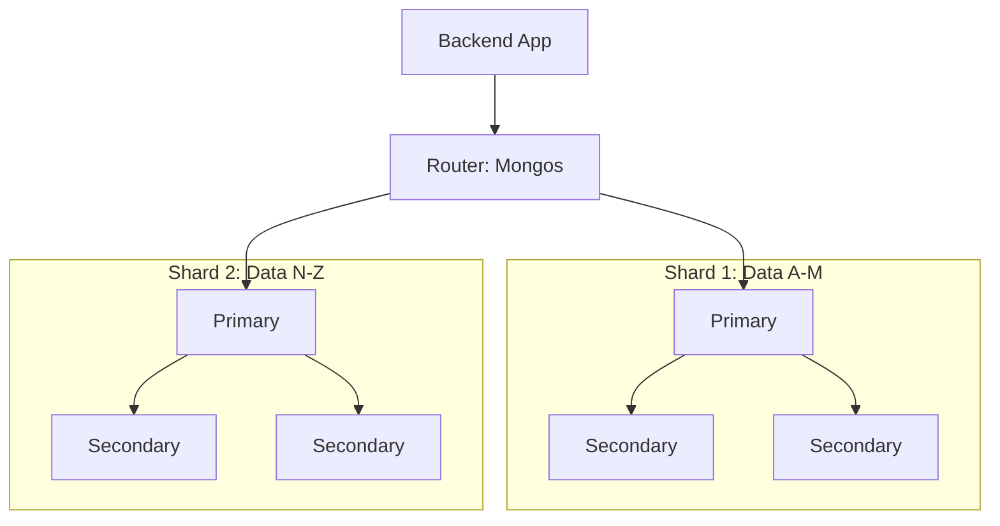

# 🍃 MongoDB Complete Guide: The Document Database
> **Objective:** Master flexible, scalable data modeling with NoSQL | **Language:** Hinglish | **Standard:** 2026 Expert Framework

---

## 🧭 1. Beginner-Friendly Hinglish Explanation
MongoDB ek "NoSQL" database hai jahan data "Tables" mein nahi, balki "Documents" (JSON jaise) mein store hota hai.

- **The Flexibility:** Maan lijiye aap ek ecommerce app bana rahe hain. Kuch products ke paas "Size" hai, kuch ke paas "Battery life" aur kuch ke paas "Material". SQL mein ye sab columns banana mushkil hai. MongoDB mein aap har product ke liye alag fields rakh sakte hain.
- **The Speed:** Isme "Joins" nahi hote, isliye data fetch karna bahut fast hota hai agar aapne sahi se model kiya hai.
- **The Concept:** Isme SQL ki tarah strict rule (Schema) nahi hote, isliye "Rapid Prototyping" ke liye ye best hai.

Think of MongoDB as a **"Digital Folder"** where you throw documents (JSON). Har document ki shape alag ho sakti hai.

---

## 🧠 2. Deep Technical Explanation
MongoDB is a **Distributed, Document-oriented Database**.

### 1. BSON (Binary JSON):
MongoDB stores data as BSON, which supports more data types than standard JSON (like `Date`, `Decimal128`, and `ObjectId`).

### 2. Embedded vs References:
- **Embedding:** Storing sub-data inside the main document (e.g., Comments inside a Post). This is fast for reads.
- **Referencing:** Storing the ID of another document (similar to Foreign Key). This is better for data that changes frequently.

### 3. Aggregation Framework:
The "Swiss Army Knife" of MongoDB. It allows you to process data in stages (e.g., Filter -> Group -> Sort -> Project).

---

## 🏗️ 3. Architecture Diagrams (The Replication & Sharding)


---

## 💻 4. Production-Ready Examples (Mongoose + Aggregation)
```typescript
// 2026 Standard: Robust Mongoose Modeling & Aggregation

import mongoose, { Schema } from 'mongoose';

// 1. Define Schema with Validation
const UserSchema = new Schema({
  username: { type: String, required: true, unique: true },
  email: { type: String, match: /.+\@.+\..+/ },
  settings: {
    theme: { type: String, default: 'dark' },
    notifications: Boolean
  }
}, { timestamps: true });

// 2. Aggregation: Get user count by theme
const getThemeStats = async () => {
  return await mongoose.model('User').aggregate([
    { $group: { _id: "$settings.theme", total: { $sum: 1 } } },
    { $sort: { total: -1 } }
  ]);
};

// 💡 Pro Tip: Use 'Lean' for read-only queries to improve performance.
const users = await User.find().lean();
```

---

## 🌍 5. Real-World Use Cases
- **Content Management Systems (CMS):** Where every page/article might have different meta-fields.
- **Big Data / Analytics:** Storing massive streams of logs and events.
- **Real-time Apps:** Using "Change Streams" to watch for data updates in real-time.

---

## ❌ 6. Failure Cases
- **Unbounded Arrays:** Storing millions of comments inside a single post document. Every document has a **16MB limit**.
- **No Indexes:** Queries becoming extremely slow as the collection grows.
- **Data Inconsistency:** Since there are no strict schema rules at the DB level, bugs in your code can lead to "Dirty Data".

---

## 🛠️ 7. Debugging Section
| Tool | Purpose | Tip |
| :--- | :--- | :--- |
| **MongoDB Compass** | GUI for Data | Great for visualizing your aggregation pipelines. |
| **explain('executionStats')** | Query Analysis | Use this to see if your query is using an index. |
| **Mongoose Debug** | Logging Queries | `mongoose.set('debug', true);` to see raw queries in console. |

---

## ⚖️ 8. Tradeoffs
- **MongoDB vs SQL:** Flexibility vs Relational Integrity.
- **Embedded vs Linked:** Read Performance vs Write Simplicity.

---

## 🛡️ 9. Security Concerns
- **NoSQL Injection:** Attackers using objects like `{$gt: ""}` in login forms to bypass password checks. **Fix: Sanitize inputs.**
- **Network Isolation:** Never expose port `27017` to the public internet. Use a VPC.

---

## 📈 10. Scaling Challenges
- **Sharding Complexity:** Managing shards is difficult. Use **MongoDB Atlas** (Managed Service) to handle this automatically.
- **Replica Set Latency:** When the "Secondary" nodes take too long to sync with the "Primary".

---

## 💸 11. Cost Considerations
- **Storage vs RAM:** MongoDB loves RAM. Ensure your "Working Set" (the data you query most) fits in RAM to avoid expensive disk reads.

---

## ✅ 12. Best Practices
- **Design for Reads:** Model your data based on how you will fetch it.
- **Use Mongoose** for schema enforcement at the application level.
- **Avoid deep nesting** (stay within 2-3 levels).

---

## ⚠️ 13. Common Mistakes
- **Over-indexing:** Slowing down every write operation.
- **Not using Transactions:** Thinking NoSQL doesn't have transactions (MongoDB has them since v4.0).
- **Ignoring the 16MB document limit.**

---

## 📝 14. Interview Questions
1. "When would you choose MongoDB over a SQL database like PostgreSQL?"
2. "What is a 'Change Stream' in MongoDB?"
3. "Explain the 'Embedding vs Referencing' tradeoff with an example."

---

## 🚀 15. Latest 2026 Production Patterns
- **Time-Series Collections:** Specialized storage for metric and sensor data (much faster than regular collections).
- **Search Indexes (Atlas Search):** Built-in Lucene-based search (alternative to ElasticSearch).
- **Serverless Instances:** Paying only for the operations you perform, not for idle server time.
漫
