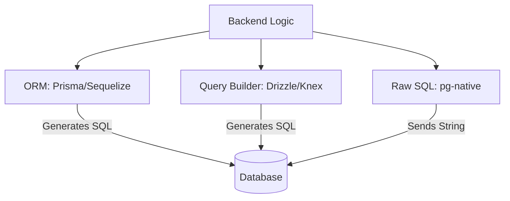

# 🥊 ORM vs Query Builder: Choosing your Database Interface
> **Objective:** Decide between abstraction and control | **Language:** Hinglish | **Standard:** 2026 Expert Framework

---

## 🧭 1. Beginner-Friendly Hinglish Explanation
ORM aur Query Builder wo "Tools" hain jo Node.js ko Database se baat karne mein help karte hain.

- **The Problem:** Raw SQL likhna fast hai, par code mein strings handle karna mushkil hai (`"SELECT * FROM users WHERE id = " + id`). Isme typos hone ka chance bahut zyada hai.
- **ORM (Object Relational Mapper):** 
  - **Concept:** DB ki table ko ek "Class/Object" bana deta hai. 
  - **Example:** `user.save()` -> Ye piche SQL `INSERT` chala deta hai. 
  - **Vibe:** "Magic". Sab asan hai, par thoda slow ho sakta hai aur complex queries mein problem karta hai. (e.g., Prisma, Sequelize).
- **Query Builder:**
  - **Concept:** Aap JS functions use karke SQL likhte hain. 
  - **Example:** `db.select().from('users').where({id: 1})`. 
  - **Vibe:** "Control". Aapko pata hai kya SQL chal raha hai. (e.g., Knex, Drizzle).

---

## 🧠 2. Deep Technical Explanation
### 1. ORM (Object-Relational Mapping):
ORMs create a "Virtual Object Database" that can be used from within the programming language.
- **Pros:** Type-safety (with TS), automatic migrations, built-in relationships, and high-level abstraction.
- **Cons:** "The Impedance Mismatch" (SQL and Objects don't map perfectly). Can generate unoptimized SQL.

### 2. Query Builders:
Functions that generate SQL strings.
- **Pros:** Close to SQL, highly predictable, better performance for complex joins.
- **Cons:** You still need to think in SQL. Managing relationships manually is more work.

### 3. The 2026 Winner: Drizzle/Prisma:
Modern tools like **Drizzle** are "Type-safe Query Builders" that feel like ORMs but give you full SQL control.

---

## 🏗️ 3. Architecture Diagrams (The Abstraction Layers)


---

## 💻 4. Production-Ready Examples (Comparison)
```typescript
// 2026 Standard: Comparing Prisma (ORM) vs Drizzle (Query Builder)

// 1. Prisma (ORM) - Highly Abstract
const userPrisma = await prisma.user.findUnique({
  where: { id: 1 },
  include: { posts: true }
});

// 2. Drizzle (Query Builder) - Explicit SQL feel
const userDrizzle = await db
  .select()
  .from(users)
  .leftJoin(posts, eq(users.id, posts.authorId))
  .where(eq(users.id, 1));

// 💡 Pro Tip: Use Prisma if you want 'Speed of Development'. 
// Use Drizzle if you want 'Maximum Performance'.
```

---

## 🌍 5. Real-World Use Cases
- **Startups:** Using Prisma to launch an MVP in 2 weeks.
- **High-Traffic Scale:** Moving to Drizzle or Raw SQL for specific endpoints that handle 10,000 requests per second.
- **Data Engineering:** Using Query Builders to generate dynamic SQL based on user filters.

---

## ❌ 6. Failure Cases
- **N+1 Problem in ORMs:** Accessing `user.posts` in a loop without eager loading (`include`).
- **SQL Injection in Raw Queries:** Using `${id}` in a raw string instead of `$1`.
- **Heavy Startup Time:** Some large ORMs can slow down your server startup by several seconds.

---

## 🛠️ 7. Debugging Section
| Tool | Feature | Action |
| :--- | :--- | :--- |
| **`DEBUG=prisma:*`** | Query Logging | See the actual SQL generated by Prisma. |
| **Drizzle Kit** | Migration Tool | Visualizing schema changes. |
| **Postgres Logs** | `log_statement = 'all'` | The ultimate truth of what hit the DB. |

---

## ⚖️ 8. Tradeoffs
- **Development Speed (ORM) vs Execution Speed (Raw/QB).**
- **Type Safety:** Modern ORMs and Query Builders both offer excellent TS support.

---

## 🛡️ 9. Security Concerns
- **Validation:** Just because you use an ORM doesn't mean the data is safe. Always use Zod before passing data to `user.create()`.

---

## 📈 10. Scaling Challenges
- **Generated Query Complexity:** ORMs sometimes generate 10-line `JOINs` for something that could be a simple 2-line query.

---

## 💸 11. Cost Considerations
- **CPU Overhead:** ORMs perform "Object Mapping" which uses CPU. For very large datasets, this can increase your cloud bill.

---

## ✅ 12. Best Practices
- **Prefer modern tools like Prisma or Drizzle.**
- **Always check the generated SQL** in your dev logs.
- **Use the tool that matches your team's SQL skill level.**

---

## ⚠️ 13. Common Mistakes
- **Using an ORM to do everything** (Even complex analytics queries).
- **Not using TypeScript** with your ORM.

---

## 📝 14. Interview Questions
1. "What is the N+1 problem and how do ORMs try to solve it?"
2. "Why would someone choose Drizzle over Prisma in 2026?"
3. "What is Object-Relational Impedance Mismatch?"

---

## 🚀 15. Latest 2026 Production Patterns
- **Edge Compatibility:** Using Drizzle because it has zero dependencies and runs on Cloudflare Workers.
- **Type-Safe Raw SQL:** Using libraries like `sql-template-strings` to get the speed of raw SQL with safety.
漫
