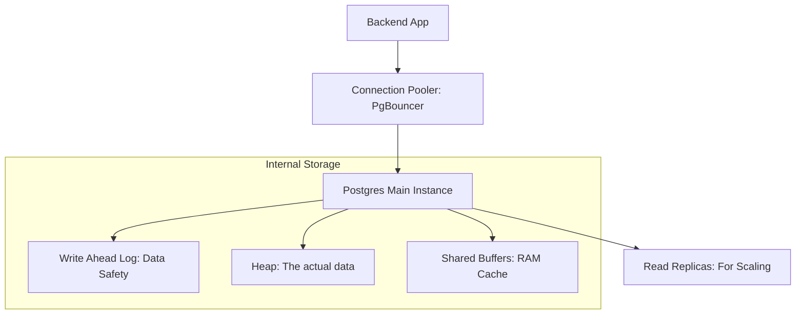

# 🐘 PostgreSQL Complete Guide: The King of Databases
> **Objective:** Master the most advanced and flexible relational database in the world | **Language:** Hinglish | **Standard:** 2026 Expert Framework

---

## 🧭 1. Beginner-Friendly Hinglish Explanation
PostgreSQL (Postgres) backend engineering ka "All-rounder" player hai. 

- **Why Postgres?** Ye sirf SQL nahi hai. Ye JSON, Vectors (AI), aur Geographic data (Maps) sab handle kar leta hai. 
- **The Power:** Ye "ACID" compliant hai—iska matlab hai ki banking systems jaise apps jahan data ki correctness sabse important hai, wahan Postgres hi use hota hai.
- **The Flexibility:** Aap isme "Extensions" daal sakte hain (e.g., `PostGIS` for maps, `pgvector` for AI).

Simple words mein: Agar aapko 2026 mein sirf ek DB seekhna hai, toh wo **PostgreSQL** hona chahiye.

---

## 🧠 2. Deep Technical Explanation
PostgreSQL is an **Object-Relational Database Management System (ORDBMS)** known for extensibility and standards compliance.

### 1. MVCC (Multi-Version Concurrency Control):
Postgres handles multiple users at once by giving each a "Snapshot" of the data. This avoids "Locking" the entire table when someone is reading, making it very fast for high-traffic apps.

### 2. Advanced Data Types:
- **JSONB:** Binary version of JSON that is indexed and fast to query.
- **UUID:** Globally unique identifiers (Better than integer IDs for distributed systems).
- **Array:** Storing a list of items directly in a column.

### 3. Extension Architecture:
Postgres allows plugins.
- **pg_stat_statements:** To track slow queries.
- **pgvector:** To store and search embeddings for RAG-based AI applications.

---

## 🏗️ 3. Architecture Diagrams (The Postgres Workflow)


---

## 💻 4. Production-Ready Examples (Using JSONB and pgvector)
```sql
-- 2026 Standard: Hybrid Relational + AI Workloads

-- 1. Create table with JSONB and Vector
CREATE TABLE products (
    id UUID PRIMARY KEY DEFAULT gen_random_uuid(),
    name TEXT NOT NULL,
    metadata JSONB, -- Flexible attributes
    embedding VECTOR(1536) -- AI embeddings from OpenAI
);

-- 2. Querying JSONB
SELECT name FROM products 
WHERE metadata @> '{"category": "electronics"}';

-- 3. Vector Similarity Search (Find similar products)
SELECT name, 1 - (embedding <=> '[0.1, 0.2, ...]') AS similarity
FROM products
ORDER BY similarity DESC
LIMIT 5;
```

---

## 🌍 5. Real-World Use Cases
- **Enterprise SaaS:** Using JSONB for custom fields and Multi-tenancy.
- **AI Agents:** Using `pgvector` to store long-term memory for bots.
- **Geo-location Apps:** Using `PostGIS` to calculate the distance between two points (e.g., Uber/Zomato).

---

## ❌ 6. Failure Cases
- **Connection Exhaustion:** Opening a new connection for every request. **Fix: Use a Connection Pool (PgBouncer).**
- **Bloat:** Postgres keeps old versions of rows (MVCC). If you don't "Vacuum" correctly, the DB becomes massive and slow.
- **Index Overload:** Having 20 indexes on a table slows down every `INSERT`.

---

## 🛠️ 7. Debugging Section
| Problem | Diagnostic Command | Fix |
| :--- | :--- | :--- |
| **Slow Query** | `EXPLAIN ANALYZE SELECT...` | Add missing Index or rewrite query. |
| **Out of Memory** | `shared_buffers` / `work_mem` | Tune your `postgresql.conf` settings. |
| **Too many connections** | `show max_connections;` | Use **PgBouncer**. |

---

## ⚖️ 8. Tradeoffs
- **Postgres vs MySQL:** Richer features and extensions vs Slightly easier to manage and faster for simple read-heavy apps.
- **Postgres vs MongoDB:** Structured/Safe vs Flexible/Easy for rapid prototyping.

---

## 🛡️ 9. Security Concerns
- **Row Level Security (RLS):** Creating policies so that a user can only see their own rows, even if they bypass the application logic.
- **SSL Connections:** Always encrypt the connection between Node.js and Postgres.

---

## 📈 10. Scaling Challenges
- **Vertical Scaling Limit:** Eventually, one server isn't enough.
- **Write Scaling:** You need **Sharding** (using tools like Citus) to split writes across multiple nodes.

---

## 💸 11. Cost Considerations
- **IOPS (Input/Output per second):** Most cloud providers charge for the speed of the disk. Ensure your indexes are in RAM to save IOPS cost.

---

## ✅ 12. Best Practices
- **Use Migrations** (Prisma/Drizzle) to change the schema. Never do it manually.
- **Always use UUIDs** for primary keys in new projects.
- **Regularly monitor 'Slow Query Logs'.**

---

## ⚠️ 13. Common Mistakes
- **Forgetting to Vacuum:** Leading to database "Bloat".
- **Storing large Blobs (Images/Files) in the DB.** (Solution: Use S3 and store the URL in Postgres).

---

## 📝 14. Interview Questions
1. "How does MVCC work in PostgreSQL?"
2. "What is the difference between JSON and JSONB in Postgres?"
3. "Explain Row Level Security (RLS) and its use case."

---

## 🚀 15. Latest 2026 Production Patterns
- **Edge Deployment:** Using Neon or Supabase to run Postgres as close to the user as possible.
- **Logical Replication:** Moving data between different versions of Postgres or to a data warehouse (BigQuery) in real-time.
- **Unlogged Tables:** Using special tables for ephemeral data that don't need crash recovery (much faster).
漫
