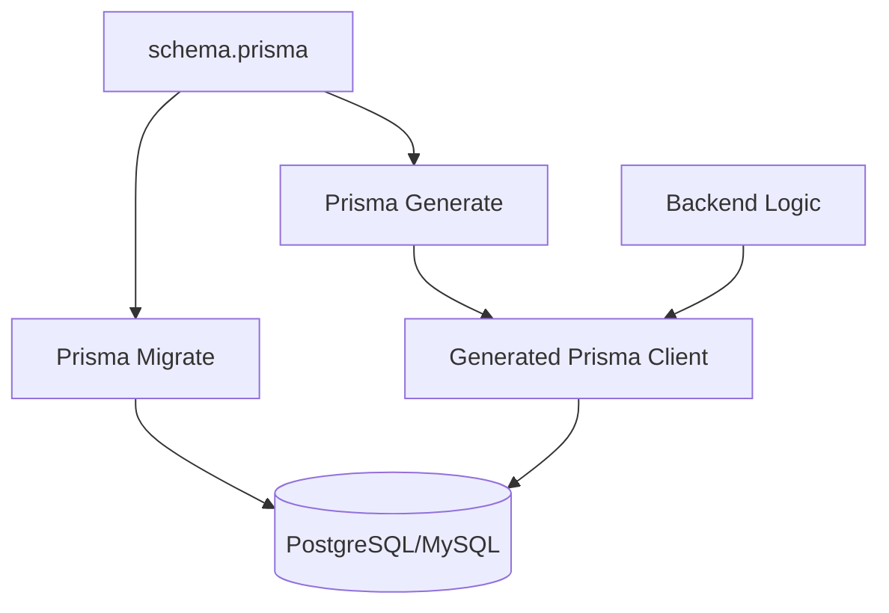

# 💎 Prisma Complete Guide: Next-Generation Node.js ORM
> **Objective:** Master the industry's most developer-friendly database toolkit | **Language:** Hinglish | **Standard:** 2026 Expert Framework

---

## 🧭 1. Beginner-Friendly Hinglish Explanation
Prisma 2026 mein backend engineering ka "Golden Standard" hai. 

- **The Problem:** Pehle ORMs (Sequelize/Mongoose) mein TypeScript support weak tha aur humein `models` manually define karne padte the.
- **The Solution:** Prisma ek `schema.prisma` file use karta hai jahan aap apna database model likhte hain.
- **The Magic:** Jab aap `npx prisma generate` chalate hain, toh Prisma ek "Client" create karta hai jo **100% Type-Safe** hota hai. Aapko VS Code mein auto-complete milta hai ki kaunse fields available hain.
- **Why it matters:** Typos khatam ho jate hain aur "Runtime errors" DB calls mein zero ho jate hain.

---

## 🧠 2. Deep Technical Explanation
### 1. Prisma Architecture:
Prisma consists of three main parts:
- **Prisma Schema:** The single source of truth for your data model.
- **Prisma Client:** An auto-generated and type-safe query builder for Node.js & TypeScript.
- **Prisma Migrate:** A declarative migration system that maps your schema to your DB.

### 2. The Engine:
Prisma uses a Query Engine (written in Rust) that sits between your JS code and the database. It optimizes queries and handles connection pooling efficiently.

### 3. Introspection:
If you have an existing database, Prisma can "Introspect" it and automatically create the `schema.prisma` file for you.

---

## 🏗️ 3. Architecture Diagrams (The Prisma Workflow)


---

## 💻 4. Production-Ready Examples (Schema & CRUD)
```prisma
// 1. schema.prisma
model User {
  id    String @id @default(uuid())
  email String @unique
  posts Post[]
}

model Post {
  id       String @id @default(uuid())
  title    String
  author   User   @relation(fields: [authorId], references: [id])
  authorId String
}
```

```typescript
// 2. Type-Safe Usage in Code
import { PrismaClient } from '@prisma/client';
const prisma = new PrismaClient();

async function createPostWithAuthor(email: string, title: string) {
  return await prisma.post.create({
    data: {
      title,
      author: {
        connect: { email } // Linking to existing user
      }
    },
    include: { author: true } // Eager loading the author details
  });
}
```

---

## 🌍 5. Real-World Use Cases
- **Rapid Prototyping:** Building a complex database structure in minutes.
- **Enterprise Apps:** Ensuring that a team of 50 developers all use the same data types and schema.
- **Serverless Backends:** Using Prisma with Neon/PlanetScale for auto-scaling DBs.

---

## ❌ 6. Failure Cases
- **Over-Fetching with `include`:** Eager loading 10 relations when you only need one. This causes heavy SQL `JOIN`s.
- **Migration Drift:** Manually changing the DB schema via GUI instead of using Prisma Migrate.
- **Startup Latency:** The Rust engine can add a small "Cold Start" delay in AWS Lambda.

---

## 🛠️ 7. Debugging Section
| Command | Purpose | Tip |
| :--- | :--- | :--- |
| **`npx prisma studio`** | Visual GUI | A beautiful browser interface to see/edit your data. |
| **`npx prisma validate`** | Schema Check | Verifies if your `.prisma` file is valid. |
| **`prisma.$on('query')`** | Query Logs | Enable this to see raw SQL in your console. |

---

## ⚖️ 8. Tradeoffs
- **Type Safety vs Control:** Prisma offers the best type safety but gives less control over raw SQL compared to Drizzle or Knex.

---

## 🛡️ 9. Security Concerns
- **Sensitive Data:** Use `@ignore` or `@map` carefully. Ensure you never include `password` fields in default `findMany` queries by using the `select` clause.

---

## 📈 10. Scaling Challenges
- **Connection Limits:** In serverless, each Lambda can open a connection. Use **Prisma Accelerate** or **PgBouncer** to manage connection limits.

---

## 💸 11. Cost Considerations
- **Prisma Accelerate:** A paid service by Prisma to handle connection pooling and global caching.

---

## ✅ 12. Best Practices
- **Use UUIDs or CUIDs** for IDs.
- **Keep your Schema organized.**
- **Use `prisma.$transaction` for multi-step updates.**
- **Prefer `select` over `include`** to only fetch what you need.

---

## ⚠️ 13. Common Mistakes
- **Forgetting `npx prisma generate`** after changing the schema.
- **Not handling Prisma Client instantiation correctly** (Always export a single instance of `new PrismaClient()`).

---

## 📝 14. Interview Questions
1. "How does Prisma handle migrations differently than Sequelize?"
2. "What is the difference between `select` and `include` in Prisma?"
3. "Explain the role of the Prisma Schema file."

---

## 🚀 15. Latest 2026 Production Patterns
- **Prisma Accelerate:** Global database caching at the edge.
- **TypedSQL:** A new feature to write raw SQL with full TypeScript safety.
- **Multi-schema Support:** Managing multiple database schemas in one Prisma project.
漫
