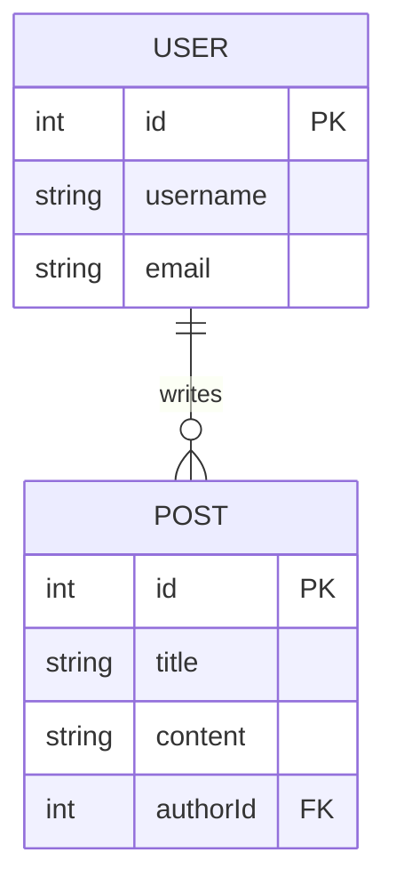

# 🗄️ SQL Fundamentals: The Language of Data
> **Objective:** Master the core principles of Relational Databases | **Language:** Hinglish | **Standard:** 2026 Expert Framework

---

## 🧭 1. Beginner-Friendly Hinglish Explanation
SQL (Structured Query Language) databases mein data ko "Tables" mein store kiya jata hai—bilkul ek Excel sheet ki tarah.

- **The Tables:** Har table ka ek fixed structure hota hai (Columns).
- **The Rows:** Har row ek individual entry hoti hai (e.g., ek user).
- **Relationships:** SQL ki asli shakti uski "Relationships" mein hai. 
  - Ek User ke paas bahut saare Posts ho sakte hain (One-to-Many).
  - Hum in tables ko "Join" karke complex data nikal sakte hain.
- **The Rule:** Data "Clean" hona chahiye. SQL ensure karta hai ki aap galat format ka data store na karein.

---

## 🧠 2. Deep Technical Explanation
### 1. Relational Model:
Data is organized into predefined schemas. Every table has a **Primary Key** (Unique ID) and can have **Foreign Keys** that link to other tables.

### 2. Basic CRUD Operations:
- **CREATE:** `INSERT INTO users (name) VALUES ('Aryan');`
- **READ:** `SELECT * FROM users WHERE id = 1;`
- **UPDATE:** `UPDATE users SET name = 'New Name' WHERE id = 1;`
- **DELETE:** `DELETE FROM users WHERE id = 1;`

### 3. JOINS:
- **INNER JOIN:** Returns records that have matching values in both tables.
- **LEFT JOIN:** Returns all records from the left table and matched records from the right.

### 4. Constraints:
- `NOT NULL`: Column cannot be empty.
- `UNIQUE`: Values must be unique.
- `CHECK`: Ensures values meet a specific condition (e.g., `age > 18`).

---

## 🏗️ 3. Architecture Diagrams (Table Relationships)


---

## 💻 4. Production-Ready Examples (Advanced Queries)
```sql
-- 2026 Standard: Complex Aggregations and Joins

-- Scenario: Get top 5 users with the most posts in the last 30 days
SELECT 
    u.username, 
    COUNT(p.id) as total_posts
FROM 
    users u
INNER JOIN 
    posts p ON u.id = p.author_id
WHERE 
    p.created_at >= NOW() - INTERVAL '30 days'
GROUP BY 
    u.id
ORDER BY 
    total_posts DESC
LIMIT 5;

-- Insight: Always use INNER JOIN instead of cross-join (逗号) 
-- for performance and readability.
```

---

## 🌍 5. Real-World Use Cases
- **Banking Systems:** Where transaction integrity and mathematical accuracy are critical.
- **ERP/CRM:** Handling complex relationships between customers, orders, and products.
- **Reporting:** Generating complex business insights by joining dozens of tables.

---

## ❌ 6. Failure Cases
- **SQL Injection:** Passing user input directly into a query string. **Fix: Use Parameterized Queries.**
- **Missing Indexes:** Searching through millions of rows without an index (Sequential Scan), making the API extremely slow.
- **N+1 Queries:** Fetching items in a loop instead of using a single `JOIN`.

---

## 🛠️ 7. Debugging Section
| Tool | Purpose | Tip |
| :--- | :--- | :--- |
| **EXPLAIN ANALYZE** | Query Profiling | Use it to see exactly how the DB is running your query and where it's slow. |
| **DBeaver / TablePlus** | GUI Management | Great for visual database management. |
| **SQL Linter** | Formatting | Keep your queries readable and standardized. |

---

## ⚖️ 8. Tradeoffs
- **Relational (SQL) vs NoSQL:** Schema rigidity and strong consistency vs Schema flexibility and high-speed writes.

---

## 🛡️ 9. Security Concerns
- **Least Privilege:** The backend DB user should only have permissions for the tables it needs. Never use `root` or `admin` in your app.
- **Encryption at Rest:** Ensure the cloud provider encrypts your DB disk.

---

## 📈 10. Scaling Challenges
- **Write Heavy Workloads:** SQL databases are usually harder to scale horizontally for writes compared to NoSQL. (Solution: **Sharding** or **Read Replicas**).

---

## 💸 11. Cost Considerations
- **Managed DBs:** AWS RDS or Google Cloud SQL are more expensive than running your own Postgres on EC2 but save massive "Admin Time".

---

## ✅ 12. Best Practices
- **Use snake_case for table and column names.**
- **Always have a primary key (id).**
- **Use meaningful data types** (e.g., `INT` for age, `VARCHAR` for name).
- **Index your Foreign Keys.**

---

## ⚠️ 13. Common Mistakes
- **Storing Passwords in Plaintext:** Always hash them before saving.
- **Selecting everything (`SELECT *`):** Only fetch the columns you actually need to save bandwidth.

---

## 📝 14. Interview Questions
1. "What is the difference between INNER JOIN and LEFT JOIN?"
2. "How would you prevent SQL Injection in a Node.js application?"
3. "Explain the purpose of the GROUP BY clause."

---

## 🚀 15. Latest 2026 Production Patterns
- **JSONB in SQL:** Storing semi-structured data inside relational tables (available in Postgres).
- **Serverless SQL:** Databases like Neon or PlanetScale that scale down to zero when not in use.
- **Vector Extensions (pgvector):** Storing and searching AI embeddings directly inside PostgreSQL.
漫
