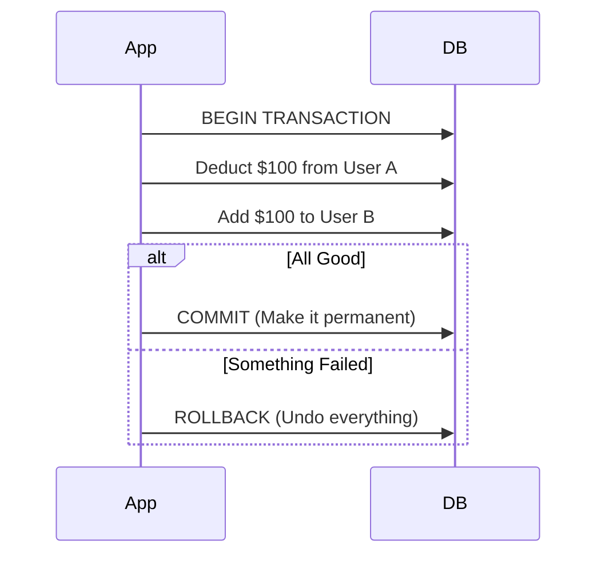

# 💎 Transactions and ACID: Ensuring Data Integrity
> **Objective:** Master "All or Nothing" operations in databases | **Language:** Hinglish | **Standard:** 2026 Expert Framework

---

## 🧭 1. Beginner-Friendly Hinglish Explanation
Transaction ka matlab hai "Ya toh sab hoga, ya kuch nahi hoga".

- **The Problem:** Sochiye aap bank se paise transfer kar rahe hain. 
  1. Aapke account se $\$100$ deduct huye.
  2. Par server crash ho gaya aur saamne wale ke account mein paise nahi pahunche.
  3. Ab aapka $\$100$ gayab!
- **The Solution:** Hum in steps ko ek "Transaction" mein band karte hain. Agar koi bhi step fail hua, toh database "Rollback" kar deta hai—matlab wo sab kuch waisa hi kar deta hai jaisa shuruat mein tha.
- **The Goal:** Data ko humesha "Sahi" (Consistent) rakhna.

---

## 🧠 2. Deep Technical Explanation
### 1. ACID Properties:
- **A - Atomicity:** The transaction is a single unit of work. Either everything succeeds or nothing does.
- **C - Consistency:** The database moves from one valid state to another. Constraints (like `NOT NULL`) are never violated.
- **I - Isolation:** Transactions running simultaneously don't interfere with each other. One transaction shouldn't see "half-done" work of another.
- **D - Durability:** Once a transaction is committed, it stays saved even if the power goes out or the system crashes.

### 2. Isolation Levels:
- **Read Uncommitted:** Can see "Dirty reads" (fastest, least safe).
- **Read Committed (Default in Postgres):** Can only see data that has been saved.
- **Repeatable Read:** Ensures that if you read a row twice, it won't change.
- **Serializable:** Transactions run as if they were one after another (slowest, safest).

---

## 🏗️ 3. Architecture Diagrams (Commit vs Rollback)


---

## 💻 4. Production-Ready Examples (Prisma Transaction)
```typescript
// 2026 Standard: Handling Financial Logic with Transactions

import { PrismaClient } from '@prisma/client';
const prisma = new PrismaClient();

async function transferFunds(fromId: string, toId: string, amount: number) {
  try {
    await prisma.$transaction(async (tx) => {
      // 1. Check balance
      const sender = await tx.user.update({
        where: { id: fromId },
        data: { balance: { decrement: amount } }
      });

      if (sender.balance < 0) {
        throw new Error("Insufficient funds"); // Triggers Rollback!
      }

      // 2. Add to receiver
      await tx.user.update({
        where: { id: toId },
        data: { balance: { increment: amount } }
      });
    });
    
    console.log("Transaction Successful!");
  } catch (error) {
    console.error("Transaction Failed and Rollbacked:", error.message);
  }
}
```

---

## 🌍 5. Real-World Use Cases
- **Banking/Payments:** Money transfers.
- **E-commerce:** Deducting stock and creating an order simultaneously.
- **User Registration:** Creating a User record and a Profile record together.

---

## ❌ 6. Failure Cases
- **Deadlocks:** Transaction A is waiting for B, and B is waiting for A. Both hang forever. (Solution: Access tables in the same order).
- **Long-running Transactions:** Keeping a transaction open for 1 minute blocks other users from updating those rows.
- **Incorrect Isolation Level:** Seeing "Phantom Reads" in a reporting query because someone else is adding data.

---

## 🛠️ 7. Debugging Section
| Problem | Diagnostic | Solution |
| :--- | :--- | :--- |
| **Hanging Queries** | `pg_stat_activity` | Identify and kill idle transactions. |
| **Serialization Failure** | Error message: "Could not serialize" | Retry the transaction automatically. |
| **Dirty Data** | Isolation Level check | Increase isolation to 'Read Committed'. |

---

## ⚖️ 8. Tradeoffs
- **High Consistency (Serializable) vs High Performance (Read Committed):** Safety vs Speed.

---

## 🛡️ 9. Security Concerns
- **Race Conditions:** An attacker trying to spend money twice at the exact same millisecond. **Fix: Use Pessimistic Locking (`SELECT FOR UPDATE`).**

---

## 📈 10. Scaling Challenges
- **Distributed Transactions:** In microservices, ACID is hard because the data is in two different databases. (Solution: **Saga Pattern** or **Two-Phase Commit**).

---

## 💸 11. Cost Considerations
- **Resource Locking:** Locked rows consume server resources. Keep transactions short and fast.

---

## ✅ 12. Best Practices
- **Keep transactions as short as possible.**
- **Never perform network calls (External APIs) inside a DB transaction.**
- **Always handle the Rollback case.**

---

## ⚠️ 13. Common Mistakes
- **Forgetting to BEGIN or COMMIT** (Usually handled by ORMs).
- **Assuming all NoSQL databases support ACID** (Many don't, or only support it for single documents).

---

## 📝 14. Interview Questions
1. "What are the ACID properties? Explain with an example."
2. "What is a Deadlock and how can you prevent it?"
3. "Explain the difference between Optimistic and Pessimistic locking."

---

## 🚀 15. Latest 2026 Production Patterns
- **Interactive Transactions (Prisma):** Allowing complex logic inside the transaction block with a shared context.
- **Read-Only Transactions:** Telling the DB a transaction is read-only to optimize the internal snapshot logic.
- **Global ACID:** New cloud databases like CockroachDB or Google Spanner that provide ACID across multiple countries.
漫
