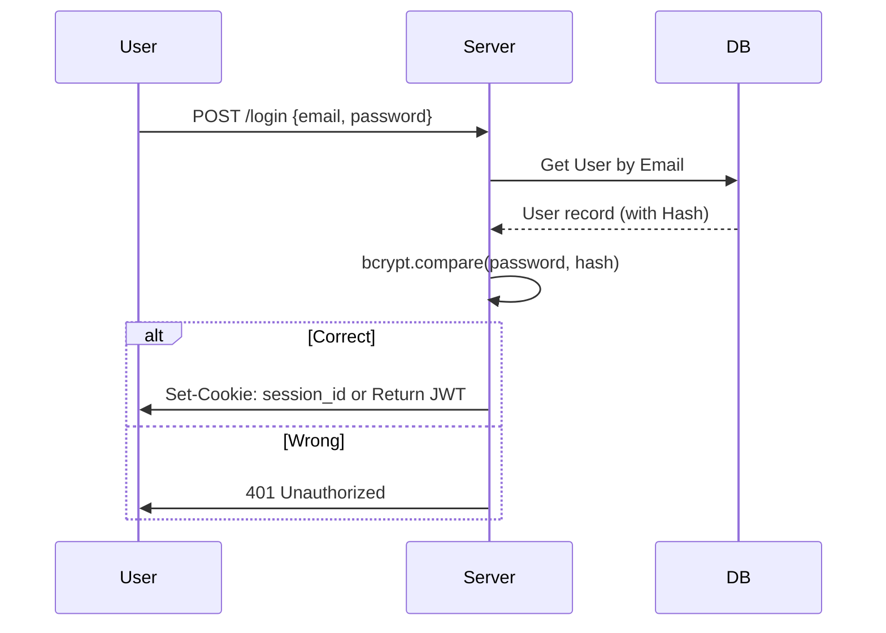

# 🔐 Authentication Fundamentals: Identifying your Users
> **Objective:** Master the core principles of identity and access | **Language:** Hinglish | **Standard:** 2026 Expert Framework

---

## 🧭 1. Beginner-Friendly Hinglish Explanation
Authentication (AuthN) ka matlab hai: "Aap kaun hain?" (Who are you?).

- **The Difference:**
  - **Authentication:** Maan lijiye aap ek office building mein enter kar rahe hain. Guard aapka ID card check karta hai. Ye "Authentication" hai.
  - **Authorization:** Ek baar aap andar aa gaye, toh kya aap CEO ke office mein ja sakte hain? Ye "Authorization" hai.
- **The Core Parts:**
  - **Credentials:** Username, Password, OTP, ya Biometrics.
  - **Persistence:** Server ko kaise yaad rahega ki aapne 5 minute pehle login kiya tha? (Using Cookies/Tokens).
- **The Golden Rule:** **"Never Store Passwords in Plaintext"**. Humesha password ko Hash karke save karein.

---

## 🧠 2. Deep Technical Explanation
### 1. The Auth Process:
1.  **Identification:** User provides a unique identifier (email/username).
2.  **Verification:** User provides a secret (password/token).
3.  **Tokenization:** Server generates a persistent proof of identity (JWT/Session ID).
4.  **Handover:** Proof is sent to the client (Cookie/Header).

### 2. Hashing vs Encryption:
- **Hashing (One-way):** You cannot get the password back from the hash. Used for passwords (e.g., `bcrypt`, `argon2`).
- **Encryption (Two-way):** You can decrypt it with a key. Used for sensitive data like credit card numbers.

### 3. Salt and Pepper:
- **Salt:** A random string added to each password before hashing to prevent "Rainbow Table" attacks.
- **Pepper:** A secret key stored in your environment config (not the DB) to add another layer of security.

---

## 🏗️ 3. Architecture Diagrams (The Auth Flow)


---

## 💻 4. Production-Ready Examples (Password Hashing)
```typescript
// 2026 Standard: Using Argon2 for Secure Password Storage

import argon2 from 'argon2';

const hashPassword = async (password: string) => {
  // Argon2 is the industry standard in 2026 over Bcrypt
  return await argon2.hash(password);
};

const verifyPassword = async (password: string, hash: string) => {
  try {
    if (await argon2.verify(hash, password)) {
      return true;
    } else {
      return false;
    }
  } catch (err) {
    // Internal error
    return false;
  }
};

// Usage
const myHash = await hashPassword("super-secret-123");
const isValid = await verifyPassword("super-secret-123", myHash);
```

---

## 🌍 5. Real-World Use Cases
- **Blogging Platforms:** Allowing users to log in via email/password.
- **Banking:** Multi-factor authentication (Password + OTP).
- **SaaS:** Enterprise login using SSO (Single Sign-On).

---

## ❌ 6. Failure Cases
- **Storing Passwords in Plaintext:** A single database leak compromises every user's account.
- **Weak Hashing Algorithms:** Using `MD5` or `SHA1` which can be cracked in seconds.
- **No Rate Limiting on Login:** Allowing a hacker to try a million passwords in an hour.

---

## 🛠️ 7. Debugging Section
| Problem | Diagnostic | Solution |
| :--- | :--- | :--- |
| **Password match fails** | Check the Salt | Ensure you're comparing the raw password with the hash from the DB. |
| **Auth headers missing** | Browser Network Tab | Check if the frontend is correctly sending the `Authorization` header. |
| **Session Expired** | Check TTL | Ensure your token/cookie expiry is long enough. |

---

## ⚖️ 8. Tradeoffs
- **Custom Auth vs Auth Providers:** Building your own auth (Full control) vs using Auth0/Clerk (Fast/Safe but expensive).
- **JWT vs Sessions:** Stateless/Scalable vs Stateful/Revocable.

---

## 🛡️ 9. Security Concerns
- **Brute Force:** Trying every combination. **Fix: Rate limiting and account lockout.**
- **Credential Stuffing:** Using passwords leaked from other sites. **Fix: Mandatory 2FA for sensitive accounts.**

---

## 📈 10. Scaling Challenges
- **Auth Service Bottleneck:** When every request needs an auth check, the auth service can become a single point of failure. (Solution: **Edge Auth** or **JWT**).

---

## 💸 11. Cost Considerations
- **SMS OTPs:** Sending SMS is expensive. Use **Authenticator Apps (TOTP)** or **Email** to save costs.

---

## ✅ 12. Best Practices
- **Use Argon2 or Bcrypt.**
- **Implement 2FA** for sensitive applications.
- **Use Secure, HTTP-Only cookies** for session identifiers.
- **Never return the password hash** in any API response.

---

## ⚠️ 13. Common Mistakes
- **Assuming HTTPS is enough** (You still need to hash).
- **Hardcoding the 'Pepper'** in the source code.
- **Not validating email format** before trying to find a user.

---

## 📝 14. Interview Questions
1. "What is the difference between Hashing and Encryption?"
2. "Why is 'Salting' important for password storage?"
3. "Explain the difference between Authentication and Authorization."

---

## 🚀 15. Latest 2026 Production Patterns
- **Passkeys (WebAuthn):** Moving away from passwords entirely to device-based biometrics.
- **Magic Links:** Passwordless login via secure email links.
- **Social Login (OAuth 2.1):** Simplified Google/GitHub logins with stricter security standards.
漫
