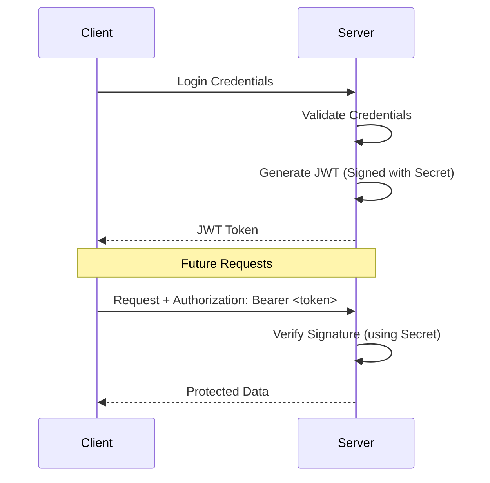

# 🔑 JWT Authentication: Stateless Identity
> **Objective:** Master JSON Web Tokens for secure, scalable backends | **Language:** Hinglish | **Standard:** 2026 Expert Framework

---

## 🧭 1. Beginner-Friendly Hinglish Explanation
JWT (JSON Web Token) ek "ID Card" ki tarah hai jo server ne sign kiya hai.

- **The Problem:** Har baar login check karne ke liye Database ko hit karna slow hai.
- **The Solution:** Jab user login karta hai, server ek token bana kar deta hai jisme user ki details (id, name, role) hoti hain.
- **The Signature:** Server is token ko ek "Secret Key" se sign karta hai. Iska matlab user details change nahi kar sakta (otherwise signature mismatch ho jayega).
- **Statelessness:** Server ko session yaad rakhne ki zaroorat nahi. User bas har request ke saath ye token bhejta hai aur server ise "Verify" kar leta hai bina DB check kiye.

---

## 🧠 2. Deep Technical Explanation
### 1. Anatomy of a JWT:
A JWT consists of three parts separated by dots (`.`):
1.  **Header:** Algorithm used (`HS256`) and type (`JWT`).
2.  **Payload:** Claims (Data) like `userId`, `exp` (Expiry), and `iat` (Issued at).
3.  **Signature:** Created by taking the encoded header, encoded payload, and a secret, then hashing them together.

### 2. How it works:
- **Client:** Stores JWT in `localStorage` or (better) a **Secure Cookie**.
- **Backend:** Receives the token in the `Authorization: Bearer <token>` header.
- **Verification:** The backend uses the Secret Key to re-hash the header/payload. If it matches the signature, the token is valid.

### 3. Claims:
- **Registered Claims:** Standard ones like `sub`, `iat`, `exp`.
- **Public/Private Claims:** Custom data you add.

---

## 🏗️ 3. Architecture Diagrams (The Stateless Flow)


---

## 💻 4. Production-Ready Examples (JWT in Node.js)
```typescript
// 2026 Standard: Using jsonwebtoken with Strong Types

import jwt from 'jsonwebtoken';

const JWT_SECRET = process.env.JWT_SECRET || 'fallback-secret';

// 1. Generate Token
const generateToken = (userId: string) => {
  return jwt.sign(
    { userId }, 
    JWT_SECRET, 
    { expiresIn: '1h' } // Always set an expiry!
  );
};

// 2. Verify Token Middleware
const authMiddleware = (req: any, res: any, next: any) => {
  const authHeader = req.headers.authorization;
  
  if (!authHeader?.startsWith('Bearer ')) {
    return res.status(401).json({ message: "No Token Provided" });
  }

  const token = authHeader.split(' ')[1];

  try {
    const decoded = jwt.verify(token, JWT_SECRET);
    req.user = decoded; // Attach user to request
    next();
  } catch (err) {
    return res.status(401).json({ message: "Invalid or Expired Token" });
  }
};
```

---

## 🌍 5. Real-World Use Cases
- **Single Page Applications (SPA):** Keeping users logged in without server-side sessions.
- **Mobile Apps:** Stable authentication that survives app restarts.
- **Microservices:** Passing user identity between services securely without sharing a session database.

---

## ❌ 6. Failure Cases
- **Secret Leak:** If your `JWT_SECRET` is leaked, anyone can create fake admin tokens.
- **Huge Payloads:** Putting too much data (images, full profile) in the JWT, making every request slow.
- **No Expiry:** Creating tokens that never expire. If a token is stolen, the hacker has permanent access.
- **Revocation:** JWTs are hard to "Delete" because the server doesn't store them. If you want to force log out a user, you need a **Blacklist** in Redis.

---

## 🛠️ 7. Debugging Section
| Tool | Purpose | Tip |
| :--- | :--- | :--- |
| **jwt.io** | Token Debugger | Paste a token to see the payload. **NEVER** paste production tokens with real secrets. |
| **JsonWebTokenError** | Error Type | Catch specific errors like `TokenExpiredError`. |

---

## ⚖️ 8. Tradeoffs
- **Stateless (JWT) vs Stateful (Sessions):** Scalability vs Revocability. JWT is better for scale; Sessions are better for strict control.

---

## 🛡️ 9. Security Concerns
- **None Algorithm:** Old libraries allowed `alg: none`, letting users bypass the signature. Modern libraries disable this.
- **XSS:** If stored in `localStorage`, JWTs can be stolen by malicious scripts. **Fix: Use HttpOnly Cookies.**
- **Signature Alg:** Prefer `RS256` (Asymmetric - Public/Private keys) over `HS256` for microservices.

---

## 📈 10. Scaling Challenges
- **Token Size:** Mobile networks can be slow. Keep JWTs small (just the `userId` and `role`).

---

## 💸 11. Cost Considerations
- **CPU:** Signing and verifying JWTs uses a tiny amount of CPU. No DB costs, but compute costs might increase at massive scale.

---

## ✅ 12. Best Practices
- **Use Short-Lived Access Tokens (15m).**
- **Use Long-Lived Refresh Tokens (7d).**
- **Never store sensitive data (passwords) in JWT payload.**
- **Always use HTTPS.**

---

## ⚠️ 13. Common Mistakes
- **Hardcoding the secret.**
- **Using a weak secret** (e.g., "123456").
- **Storing JWT in `localStorage` for high-security apps.**

---

## 📝 14. Interview Questions
1. "What are the three parts of a JWT and what do they contain?"
2. "How do you invalidate a JWT before it expires?"
3. "Why should you use a 'Refresh Token' strategy with JWT?"

---

## 🚀 15. Latest 2026 Production Patterns
- **PASETO (Platform-Agnostic Security Tokens):** A safer alternative to JWT that fixes many of JWT's design flaws.
- **JWT over HTTP/3:** Faster headers for the next generation of the web.
- **Zero-Trust JWT:** Verifying tokens at the API Gateway level before the request even reaches the microservice.
漫
