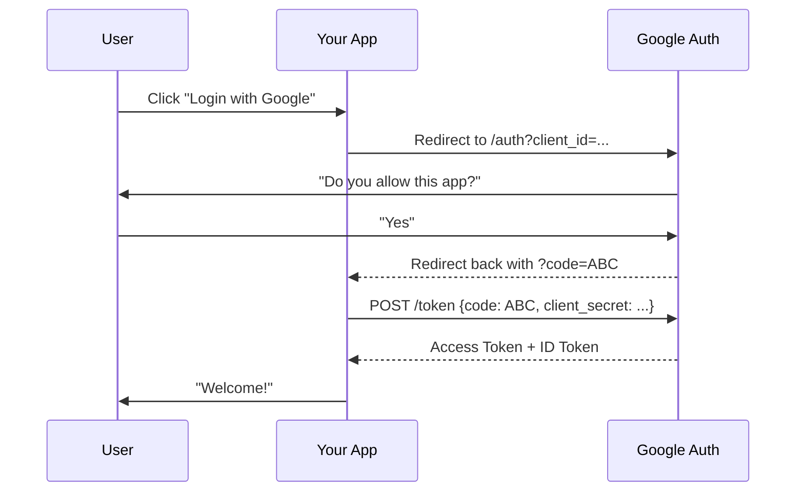

# 🔑 OAuth 2.0 and SSO: Third-Party Authentication
> **Objective:** Master secure, delegated access and Single Sign-On | **Language:** Hinglish | **Standard:** 2026 Expert Framework

---

## 🧭 1. Beginner-Friendly Hinglish Explanation
OAuth aur SSO ka matlab hai "Login with Google/GitHub/Apple".

- **The Problem:** Har nayi website par naya account banana aur password yaad rakhna users ke liye annoying hai. Aur companies ke liye passwords secure rakhna risky hai.
- **The Solution:** Kyun na hum Google se kahein: "Bhai, kya ye user sahi hai?". Agar Google 'Haan' bolta hai, toh hum user ko login karne dete hain.
- **OAuth:** Ye "Delegated Authorization" hai. Matlab user Google ko permission deta hai ki wo hamari website ko uska naam aur email bataye.
- **SSO (Single Sign-On):** Ek baar login karo (e.g., Office account) aur saari internal apps (Slack, Jira, Zoom) automatically login ho jayein.

---

## 🧠 2. Deep Technical Explanation
### 1. OAuth 2.0 Roles:
- **Resource Owner:** The User.
- **Client:** Your Application (The one wanting access).
- **Authorization Server:** Google/GitHub.
- **Resource Server:** The API that holds the data (e.g., Google Profile API).

### 2. The Authorization Code Flow (The Secure Way):
1.  **Redirect:** User clicks "Login with Google". You redirect them to Google's login page.
2.  **Consent:** User says "Yes, let SusaGPT see my email".
3.  **Code:** Google redirects back to your site with a temporary **Auth Code**.
4.  **Exchange:** Your Backend sends this Code + Client Secret to Google.
5.  **Token:** Google returns an `access_token` and `id_token`.

### 3. OIDC (OpenID Connect):
A layer on top of OAuth 2.0 that provides identity (The `id_token` in JWT format).

---

## 🏗️ 3. Architecture Diagrams (The OAuth Dance)


---

## 💻 4. Production-Ready Examples (Passport.js + Google)
```typescript
// 2026 Standard: Implementing Google OAuth with Passport

import passport from 'passport';
import { Strategy as GoogleStrategy } from 'passport-google-oauth20';

passport.use(new GoogleStrategy({
    clientID: process.env.GOOGLE_CLIENT_ID,
    clientSecret: process.env.GOOGLE_CLIENT_SECRET,
    callbackURL: "/auth/google/callback"
  },
  async (accessToken, refreshToken, profile, done) => {
    // 1. Check if user exists in DB
    let user = await db.user.findUnique({ where: { googleId: profile.id } });
    
    // 2. If not, create them
    if (!user) {
      user = await db.user.create({ 
        data: { googleId: profile.id, email: profile.emails[0].value } 
      });
    }
    
    return done(null, user);
  }
));

// Routes
app.get('/auth/google', passport.authenticate('google', { scope: ['profile', 'email'] }));
app.get('/auth/google/callback', passport.authenticate('google', { failureRedirect: '/login' }), 
  (req, res) => res.redirect('/dashboard')
);
```

---

## 🌍 5. Real-World Use Cases
- **B2C Apps:** "Login with Facebook" to reduce friction.
- **Enterprise SaaS:** Using **SAML** or **Okta** to allow employees to login with their company email.
- **API Access:** Allowing an app to "Read your Google Calendar" without giving them your password.

---

## ❌ 6. Failure Cases
- **Redirect URI Mismatch:** Hacker trying to steal the auth code by redirecting it to their own site. **Fix: Strict whitelist of URLs in the provider dashboard.**
- **Leaking Client Secret:** If your secret is in GitHub, anyone can impersonate your app.
- **CSRF in OAuth:** Not using a `state` parameter during the redirect.

---

## 🛠️ 7. Debugging Section
| Problem | Diagnostic | Solution |
| :--- | :--- | :--- |
| **"Invalid Client"** | Check Client ID/Secret | Ensure they match the provider's dashboard exactly. |
| **"Unauthorized Redirect"** | Check Callback URL | Ensure it is exactly the same (including http vs https). |
| **Token Expired** | Check `exp` claim | Use the `refreshToken` to get a new one. |

---

## ⚖️ 8. Tradeoffs
- **Custom OAuth vs managed (Firebase/Clerk):** Flexibility vs Speed and security maintenance.
- **SAML vs OAuth:** Heavy enterprise XML-based standard vs Modern JSON-based standard.

---

## 🛡️ 9. Security Concerns
- **PKCE (Proof Key for Code Exchange):** Mandatory in 2026 for mobile and SPA apps to prevent auth code interception.
- **Scope Creep:** Don't ask for "Full Google Drive access" if you only need "Email". Users will trust you less.

---

## 📈 10. Scaling Challenges
- **Multiple Providers:** Handling logic for Google, GitHub, and Apple together can get messy. Use an abstraction like **Auth.js** or **Passport**.

---

## 💸 11. Cost Considerations
- **Auth Providers:** Many providers charge per MAU (Monthly Active User) after a certain limit. Building your own is "Free" but takes months of engineering time.

---

## ✅ 12. Best Practices
- **Always use the `state` parameter.**
- **Request the minimum scope needed.**
- **Use PKCE for all client-side auth.**
- **Encrypt sensitive profile data in your DB.**

---

## ⚠️ 13. Common Mistakes
- **Assuming `id_token` is always valid** (You must verify the signature!).
- **Storing the Access Token in the frontend incorrectly.**

---

## 📝 14. Interview Questions
1. "Explain the difference between OAuth 2.0 and OpenID Connect (OIDC)."
2. "Why is the 'Authorization Code Flow' safer than the 'Implicit Flow'?"
3. "What is a 'Refresh Token' and why is it needed?"

---

## 🚀 15. Latest 2026 Production Patterns
- **OAuth 2.1:** The consolidated new standard that removes legacy, insecure flows.
- **Device Code Flow:** Authenticating on a TV or CLI by entering a code on your phone.
- **Passkeys + OAuth:** Combining biometric login with third-party identity.
漫
