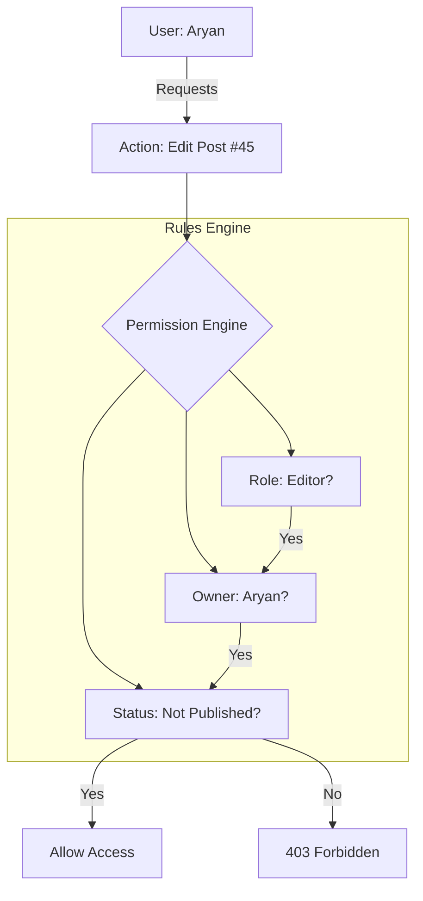

# 🛡️ Permission Systems: Fine-Grained Authorization
> **Objective:** Design deep, resource-level access control systems | **Language:** Hinglish | **Standard:** 2026 Expert Framework

---

## 🧭 1. Beginner-Friendly Hinglish Explanation
Permission Systems RBAC ka "Bada Bhai" hai. 

- **The Problem:** RBAC (Roles) keh deta hai ki "Editors edit kar sakte hain". Par kya Editor A Editor B ka post edit kar sakta hai? Nahi. 
- **The Solution:** Humein resource-level permissions chahiye. (e.g., `can_edit_post`, `is_owner`).
- **The Concept:** Permission system decide karta hai ki ek "Subject" (User) ek "Action" (Edit) kar sakta hai ek "Object" (Post) par, given specific "Conditions" (Ownership).

Sochiye ye ek "Digital Registry" hai jahan har resource ke liye likha hai ki use kaun chhu sakta hai.

---

## 🧠 2. Deep Technical Explanation
### 1. The Subjects, Actions, and Objects:
- **Subject:** The entity requesting access (User/Service).
- **Action:** The operation (Create, Read, Update, Delete).
- **Object:** The specific instance of a resource (Post #123).

### 2. ACL (Access Control List):
A list attached to an object that specifies which subjects have access to it. Common in file systems (Windows/Linux) and Cloud (AWS S3 buckets).

### 3. ABAC (Attribute-Based Access Control):
Access is granted based on attributes of the subject, object, and environment.
- *Subject:* User is in the "Marketing" department.
- *Object:* Post is in the "Draft" state.
- *Environment:* Current time is between 9 AM and 5 PM.

---

## 🏗️ 3. Architecture Diagrams (Permission Logic)


---

## 💻 4. Production-Ready Examples (Using CASL)
```typescript
// 2026 Standard: Fine-grained permissions with CASL

import { AbilityBuilder, createMongoAbility } from '@casl/ability';

const defineAbilitiesFor = (user: any) => {
  const { can, cannot, build } = new AbilityBuilder(createMongoAbility);

  if (user.role === 'ADMIN') {
    can('manage', 'all'); // Admin can do anything
  } else {
    can('read', 'Post'); // Everyone can read posts
    
    // Ownership Check: User can only update their OWN posts
    can('update', 'Post', { authorId: user.id });
    
    // Constraint: Cannot update if post is already published
    cannot('update', 'Post', { published: true }).because('Published posts are locked');
  }

  return build();
};

// Usage in Route
const ability = defineAbilitiesFor(req.user);
if (ability.can('update', targetPost)) {
  // Proceed with update...
} else {
  res.status(403).send(ability.relevantRuleFor('update', targetPost).reason);
}
```

---

## 🌍 5. Real-World Use Cases
- **Google Docs:** "Anyone with the link can view," but only "Specific users can edit."
- **GitHub:** "Maintainers" can merge PRs; "Contributors" can only open them.
- **Banking:** Managers can approve loans only up to $\$50,000$.

---

## ❌ 6. Failure Cases
- **Leaky Permissions:** Forgetting to check ownership, allowing User A to delete User B's account by just changing an ID in the URL.
- **Performance Drag:** Checking 50 different attributes and ownerships on every single API call can slow down the system. **Fix: Use Indexed permissions.**
- **Complex Policies:** Creating rules that are so complicated that even the developers don't know who has access to what.

---

## 🛠️ 7. Debugging Section
| Problem | Diagnostic | Solution |
| :--- | :--- | :--- |
| **Access Denied wrongly** | Log the "Rule" being triggered | Most libraries like CASL can tell you exactly which rule blocked the user. |
| **Data Leak** | Manual Audit / Pentest | Try to access a resource with a different user's token. |

---

## ⚖️ 8. Tradeoffs
- **Complexity vs Granularity:** Basic roles are easy; fine-grained permissions are secure but hard to build and maintain.

---

## 🛡️ 9. Security Concerns
- **Insecure Direct Object Reference (IDOR):** This is the #1 vulnerability in permission systems. Never assume that a logged-in user can access any resource ID they provide.

---

## 📈 10. Scaling Challenges
- **Large Relationship Graphs:** In a system like Facebook, "Can I see this post?" depends on "Are we friends?". This requires a specialized database like **SpiceDB (Google Zanzibar style)**.

---

## 💸 11. Cost Considerations
- **Engineering Time:** Fine-grained auth is one of the most time-consuming features to build correctly.

---

## ✅ 12. Best Practices
- **Centralize your logic.** Don't scatter `if(user.id === post.ownerId)` all over your controllers.
- **Use a proven library** (CASL, AccessControl).
- **Test your permissions** with specialized unit tests.

---

## ⚠️ 13. Common Mistakes
- **Implicit "Allow":** Always default to **"Deny All"** and explicitly grant permissions.
- **Checking permissions in UI only.**

---

## 📝 14. Interview Questions
1. "What is an IDOR vulnerability and how do you prevent it?"
2. "How would you design a permission system for a Notion-like app?"
3. "Explain the difference between ACL and ABAC."

---

## 🚀 15. Latest 2026 Production Patterns
- **Zanzibar Architecture:** Using a dedicated global service for relationship-based access control.
- **Warrant / Auth0 FGA:** Managed services that provide fine-grained authorization as an API.
- **Graph-based Auth:** Using Neo4j to quickly check "Friend of Friend" style permissions.
漫
