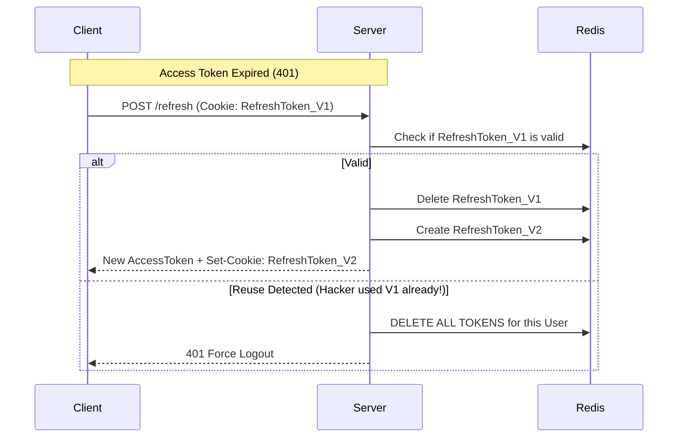

# 🔄 Refresh Tokens and Security: High-Level Persistence
> **Objective:** Balance user convenience with extreme security using dual-token strategies | **Language:** Hinglish | **Standard:** 2026 Expert Framework

---

## 🧭 1. Beginner-Friendly Hinglish Explanation
Refresh Tokens ka matlab hai: "Bar-baar login na karna pade, par security bhi bani rahe".

- **The Problem:** Agar hum ek hi JWT bana dein jo 1 saal tak chale, toh agar wo chori ho gaya, toh hacker ke paas 1 saal ka access hoga. Agar hum 15 minute ka JWT banayein, toh user ko har 15 minute mein login karna padega.
- **The Solution (The Duo):**
  1. **Access Token (Short-lived):** Ye 15 minute chalta hai. Ye requests authorize karta hai.
  2. **Refresh Token (Long-lived):** Ye 7 din chalta hai. Jab Access Token expire hota hai, ye chupke se server ke paas jata hai aur naya Access Token le aata hai. User ko pata bhi nahi chalta!
- **Security:** Refresh Token ko hum DB/Redis mein save karte hain taaki hum use "Revoke" (Cancel) kar sakein agar user phone kho de.

---

## 🧠 2. Deep Technical Explanation
### 1. Token Rotation:
Every time a Refresh Token is used to get a new Access Token, the server also issues a **NEW Refresh Token** and invalidates the old one.
- **Why?** If a hacker steals a Refresh Token and uses it, the real user will also try to use it later. The server will see the old token being reused (Token Reuse Detection) and instantly invalidate ALL sessions for that user.

### 2. Fingerprinting:
Binding a token to a specific browser or IP. If the token is used from a different device, it triggers an alert or a re-login.

### 3. Storage:
- **Access Token:** In-memory (Variables) in the frontend.
- **Refresh Token:** **HttpOnly, Secure, SameSite=Strict Cookie**. This protects it from XSS.

---

## 🏗️ 3. Architecture Diagrams (The Rotation Flow)


---

## 💻 4. Production-Ready Examples (Token Rotation Logic)
```typescript
// 2026 Standard: Implementing Refresh Token Rotation in Node.js

const handleRefresh = async (req: Request, res: Response) => {
  const oldRefreshToken = req.cookies.refreshToken;
  if (!oldRefreshToken) return res.sendStatus(401);

  // 1. Find the token in Redis/DB
  const tokenData = await redis.get(`refresh_token:${oldRefreshToken}`);
  
  if (!tokenData) {
    // 🚩 REUSE DETECTION: Someone is using an old or fake token
    const decoded: any = jwt.decode(oldRefreshToken);
    await redis.del(`user_sessions:${decoded.userId}`); // Wipe all sessions
    return res.status(403).send("Security Alert: Session compromised.");
  }

  // 2. Token is valid, rotate it
  const { userId } = JSON.parse(tokenData);
  const newAccessToken = generateAccessToken(userId);
  const newRefreshToken = generateRefreshToken(userId);

  // 3. Update Redis
  await redis.del(`refresh_token:${oldRefreshToken}`);
  await redis.set(`refresh_token:${newRefreshToken}`, JSON.stringify({ userId }), { EX: 604800 }); // 7 days

  // 4. Send back to client
  res.cookie('refreshToken', newRefreshToken, { httpOnly: true, secure: true });
  res.json({ accessToken: newAccessToken });
};
```

---

## 🌍 5. Real-World Use Cases
- **Banking Apps:** Short access tokens for high security.
- **Social Media:** Long-lived sessions so you don't have to login every time you open the app.
- **Mobile Apps:** Using Refresh Tokens stored in secure hardware enclaves.

---

## ❌ 6. Failure Cases
- **No Rotation:** Using the same Refresh Token for months.
- **Storing Refresh Token in `localStorage`:** Making it vulnerable to XSS theft.
- **Infinite Refresh:** Not having an absolute expiry (e.g., after 30 days, the user MUST re-login regardless of refresh tokens).

---

## 🛠️ 7. Debugging Section
| Status Code | Meaning | Fix |
| :--- | :--- | :--- |
| **401 Unauthorized** | Access Token Expired | Trigger the refresh flow in the frontend interceptor. |
| **403 Forbidden** | Refresh Token Invalid/Reused | Force user to re-login. |
| **Cookie not sent** | `SameSite` / `Domain` mismatch | Check your cookie configuration in the backend. |

---

## ⚖️ 8. Tradeoffs
- **Security vs Complexity:** Implementing rotation and reuse detection is much harder than a simple JWT but 10x more secure.

---

## 🛡️ 9. Security Concerns
- **XSS (Cross-Site Scripting):** Still the biggest threat. If a hacker can run JS on your site, they can't see the `HttpOnly` cookie, but they can still trigger a `/refresh` request.

---

## 📈 10. Scaling Challenges
- **Database Load:** If you have 1 million users refreshing tokens every 15 minutes, your Redis instance needs to be highly available.

---

## 💸 11. Cost Considerations
- **Storage:** Storing million of active refresh tokens in Redis takes a few GBs of RAM.

---

## ✅ 12. Best Practices
- **Use `HttpOnly` and `Secure` cookies for Refresh Tokens.**
- **Implement Token Rotation.**
- **Implement Token Reuse Detection.**
- **Use a short TTL for Access Tokens (5-15 mins).**

---

## ⚠️ 13. Common Mistakes
- **Sending the Refresh Token in the JSON body.**
- **Not having a way to "Revoke All Sessions" for a compromised user.**

---

## 📝 14. Interview Questions
1. "Why do we need a Refresh Token? Why not just a long-lived Access Token?"
2. "How does 'Refresh Token Rotation' prevent token theft?"
3. "Where should you store a Refresh Token on the frontend and why?"

---

## 🚀 15. Latest 2026 Production Patterns
- **OIDC Back-Channel Logout:** Automatically logging a user out of all linked apps when they logout from the main identity provider.
- **Sliding Sessions:** Every time the user is active, their session expiry is pushed forward.
- **Device Fingerprinting:** Using Canvas fingerprinting or WebGL info to ensure the refresh token is being used by the same browser.
漫
