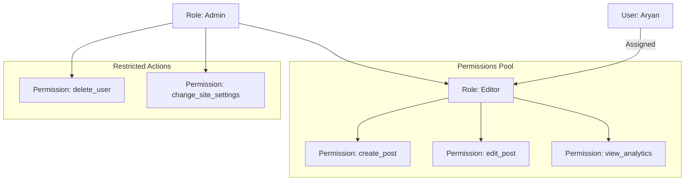

# 🎭 Role-Based Access Control (RBAC): Managing Permissions
> **Objective:** Design scalable and secure authorization systems | **Language:** Hinglish | **Standard:** 2026 Expert Framework

---

## 🧭 1. Beginner-Friendly Hinglish Explanation
RBAC ka matlab hai "Kaam ke hisab se permission dena".

- **The Problem:** Agar aapke app mein 1000 users hain, toh har user ko individually permission dena ("Ye delete kar sakta hai," "Ye sirf dekh sakta hai") ek nightmare hoga.
- **The Solution:** Hum "Roles" banate hain (e.g., ADMIN, EDITOR, USER).
  - **ADMIN:** Sab kuch kar sakta hai.
  - **EDITOR:** Article likh aur edit kar sakta hai, par user delete nahi kar sakta.
  - **USER:** Sirf apna profile dekh sakta hai.
- **The Concept:** Aap user ko role dete hain, aur role ko permission dete hain.

---

## 🧠 2. Deep Technical Explanation
### 1. The RBAC Model:
- **User:** The person logged in.
- **Role:** A group of permissions (Admin, Moderator, Customer).
- **Permission:** A specific action on a resource (e.g., `READ_USER`, `DELETE_POST`).
- **Mapping:** `User -> Role -> Permissions`.

### 2. Static vs Dynamic RBAC:
- **Static:** Roles are hardcoded (e.g., an `isAdmin` boolean in the DB). Simple but inflexible.
- **Dynamic:** Roles and their permissions are stored in the database, allowing admins to change permissions without redeploying code.

### 3. Middleware implementation:
In Express, we use a middleware that checks if the `req.user.role` matches the required role for a route.

---

## 🏗️ 3. Architecture Diagrams (The RBAC Hierarchy)


---

## 💻 4. Production-Ready Examples (RBAC Middleware)
```typescript
// 2026 Standard: Flexible RBAC Implementation

enum Role {
  USER = 'USER',
  EDITOR = 'EDITOR',
  ADMIN = 'ADMIN'
}

// 1. Authorization Middleware
const authorize = (...allowedRoles: Role[]) => {
  return (req: any, res: any, next: any) => {
    const userRole = req.user.role;

    if (!allowedRoles.includes(userRole)) {
      return res.status(403).json({ 
        message: "Forbidden: You don't have permission for this action" 
      });
    }
    next();
  };
};

// 2. Usage in Routes
app.delete('/users/:id', 
  authenticate, // Identify User
  authorize(Role.ADMIN), // Check if Admin
  (req, res) => {
    // Delete logic...
  }
);

app.post('/posts', 
  authenticate, 
  authorize(Role.ADMIN, Role.EDITOR), // Both Admin and Editor can post
  (req, res) => {
    // Create post logic...
  }
);
```

---

## 🌍 5. Real-World Use Cases
- **LMS (Learning Management System):** Teacher can create courses; Student can only view them.
- **Company Dashboard:** Managers can see team performance; Employees only see their own.
- **E-commerce:** "Support" role can cancel orders but cannot change product prices.

---

## ❌ 6. Failure Cases
- **Role Escalation:** A user finding a way to change their role from `USER` to `ADMIN` in the request body. **Fix: Only Admins can update roles.**
- **Hardcoding everything:** Making it impossible to add a new "Moderator" role without changing 50 files.
- **Checking Roles on Frontend only:** Hackers can easily bypass UI buttons. **Always check on the Backend.**

---

## 🛠️ 7. Debugging Section
| Problem | Diagnostic | Solution |
| :--- | :--- | :--- |
| **Admin gets 403** | Check Role String | Ensure DB value matches `Role.ADMIN` exactly (case-sensitive). |
| **Logic is too complex** | Nested if/else for roles | Use an **Access Control Library** like `casl` or `accesscontrol`. |

---

## ⚖️ 8. Tradeoffs
- **RBAC (Role-based) vs ABAC (Attribute-based):** Simple roles vs complex rules based on attributes (e.g., "User can edit if it's Tuesday and they are in India").

---

## 🛡️ 9. Security Concerns
- **Insecure Direct Object Reference (IDOR):** Even if I'm an `EDITOR`, can I edit *your* post? RBAC alone doesn't solve this. You need **Ownership Checks**.

---

## 📈 10. Scaling Challenges
- **Permissions Explosion:** When you have 100 roles and 1000 permissions, managing the mapping becomes a dedicated UI task.

---

## 💸 11. Cost Considerations
- **Database Reads:** Fetching a user's full permission set on every request. **Fix: Cache permissions in JWT or Redis.**

---

## ✅ 12. Best Practices
- **Follow the Principle of Least Privilege.**
- **Use meaningful role names.**
- **Default to 'USER' role for new signups.**
- **Log all 'Forbidden (403)' attempts.**

---

## ⚠️ 13. Common Mistakes
- **Using strings instead of Enums** (Typos like `Admin` vs `admin`).
- **Forgetting to check auth before checking roles.**

---

## 📝 14. Interview Questions
1. "What is the difference between Authentication and Authorization?"
2. "How would you implement a 'Super Admin' role that can bypass all checks?"
3. "Explain RBAC vs ABAC with examples."

---

## 🚀 15. Latest 2026 Production Patterns
- **CASL Library:** A powerful, isomorphic library to handle permissions on both Frontend and Backend.
- **Policy as Code:** Using **OPA (Open Policy Agent)** to define complex authorization rules outside of the application code.
- **Fine-grained Authorization (FGA):** Tools like **Auth0 FGA** or **SpiceDB** for managing billions of relationships (e.g., "User X has access to Folder Y").
漫
