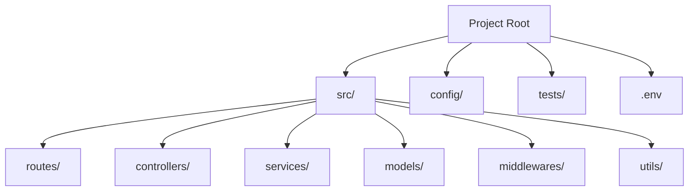

# 📂 Backend Folder Structure: The Production Blueprint
> **Objective:** Design scalable and standardized project structures | **Language:** Hinglish | **Standard:** 2026 Expert Framework

---

## 🧭 1. Beginner-Friendly Hinglish Explanation
Folder structure ka matlab hai "Apne code ki files ko sahi jagah rakhna".

- **The Problem:** Agar aap saara code ek hi `index.js` mein likh denge, toh 1 mahine baad aapko khud samajh nahi aayega ki kya kahan hai.
- **The Solution:** Humein ek "Standard" follow karna chahiye jo industry-ready ho.
- **The Philosophy:** "Co-location". Related files ko paas rakho, aur responsibilities ko alag karo.
- **Intuition:** Ye ek library ki tarah hai. "History" ki books history section mein, "Science" ki science mein. 

---

## 🧠 2. Deep Technical Explanation
### 1. The Anatomy of a Production App:
- **`src/`:** The core source code.
- **`config/`:** Environment variables and global settings.
- **`controllers/`:** Request handlers.
- **`services/`:** Business logic.
- **`models/`:** Database schemas.
- **`routes/`:** URL endpoints mapping.
- **`middlewares/`:** Auth, logging, error handling.
- **`utils/` / `helpers/`:** Small utility functions.
- **`tests/`:** Unit and integration tests.

### 2. Feature-based vs Layer-based:
- **Layer-based:** All controllers in one folder, all services in another. (Standard for small/medium apps).
- **Feature-based:** `modules/users/`, `modules/orders/` - Each containing its own controllers/services. (Best for giant microservices).

---

## 🏗️ 3. Architecture Diagrams (The Blueprint)


---

## 💻 4. Production-Ready Examples (The Ideal Structure)
```text
my-backend-app/
├── node_modules/
├── src/
│   ├── app.ts            # App initialization
│   ├── server.ts         # Server start logic
│   ├── config/           # Database, Auth config
│   ├── constants/        # Fixed values (Status codes)
│   ├── controllers/      # Handlers (req, res)
│   ├── middlewares/      # auth.ts, error.ts, logger.ts
│   ├── models/           # Prisma/Mongoose schemas
│   ├── routes/           # index.ts (merges all routes)
│   ├── services/         # Business logic
│   ├── types/            # TypeScript interfaces
│   └── utils/            # catchAsync.ts, AppError.ts
├── tests/                # __tests__/
├── .env                  # Secrets (gitignored)
├── .gitignore
├── package.json
└── tsconfig.json
```

---

## 🌍 5. Real-World Use Cases
- **Enterprise APIs:** Where 20+ developers need to know exactly where to find the 'Email Service'.
- **Open Source Projects:** To make it easy for contributors to understand the codebase.
- **Microservices:** Keeping each service small but perfectly organized.

---

## ❌ 6. Failure Cases
- **Circular Imports:** Folder A imports B, and B imports A because logic is mixed up.
- **Deep Nesting:** Folders like `src/logic/business/users/v1/helpers/`. **Fix: Keep it shallow.**
- **Hidden Logic:** Putting important business logic in a `utils/` file.

---

## 🛠️ 7. Debugging Section
| Problem | Diagnostic | Solution |
| :--- | :--- | :--- |
| **Import Error** | File path wrong | Use **Path Aliases** (e.g., `@/controllers/user`). |
| **Logic Conflict** | Duplicate code | Move shared logic to a `Service` or `Utility`. |

---

## ⚖️ 8. Tradeoffs
- **Complexity vs Cleanliness:** A 10-folder structure for a "Hello World" app is overkill.
- **Standard vs Custom:** Standard structures are easier for new hires; custom might be faster for you.

---

## 🛡️ 9. Security Concerns
- **Exposing Config:** Storing `.env` in a public folder or committing it to Git.
- **Unprotected Routes:** Forgetting to add the `auth` middleware in the `routes/index.ts`.

---

## 📈 10. Scaling Challenges
- **Refactoring:** Moving from Layer-based to Feature-based as the app grows to 100+ files.

---

## 💸 11. Cost Considerations
- **Developer Productivity:** A clean structure saves thousands of dollars in "Search Time" over the project lifecycle.

---

## ✅ 12. Best Practices
- **Use meaningful names.**
- **Keep files small** (< 300 lines).
- **Use a `routes/index.ts`** to aggregate all routes.
- **Always separate `app.ts` from `server.ts`** (important for testing).

---

## ⚠️ 13. Common Mistakes
- **Putting DB logic in Controllers.**
- **Using 'Global' variables** instead of passing data through parameters.

---

## 📝 14. Interview Questions
1. "How do you organize a large-scale Node.js project?"
2. "Why should we separate `server.js` and `app.js`?"
3. "What is the difference between a Controller and a Service?"

---

## 🚀 15. Latest 2026 Production Patterns
- **NX Monorepo:** Managing multiple backend services in one repository with shared libraries.
- **Domain-Driven Design (DDD):** Organizing folders by 'Domain' (e.g., `Identity`, `Inventory`, `Billing`).
- **T3 Stack Style:** Rigid, type-safe folder conventions that eliminate decision fatigue.
漫
