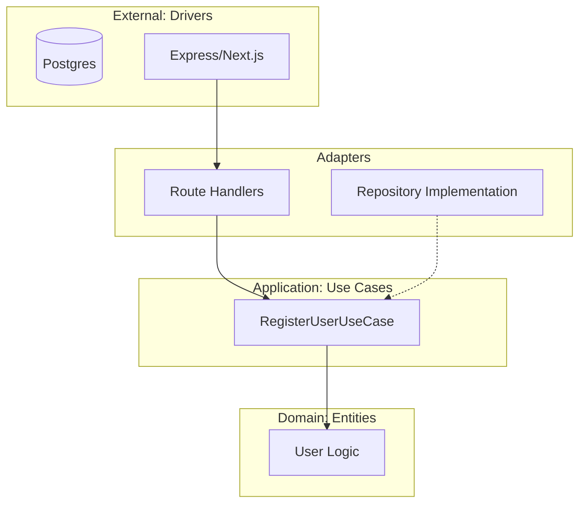

# 🧼 Clean Architecture Fundamentals: Code that Lasts
> **Objective:** Build systems that are independent of frameworks, UI, and databases | **Language:** Hinglish | **Standard:** 2026 Expert Framework

---

## 🧭 1. Beginner-Friendly Hinglish Explanation
Clean Architecture ka matlab hai: "Aapka Business Logic (Core) sabse important hai, framework (Express/Nest) nahi".

- **The Problem:** Aksar hum app banate hain aur code Express ya Mongoose se itna jud jata hai ki baad mein unhe change karna namumkin ho jata hai.
- **The Solution (The Onion):** Code ko circles mein organize karo. 
  - **Center (Entities):** Aapke business rules (e.g., "Order ka total negative nahi ho sakta"). Ise kisi framework ka pata nahi hota.
  - **Outer (Frameworks/DB):** Express, Postgres, ya React sabse bahar hote hain.
- **The Rule:** "Dependency Rule". Bahar wala andar wale ko jaanta hai, par andar wala bahar wale ke baare mein kuch nahi jaanta. 

Intuition: Aapka dimag (Core) wahi rehta hai, bhale hi aap kapde (Framework) badalte rahein.

---

## 🧠 2. Deep Technical Explanation
### 1. The 4 Layers (Uncle Bob's Model):
1.  **Entities (Core):** Business objects and rules.
2.  **Use Cases (Interactors):** Application-specific business rules (e.g., "User joins a course").
3.  **Interface Adapters:** Controllers, Presenters, and Repositories that convert data from Core to External formats.
4.  **Frameworks & Drivers:** Databases, Web Frameworks, and external devices.

### 2. Independence:
- **Framework Independent:** You can swap Express for Fastify without touching business logic.
- **Database Independent:** You can swap SQL for NoSQL.
- **UI Independent:** You can run the same logic from a CLI, Web, or Mobile.

### 3. Dependency Inversion:
Using Interfaces/Abstractions to ensure higher-level modules don't depend on lower-level modules.

---

## 🏗️ 3. Architecture Diagrams (The Onion Model)


---

## 💻 4. Production-Ready Examples (The Use Case Pattern)
```typescript
// 2026 Standard: Implementing a Clean Use Case

// 1. Domain Entity (Pure Logic)
class Order {
  constructor(public id: string, public total: number) {
    if (total < 0) throw new Error("Invalid Total");
  }
}

// 2. Use Case (Interactor)
interface OrderRepository {
  save(order: Order): Promise<void>;
}

class CreateOrderUseCase {
  constructor(private orderRepo: OrderRepository) {}

  async execute(id: string, amount: number) {
    const order = new Order(id, amount);
    await this.orderRepo.save(order);
    return order;
  }
}

// 💡 The 'OrderRepository' is an INTERFACE. 
// The actual implementation (Prisma/Mongo) is injected at runtime.
```

---

## 🌍 5. Real-World Use Cases
- **Enterprise SaaS:** Where the product will live for 10+ years and need to evolve.
- **Multi-platform Apps:** Shared logic between an API and a Background Worker.
- **Heavily Tested Systems:** Since core logic has zero dependencies, it can be unit tested instantly.

---

## ❌ 6. Failure Cases
- **Over-Engineering:** Applying Clean Architecture to a simple "To-Do List" app. You will end up with 20 files for a single feature.
- **Leaking Frameworks:** Accidentally importing `express.Request` inside a Use Case. **Fix: Use DTOs (Data Transfer Objects).**
- **Boilerplate Fatigue:** Developers getting frustrated by the number of files and interfaces.

---

## 🛠️ 7. Debugging Section
| Problem | Diagnosis | Solution |
| :--- | :--- | :--- |
| **Logic depends on DB** | SQL found in Use Case | Move SQL to the Repository Implementation. |
| **Test is slow** | Depends on real DB | Use a **Mock/In-Memory** implementation of the Repository interface. |
| **Circle Dependencies** | Multiple layers importing each other | Use **Dependency Injection**. |

---

## ⚖️ 8. Tradeoffs
- **Clarity vs Complexity:** Much easier to understand "What the app does" by looking at Use Cases, but much more code to write.
- **Stability vs Speed:** High maintainability at the cost of slower initial delivery.

---

## 🛡️ 9. Security Concerns
- **Validation placement:** Domain-level validation (Entities) ensures that no matter where the request comes from, the business rules are never violated.

---

## 📈 10. Scaling Challenges
- **Team Knowledge:** Every developer needs to understand the pattern, or they will break the "Dependency Rule" accidentally.

---

## 💸 11. Cost Considerations
- **TCO (Total Cost of Ownership):** High upfront cost, but extremely low cost for adding new features 2 years later.

---

## ✅ 12. Best Practices
- **Start with Entities.**
- **Keep Use Cases focused** (One task per use case).
- **Use Dependency Injection.**
- **Never allow inner layers to know about HTTP or SQL.**

---

## ⚠️ 13. Common Mistakes
- **Creating too many interfaces** that only have one implementation.
- **Calling one Use Case from another** (Creates tight coupling).

---

## 📝 14. Interview Questions
1. "What is the Dependency Rule in Clean Architecture?"
2. "Why should you keep your business logic independent of the database?"
3. "What is a 'Use Case' and how is it different from a 'Service'?"

---

## 🚀 15. Latest 2026 Production Patterns
- **Hexagonal Architecture (Ports and Adapters):** A modern evolution of Clean Architecture.
- **Domain-Driven Design (DDD) Integration:** Using Bounded Contexts to group Clean Architecture circles.
- **Type-Safe DTOs:** Using Zod to ensure data crossing the boundaries is always valid.
漫
