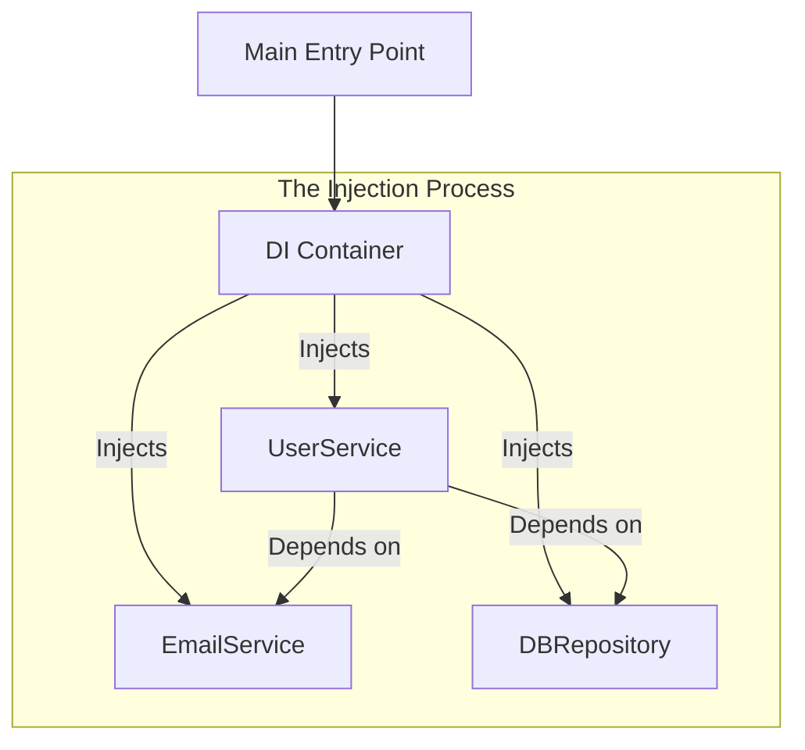

# 💉 Dependency Injection: Decoupling your Logic
> **Objective:** Master the 'D' in SOLID for flexible and testable code | **Language:** Hinglish | **Standard:** 2026 Expert Framework

---

## 🧭 1. Beginner-Friendly Hinglish Explanation
Dependency Injection (DI) ka matlab hai: "Ek class ko uski zaroorat ki cheezein (Dependencies) khud nahi banane dena, balki bahar se 'Supply' karna".

- **The Problem:** Maan lijiye aapka `UserService` khud `new EmailService()` banata hai. Ab agar aapko testing ke liye ek dummy email service chahiye, toh aap use change nahi kar sakte kyunki wo "Hardcoded" hai.
- **The Solution:** `UserService` ko bolo: "Tumhe jo bhi email service chahiye, mujhe batao, main tumhe 'Inject' (provide) kar dunga".
- **The Concept:** `UserService` ab email service ki "Implementation" par nahi, sirf "Interface" par depend karega.

Intuition: Aap ek bulb (Service) ko holder (App) mein lagate hain. Aap holder nahi badalte, sirf bulb badal sakte hain.

---

## 🧠 2. Deep Technical Explanation
### 1. Inversion of Control (IoC):
Normally, your code controls which dependencies to create. With DI, you "Invert" that control to a framework or a higher-level module.

### 2. Dependency Inversion Principle (DIP):
High-level modules should not depend on low-level modules. Both should depend on abstractions (Interfaces).

### 3. Types of DI:
- **Constructor Injection (Recommended):** Passing dependencies through the class constructor.
- **Property/Setter Injection:** Setting dependencies via public properties or methods.

### 4. DI Container:
A specialized tool (like **InversifyJS** or **NestJS**) that automatically manages the creation and injection of all your services.

---

## 🏗️ 3. Architecture Diagrams (The DI Container)


---

## 💻 4. Production-Ready Examples (Manual DI vs Container)
```typescript
// 2026 Standard: Manual Constructor Injection (The Foundation)

// 1. Define Interface
interface IEmailService {
  send(to: string, msg: string): void;
}

// 2. The Service (Decoupled)
class UserService {
  constructor(private emailService: IEmailService) {}

  async welcomeUser(email: string) {
    this.emailService.send(email, "Welcome!");
  }
}

// 3. The Real Implementation
class SendGridEmail implements IEmailService {
  send(to: string, msg: string) { /* Logic */ }
}

// 4. The Mock Implementation (For Testing)
class MockEmail implements IEmailService {
  send(to: string, msg: string) { console.log("Mock email sent!"); }
}

// 5. Injection
const prodService = new UserService(new SendGridEmail());
const testService = new UserService(new MockEmail());
```

---

## 🌍 5. Real-World Use Cases
- **Unit Testing:** Mocking database calls and external APIs to run tests in milliseconds.
- **Multi-tenant Apps:** Injecting different database repositories based on which company is logged in.
- **Frameworks:** NestJS uses DI as its core foundation for organizing code.

---

## ❌ 6. Failure Cases
- **Circular Dependencies:** Service A needs B, and B needs A. The container will crash trying to resolve this. **Fix: Use Interfaces or redesign.**
- **Service Locator Anti-pattern:** Instead of having dependencies injected, a class manually asks a `Locator` for a service. This makes the code hard to follow.
- **Over-abstraction:** Creating an interface for every single utility function, even if it will never change.

---

## 🛠️ 7. Debugging Section
| Problem | Diagnostic | Solution |
| :--- | :--- | :--- |
| **"Cannot resolve dependency"** | DI Container Error | Ensure the service is "Registered" in your container/module. |
| **"Undefined" dependency** | Constructor parameter order | Check if you're correctly passing arguments in the `super()` or constructor. |

---

## ⚖️ 8. Tradeoffs
- **Clarity vs Decoupling:** DI makes it harder to see "exactly which code is running" just by looking at one file, but makes the system much more flexible.

---

## 🛡️ 9. Security Concerns
- **Property Injection:** If not handled carefully, someone could manually overwrite a service instance in memory if the property is public.

---

## 📈 10. Scaling Challenges
- **Startup Time:** Large DI containers can add a few hundred milliseconds to your app's startup time as they "Resolve" the entire dependency graph.

---

## 💸 11. Cost Considerations
- **Maintenance:** DI significantly lowers the cost of refactoring. If you want to change your database, you only change the "Binding" in one place.

---

## ✅ 12. Best Practices
- **Prefer Constructor Injection.**
- **Depend on Interfaces, not Classes.**
- **Keep your classes 'Dumb'** about where their dependencies come from.

---

## ⚠️ 13. Common Mistakes
- **Passing the whole DI Container into a class** (This is the Service Locator anti-pattern).
- **Hardcoding `new` inside services.**

---

## 📝 14. Interview Questions
1. "What is Inversion of Control (IoC)?"
2. "How does Dependency Injection improve the testability of an application?"
3. "What is the difference between Constructor and Property injection?"

---

## 🚀 15. Latest 2026 Production Patterns
- **NestJS Modules:** The most robust DI implementation in the Node ecosystem.
- **Tsyringe:** A lightweight DI container from Microsoft.
- **Functional DI:** Using "Reader Monads" or "Higher-Order Functions" for a more lightweight, functional approach to injection.
漫
