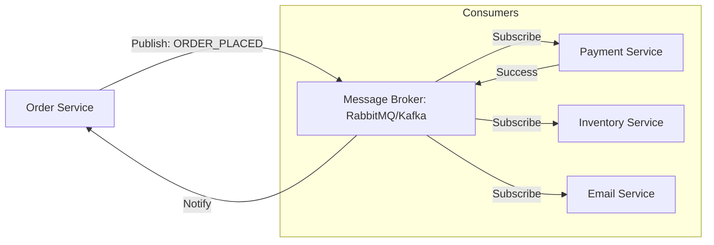

# 📨 Event-Driven Architecture (EDA): Decoupled Communication
> **Objective:** Master asynchronous, event-based systems for high scalability | **Language:** Hinglish | **Standard:** 2026 Expert Framework

---

## 🧭 1. Beginner-Friendly Hinglish Explanation
Event-Driven Architecture (EDA) ka matlab hai "Kaam khatam karke bhul jana (Fire and Forget)".

- **The Problem:** Maan lijiye jab koi user signup karta hai, aapko:
  1. User save karna hai (DB).
  2. Welcome email bhejna hai (External API).
  3. Analytics update karni hai.
  Agar email server slow hai, toh user ko 5 second tak wait karna padega "Signup Success" dekhne ke liye.
- **The Solution:** Signup Service bas ek "Event" chhodti hai: `USER_SIGNED_UP`.
- **The Flow:** Doosre services (Email Service, Analytics Service) is event ko "Listen" kar rahe hain. Jaise hi event aata hai, wo apna kaam shuru kar dete hain. Signup Service ko wait nahi karna padta.

Intuition: Ye ek "Announcement" system ki tarah hai. "Attention please, ek user ne signup kiya hai!". Jise zaroorat hai, wo sun lega.

---

## 🧠 2. Deep Technical Explanation
### 1. Key Components:
- **Event Producer:** The service that detects a state change and sends an event.
- **Event Channel (Message Broker):** The infrastructure that carries the event (Kafka, RabbitMQ, Redis Pub/Sub).
- **Event Consumer:** The service that listens for and processes the event.

### 2. Pub/Sub vs Message Queues:
- **Pub/Sub (Publish/Subscribe):** One event is sent to many listeners (e.g., Broadcast).
- **Message Queue:** One message is sent to exactly one consumer (e.g., Task Processing).

### 3. Eventual Consistency:
In EDA, data is not updated everywhere instantly. It takes a few milliseconds/seconds for all services to process the event and reach a consistent state.

---

## 🏗️ 3. Architecture Diagrams (The Event Hub)


---

## 💻 4. Production-Ready Examples (Node.js EventEmitter & Redis)
```typescript
// 2026 Standard: In-Process vs Distributed Events

// 1. In-Process (Simple EventEmitter)
import { EventEmitter } from 'events';
const eventBus = new EventEmitter();

eventBus.on('order:created', (orderId) => {
  console.log(`Sending confirmation for order ${orderId}`);
});

// 2. Distributed (Using Redis/RabbitMQ pattern)
// This would typically use a library like 'bullmq' or 'amqplib'
async function publishOrderCreated(orderData: any) {
  // Logic to push to RabbitMQ or Kafka
  // await rabbitmq.publish('orders', 'order:created', orderData);
}

// 💡 Pro Tip: Use Events for non-critical side effects to keep your 
// main API response times under 100ms.
```

---

## 🌍 5. Real-World Use Cases
- **E-commerce:** Handling complex checkout flows (stock, shipping, tax, emails).
- **Social Media:** Real-time notifications and feed updates.
- **Log Aggregation:** Sending millions of log events to a central dashboard.
- **Microservices:** Decoupling services so they don't have to call each other's APIs directly.

---

## ❌ 6. Failure Cases
- **Message Loss:** If the broker crashes, events might be lost forever. **Fix: Use Persistent Queues.**
- **Duplicate Processing:** A consumer might receive the same event twice. **Fix: Ensure Idempotency (Processing once gives the same result as twice).**
- **Dead Letter Queues (DLQ):** What happens if an event keeps failing? **Solution: Move it to a "Dead Letter" queue for manual inspection.**

---

## 🛠️ 7. Debugging Section
| Tool | Purpose | Tip |
| :--- | :--- | :--- |
| **RabbitMQ Management UI** | Monitor Queues | See how many messages are "In Flight" or "Unacknowledged". |
| **Kafka Offset Explorer** | Debug Streams | See exactly where the consumer is in the message stream. |
| **Logging Correlation IDs** | Trace Events | Pass a `trace_id` through every event to see the full journey of a request. |

---

## ⚖️ 8. Tradeoffs
- **Performance vs Complexity:** Extremely fast response times but much harder to debug and manage "Distributed State".

---

## 🛡️ 9. Security Concerns
- **Event Tampering:** Ensuring that events are signed so a hacker can't inject a fake `PAYMENT_SUCCESS` event into your broker.

---

## 📈 10. Scaling Challenges
- **Order of Events:** In a distributed system, Event B might arrive before Event A. (Solution: Use **Sequence Numbers** or **Timestamping**).

---

## 💸 11. Cost Considerations
- **Broker Infrastructure:** Running a high-availability Kafka cluster is expensive and requires dedicated DevOps engineers.

---

## ✅ 12. Best Practices
- **Design for Idempotency.**
- **Use standard event schemas (CloudEvents).**
- **Implement strong monitoring on your message queues.**
- **Keep events small.**

---

## ⚠️ 13. Common Mistakes
- **Trying to use Events for everything** (Sometimes a simple direct API call is better).
- **Ignoring the "Eventual Consistency" delay** in the UI.

---

## 📝 14. Interview Questions
1. "What is the difference between synchronous and asynchronous communication?"
2. "How do you handle a scenario where an event fails to process?"
3. "Explain the concept of 'Idempotency' in the context of event consumers."

---

## 🚀 15. Latest 2026 Production Patterns
- **Serverless Event Bus (AWS EventBridge):** Zero-management event routing across microservices.
- **Event Sourcing:** Storing the *entire history* of events as the single source of truth instead of just the current state in a DB.
- **Change Data Capture (CDC):** Automatically generating events from database changes (e.g., using Debezium).
漫
