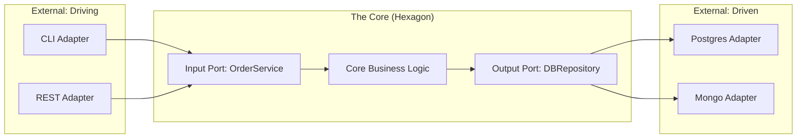

# 🛑 Hexagonal Architecture (Ports and Adapters)
> **Objective:** Design pluggable and testable systems | **Language:** Hinglish | **Standard:** 2026 Expert Framework

---

## 🧭 1. Beginner-Friendly Hinglish Explanation
Hexagonal Architecture ka matlab hai: "Aapka App ek Socket ki tarah hai, jisme aap koi bhi Plug laga sakte hain".

- **The Core (Hexagon):** Iske andar sirf aapki Business Logic hoti hai. Isse fark nahi padta ki request kahan se aa rahi hai ya data kahan ja raha hai.
- **The Ports (Interfaces):** Ye app ke "Gateways" hain. 
  - **Inbound Port:** "Mujhe ek Order create karne ki request chahiye" (Interface).
  - **Outbound Port:** "Mujhe ye Order kahin save karna hai" (Interface).
- **The Adapters (Plugs):** Ye actual code hain jo port ko connect karte hain.
  - **REST Adapter:** HTTP request ko port ke layak banata hai.
  - **Postgres Adapter:** Order ko database mein save karta hai.
- **The Result:** Aap asani se "Postgres" nikal kar "MongoDB" laga sakte hain bina core logic ko chhuye.

---

## 🧠 2. Deep Technical Explanation
### 1. Ports (The "What"):
Ports are **Interfaces**. They define what the system can do or what it needs from the outside world.
- **Driving Ports:** Input interfaces (API, CLI, GUI).
- **Driven Ports:** Output interfaces (Database, Mail Service, External API).

### 2. Adapters (The "How"):
Adapters are the **Implementations**. They adapt a specific technology to a Port.
- **Primary Adapters:** Call the Ports (e.g., Express Controllers).
- **Secondary Adapters:** Are called by the Core through the Ports (e.g., a Redis Repository).

### 3. The Hexagon Shape:
The "Hexagon" represents that the system can have many sides (Ports) and it's not a simple top-to-bottom hierarchy.

---

## 🏗️ 3. Architecture Diagrams (Ports and Adapters)


---

## 💻 4. Production-Ready Examples (The Port Pattern)
```typescript
// 2026 Standard: Implementing Hexagonal Architecture

// 1. Driven Port (The Contract)
interface MessagePort {
  send(to: string, msg: string): Promise<void>;
}

// 2. Core Logic (Uses the Port)
class NotificationService {
  constructor(private messagePort: MessagePort) {}

  async notifyUser(userId: string) {
    // Business logic here...
    await this.messagePort.send(userId, "Hello World");
  }
}

// 3. Driven Adapter (The Implementation)
class TwilioSmsAdapter implements MessagePort {
  async send(to: string, msg: string) {
    console.log(`Sending SMS via Twilio to ${to}: ${msg}`);
  }
}

// 4. Primary Adapter (The Trigger)
app.post('/notify', async (req, res) => {
  const service = new NotificationService(new TwilioSmsAdapter());
  await service.notifyUser(req.body.id);
  res.send("Done");
});
```

---

## 🌍 5. Real-World Use Cases
- **Payment Processing:** Swapping Stripe for Razorpay by just changing the adapter.
- **Testing:** Using a `MockEmailAdapter` for tests so you don't send real emails while debugging.
- **Migration:** Moving from a monolithic DB to microservices one-by-one by swapping adapters.

---

## ❌ 6. Failure Cases
- **Adapter Logic Leak:** Putting business rules inside the "Stripe Adapter". **Fix: Keep adapters strictly for translation.**
- **Indirection Overload:** Having too many ports and interfaces for a very simple app, making it hard to follow the code.

---

## 🛠️ 7. Debugging Section
| Problem | Diagnostic | Solution |
| :--- | :--- | :--- |
| **App fails in Prod only** | Adapter mismatch | Check if the Adapter implementation matches the Port interface exactly. |
| **Logic is hard to follow** | Too many ports | Group related actions into a single Port. |

---

## ⚖️ 8. Tradeoffs
- **Flexibility vs Speed of Development:** Hexagonal takes more time to set up but makes future changes 10x easier.

---

## 🛡️ 9. Security Concerns
- **Validation:** Driving adapters (REST) should handle input sanitization before calling the Core.

---

## 📈 10. Scaling Challenges
- **Complexity:** As the number of ports grows, the dependency injection container (Inversify/NestJS) becomes critical.

---

## 💸 11. Cost Considerations
- **Maintenance Savings:** The biggest "cost" of software is change. Hexagonal architecture dramatically lowers the cost of changing vendors or databases.

---

## ✅ 12. Best Practices
- **Define Ports first.**
- **Keep the Core pure** (no dependencies on `fs`, `http`, or `db`).
- **Use Dependency Injection.**

---

## ⚠️ 13. Common Mistakes
- **Leaking external types** (like `PrismaUser`) into the Core. (Solution: Map them to a Domain model).
- **Naming Ports poorly** (Use `NotificationPort` instead of `EmailService`).

---

## 📝 14. Interview Questions
1. "What is the difference between Primary and Secondary adapters?"
2. "How does Hexagonal Architecture help in Unit Testing?"
3. "What are 'Ports' in this context?"

---

## 🚀 15. Latest 2026 Production Patterns
- **Functional Adapters:** Using simple factory functions to create adapters.
- **Modular Monoliths with Hexagons:** Each module is its own hexagon, communicating via ports.
- **Serverless Adapters:** Adapting the core to run on Lambda, Vercel, or Fly.io by just changing the Entry-point adapter.
漫
