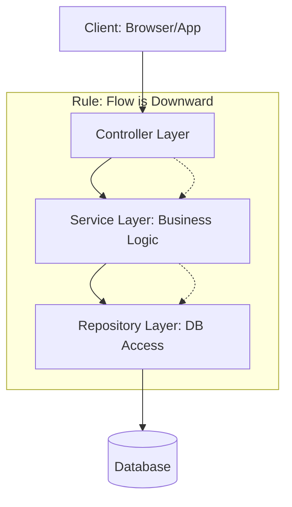

# 🥪 Layered Architecture: Organizing for Stability
> **Objective:** Master the 'N-Tier' pattern for structured and maintainable code | **Language:** Hinglish | **Standard:** 2026 Expert Framework

---

## 🧭 1. Beginner-Friendly Hinglish Explanation
Layered Architecture ka matlab hai "Code ko alag-alag responsibility ke floors (layers) mein baantna".

- **The Floors:**
  1. **Presentation Layer (Controllers):** Ye bahar ki duniya (User) se baat karta hai. Request leta hai aur response bhejta hai.
  2. **Business Logic Layer (Services):** Asli "Dimag". Yahan calculations aur business rules hote hain.
  3. **Data Access Layer (Repositories):** Ye database se baat karta hai. Iska kaam sirf data nikalna aur save karna hai.
- **The Rule:** Ek floor (layer) sirf apne neeche wale floor se baat kar sakta hai. 
- **The Result:** Agar aapko database badalna hai (Postgres to Mongo), toh aapko poora app nahi, sirf "Data Layer" change karni hogi.

---

## 🧠 2. Deep Technical Explanation
### 1. Separation of Concerns (SoC):
Each layer has a clearly defined responsibility, reducing "Tight Coupling."

### 2. The Standard 3-Layer Pattern:
- **Controllers:** Handle HTTP requests, validate input format, and call the service. They should be "Thin" (no business logic).
- **Services:** Implement the core domain logic. They are "Fat" and contain the most important code.
- **Repositories:** Abstract the database technology. They use ORMs like Prisma or Drizzle to perform CRUD.

### 3. Cross-Cutting Concerns:
Things like Logging, Auth, and Error Handling that "cut across" all layers. Usually handled by Middlewares or Decorators.

---

## 🏗️ 3. Architecture Diagrams (The Hierarchy)


---

## 💻 4. Production-Ready Examples (Layered Structure)
```typescript
// 2026 Standard: Implementing a Clean Layered Request

// 1. Repository (Data Access)
class UserRepository {
  async findById(id: string) {
    return await prisma.user.findUnique({ where: { id } });
  }
}

// 2. Service (Business Logic)
class UserService {
  constructor(private userRepo: UserRepository) {}

  async getUserProfile(id: string) {
    const user = await this.userRepo.findById(id);
    if (!user) throw new Error("User not found");
    // Add logic: calculate membership tier, etc.
    return { ...user, tier: "Gold" };
  }
}

// 3. Controller (Presentation)
app.get('/users/:id', async (req, res) => {
  try {
    const userService = new UserService(new UserRepository());
    const profile = await userService.getUserProfile(req.params.id);
    res.json(profile);
  } catch (err) {
    res.status(404).json({ error: err.message });
  }
});
```

---

## 🌍 5. Real-World Use Cases
- **Enterprise Web Apps:** Where maintainability is more important than raw performance.
- **Financial Systems:** Where business rules are complex and need dedicated service classes.
- **CRUD APIs:** Providing a standardized way to build dozens of resources.

---

## ❌ 6. Failure Cases
- **Logic Leakage:** Putting SQL queries inside the Controller or validation logic inside the Repository.
- **Circular Dependencies:** Service A depends on Service B, and B depends on A. **Fix: Use Events or a higher-level module.**
- **The "Anemic Domain Model":** When your services are just "Pass-throughs" that do nothing but call the repository. (Solution: If logic is simple, maybe you don't need a layer).

---

## 🛠️ 7. Debugging Section
| Symptom | Diagnosis | Solution |
| :--- | :--- | :--- |
| **Test is hard to write** | Layers are too coupled | Use **Dependency Injection** to mock layers. |
| **Changes break everything** | No clear boundaries | Refactor logic into the correct floor. |
| **Slow API** | Many layers adding overhead | For very hot paths, bypass a layer (carefully). |

---

## ⚖️ 8. Tradeoffs
- **Maintainability vs Complexity:** More files/classes to manage, but easier to understand each part.
- **Scalability vs Speed:** Adding layers adds a tiny bit of latency (function calls).

---

## 🛡️ 9. Security Concerns
- **Validation placement:** Always validate "Format" in the Controller and "Rules/Ownership" in the Service.

---

## 📈 10. Scaling Challenges
- **Team Size:** Large teams work better with layers because different developers can work on the "Service" while others work on the "Repository" simultaneously.

---

## 💸 11. Cost Considerations
- **Development Time:** It takes longer to set up a layered project initially compared to a single-file script.

---

## ✅ 12. Best Practices
- **Keep Controllers thin.**
- **Keep Services pure** (don't let them know about `res.send()` or HTTP headers).
- **Use Interfaces** between layers for easier testing.

---

## ⚠️ 13. Common Mistakes
- **Passing the `res` object into the service.** (This makes the service impossible to test without an HTTP mock).
- **Importing models directly in the controller.**

---

## 📝 14. Interview Questions
1. "What is the primary responsibility of the Service layer?"
2. "How does layered architecture improve testability?"
3. "What are 'Cross-Cutting Concerns'?"

---

## 🚀 15. Latest 2026 Production Patterns
- **Functional Services:** Using pure functions for business logic instead of heavy classes.
- **Vertical Slice Architecture:** Organizing folders by "Feature" (e.g., `orders/`, `users/`) rather than "Layer" (e.g., `services/`, `controllers/`).
- **Middleware-centric logic:** Moving common validation and auth entirely into the middleware layer.
漫
