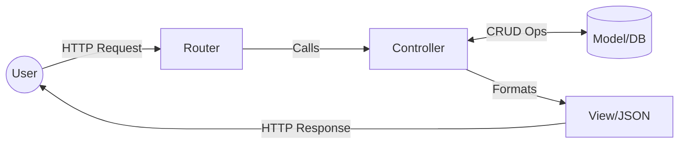

# 🏢 MVC Architecture: The Classic Pattern
> **Objective:** Master the Model-View-Controller pattern for organized backend development | **Language:** Hinglish | **Standard:** 2026 Expert Framework

---

## 🧭 1. Beginner-Friendly Hinglish Explanation
MVC ka matlab hai "Ghar ko 3 kamron mein baantna":

- **Model (M):** Ye aapka "Store Room" hai. Saara data aur database ki logic yahan rehti hai.
- **View (V):** Ye aapka "Showroom" hai. User ko jo dikhta hai (HTML/JSON) wo yahan se banta hai.
- **Controller (C):** Ye aapka "Manager" hai. Jab user request karta hai, toh Manager decide karta hai ki kaunsa data (Model) nikalna hai aur kya dikhana (View) hai.

Intuition: Jab aap restaurant jaate hain:
1. **Waiter (Controller)** aapse order leta hai.
2. **Chef (Model)** khana banata hai (Data).
3. **Plating (View)** karke aapko diya jata hai.

---

## 🧠 2. Deep Technical Explanation
### 1. Separation of Concerns:
MVC decouples data access, business logic, and presentation logic.
- **Model:** Represents the data structure. In Node.js, these are often Mongoose/Prisma schemas.
- **View:** In a pure Backend (REST API), the "View" is the JSON response format. In SSR (Server Side Rendering), it's EJS or Pug templates.
- **Controller:** Processes input, validates it, interacts with the Model, and sends a response.

### 2. The Flow:
`Request -> Router -> Controller -> Model -> Controller -> View/Response -> User`.

---

## 🏗️ 3. Architecture Diagrams (MVC Data Flow)


---

## 💻 4. Production-Ready Examples (Express MVC)
```typescript
// 2026 Standard: Clean MVC Implementation

// 📂 models/User.model.ts
export interface User { id: string; name: string; }

// 📂 controllers/User.controller.ts
import { Request, Response } from 'express';
import * as UserModel from '../models/User.model';

export const getUser = async (req: Request, res: Response) => {
  const user = await UserModel.findById(req.params.id); // Model logic
  if (!user) return res.status(404).json({ error: "Not found" });
  res.json({ data: user }); // View logic (JSON response)
};

// 📂 routes/User.routes.ts
import { Router } from 'express';
import { getUser } from '../controllers/User.controller';

const router = Router();
router.get('/:id', getUser);
export default router;
```

---

## 🌍 5. Real-World Use Cases
- **Legacy Systems:** Ruby on Rails, Django, and Laravel are built entirely on MVC.
- **SSR Applications:** Next.js or Nuxt.js apps often follow this for server-side logic.
- **Simple CRUD APIs:** Where the logic isn't complex enough for Clean Architecture.

---

## ❌ 6. Failure Cases
- **Fat Controllers:** Putting 500 lines of business logic inside a controller. **Fix: Move logic to Services (Layered Architecture).**
- **Skinny Models:** Models that only define schemas but have no data logic.
- **View Overload:** Logic inside the template (EJS) that should be in the controller.

---

## 🛠️ 7. Debugging Section
| Problem | Diagnostic | Solution |
| :--- | :--- | :--- |
| **Data not updating** | Check Model | Verify DB connection and schema validation. |
| **404 Errors** | Check Router | Ensure the route is correctly mapped to the controller. |
| **UI breaks** | Check View/JSON | Ensure the controller is sending the correct JSON structure. |

---

## ⚖️ 8. Tradeoffs
- **Simplicity vs Scalability:** MVC is great for small-medium apps but becomes messy for complex enterprise systems.

---

## 🛡️ 9. Security Concerns
- **Mass Assignment:** Passing `req.body` directly to `Model.create()`. **Fix: Use DTOs or explicit field mapping.**

---

## 📈 10. Scaling Challenges
- **Circular Dependencies:** Models importing each other in a complex graph. **Fix: Use a Service layer.**

---

## 💸 11. Cost Considerations
- **Development Speed:** MVC is the fastest way to prototype and launch a product.

---

## ✅ 12. Best Practices
- **Keep Controllers thin.**
- **Use Routers** to keep `app.ts` clean.
- **Validate requests** before they hit the controller.

---

## ⚠️ 13. Common Mistakes
- **Directly exposing Database IDs** in the View.
- **Not using Services** when business logic grows.

---

## 📝 14. Interview Questions
1. "What is the difference between MVC and Layered Architecture?"
2. "Why should business logic be kept out of the Controller?"
3. "How does MVC help in parallel development?"

---

## 🚀 15. Latest 2026 Production Patterns
- **API-First MVC:** Designing the 'View' as a strict OpenAPI contract before writing code.
- **Isomorphic MVC:** Sharing 'Model' types between Frontend and Backend (TypeScript).
漫
