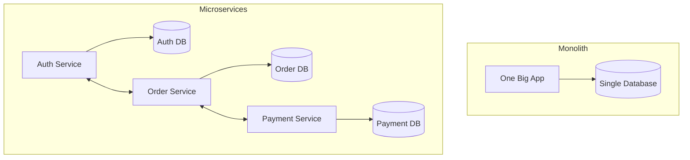

# 🏛️ Monolithic vs Microservices: The Great Architectural Debate
> **Objective:** Choose the right foundation for your system's growth | **Language:** Hinglish | **Standard:** 2026 Expert Framework

---

## 🧭 1. Beginner-Friendly Hinglish Explanation
Architecture ka matlab hai: "Aap apna code aur database kaise organize karte hain".

- **Monolith (Single Unit):**
  - **Concept:** Poora app (Auth, Payments, Inventory) ek hi codebase aur ek hi server par chalta hai.
  - **Intuition:** Ek badi Joint Family. Sab saath rehte hain, ek hi kitchen (Database) use karte hain. Agar ek ko bukhar hua (bug), toh sab bimar ho sakte hain.
- **Microservices (Distributed):**
  - **Concept:** App ko chote-chote independent services mein tod diya jata hai. Har service ka apna server aur apna database hota hai.
  - **Intuition:** Alag-alag flats. Har kisi ka apna kitchen hai. Agar ek flat mein light chali gayi, toh doosre flats ko fark nahi padega.

---

## 🧠 2. Deep Technical Explanation
### 1. Monolithic Architecture:
All functional business domains are bundled into a single deployable artifact.
- **Pros:** Easier to develop initially, simpler testing (no network overhead), easy deployment.
- **Cons:** Hard to scale specific parts, slow build times for large teams, a single bug can crash the whole system.

### 2. Microservices Architecture:
Applications are composed of small, loosely coupled services communicating via lightweight protocols (REST, gRPC, RabbitMQ).
- **Pros:** Independent scaling (scale only the payment service), technology flexibility (one service in Node, another in Go), fault isolation.
- **Cons:** Operational complexity (Kubernetes needed), data consistency issues (Distributed transactions are hard), network latency.

### 3. The 2026 Middle Ground: The Modular Monolith:
Building a single codebase but keeping the domains strictly separated. This gives you the speed of a Monolith with the scalability of Microservices.

---

## 🏗️ 3. Architecture Diagrams (The Visual Shift)


---

## 💻 4. Production-Ready Examples (Modular Thinking)
```typescript
// 2026 Standard: Designing for Future Separation (Modular Monolith)

// 📂 src/modules/users/
// 📂 src/modules/orders/
// 📂 src/modules/payments/

// Inside users/user.service.ts
export class UserService {
  // This service ONLY touches the user-related tables.
  // It NEVER imports OrderService directly to avoid circular dependency.
}

// Communication between modules should happen via events or interfaces,
// making it easy to pull 'Payments' into its own microservice later.
```

---

## 🌍 5. Real-World Use Cases
- **Startups (Pre-Product Market Fit):** Always start with a **Monolith**. Speed is everything.
- **Netflix/Amazon:** Millions of users, thousands of engineers. They NEED **Microservices** to work in parallel.
- **E-commerce:** Moving the "Payment Gateway" to a microservice for better security and dedicated scaling.

---

## ❌ 6. Failure Cases
- **The "Distributed Monolith":** Breaking an app into microservices but keeping them tightly coupled (Service A can't work without Service B). This is the worst of both worlds.
- **Premature Decomposition:** Building microservices when you only have 10 users and 1 developer. You will waste all your time on infrastructure instead of features.

---

## 🛠️ 7. Debugging Section
| Problem | Diagnostic | Solution |
| :--- | :--- | :--- |
| **High Latency** | Distributed Tracing (Jaeger) | See which service is slow in the chain. |
| **Data Inconsistency** | Check Event Logs | Ensure the message was processed by all services. |
| **Build Slowness** | Analyze Dependency Graph | Split the Monolith into Modules. |

---

## ⚖️ 8. Tradeoffs
- **Simplicity vs Scalability.**
- **Strong Consistency (SQL Transactions) vs Eventual Consistency (Microservices).**

---

## 🛡️ 9. Security Concerns
- **Attack Surface:** In microservices, every service has an API that needs to be secured (mTLS, API Gateways). In a monolith, internal calls are private.

---

## 📈 10. Scaling Challenges
- **Database Scaling:** A single Postgres instance for a Monolith might reach its CPU limit. Microservices split the load naturally.

---

## 💸 11. Cost Considerations
- **Cloud Bill:** Microservices often cost more due to multiple small instances, load balancers, and cross-service bandwidth.

---

## ✅ 12. Best Practices
- **Start small (Monolith).**
- **Use Domain-Driven Design (DDD)** to define boundaries.
- **If using Microservices, invest in Automation (CI/CD, Monitoring, K8s).**

---

## ⚠️ 13. Common Mistakes
- **Shared Databases:** Two microservices should NEVER share the same database. This kills independence.
- **Ignoring Network Failures:** Always assume a service call will fail (Use **Circuit Breakers**).

---

## 📝 14. Interview Questions
1. "When should you NOT use microservices?"
2. "How do you handle data consistency across multiple microservices?"
3. "What is a 'Modular Monolith' and what problem does it solve?"

---

## 🚀 15. Latest 2026 Production Patterns
- **Service Mesh (Istio/Linkerd):** Handling service-to-service communication, security, and retries automatically.
- **Wasm (WebAssembly) in Backend:** Running high-performance logic across services with near-native speed.
- **Micro-Frontends:** Applying microservice principles to the Frontend to allow teams to deploy UI independently.
漫
