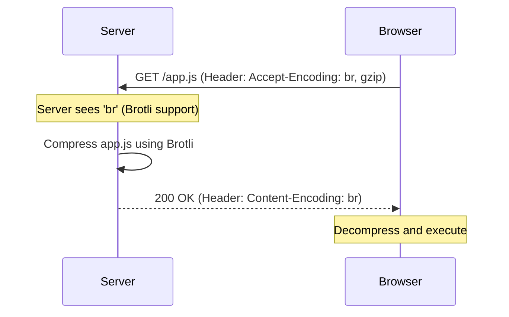

# 🗜️ Compression and Minification: Shrinking the Payload
> **Objective:** Reduce bandwidth usage and improve response times by optimizing data size | **Language:** Hinglish | **Standard:** 2026 Expert Framework

---

## 🧭 1. Beginner-Friendly Hinglish Explanation
Compression aur Minification ka matlab hai: "Data ko pichka kar (squeeze) chota karna taaki wo internet par tezi se travel kare".

- **Compression (Gzip/Brotli):** Ye ek "Zip file" ki tarah hai. Server file ko bhejne se pehle compress karta hai, aur browser use automatically uncompress kar leta hai.
- **Minification (JS/CSS):** Ye code se faltu cheezein (spaces, comments, long variable names) nikal deta hai. 
  - *Normal:* `let myUserName = "Aryan"; // this is a name`
  - *Minified:* `let a="Aryan";`
- **The Result:** Aapki 1MB ki file 200KB ki ho jati hai. User ka data bachta hai aur site fast load hoti hai.

---

## 🧠 2. Deep Technical Explanation
### 1. Gzip vs Brotli:
- **Gzip:** The classic standard. Fast and widely supported.
- **Brotli (Google):** Modern standard. Better compression than Gzip (up to 20% smaller) but takes slightly more CPU to compress. In 2026, Brotli is preferred for static assets.

### 2. Binary vs Text:
Compression works best on text (JSON, HTML, JS) because of repeating patterns. For images (JPEG, PNG), compression is already built-in, so Gzipping them doesn't help much.

### 3. Minification Process:
- **Uglification:** Renaming variables to single letters.
- **Dead Code Elimination:** Removing code that is never called (Tree Shaking).

---

## 🏗️ 3. Architecture Diagrams (The Compression Flow)


---

## 💻 4. Production-Ready Examples (Enabling Compression)
```typescript
// 2026 Standard: Enabling Brotli/Gzip in Express

import express from 'express';
import compression from 'compression';

const app = express();

// 1. Apply compression middleware
// It automatically picks the best algorithm supported by the browser
app.use(compression({
  level: 6, // Balance between speed and compression ratio
  threshold: 1024, // Only compress responses larger than 1KB
  filter: (req, res) => {
    if (req.headers['x-no-compression']) return false;
    return compression.filter(req, res);
  }
}));

app.get('/api/data', (req, res) => {
  res.json({ massive: "payload of data..." }); // This will be compressed!
});
```

---

## 🌍 5. Real-World Use Cases
- **Mobile Users:** Essential for users on 3G/4G networks where every byte counts.
- **Large JSON APIs:** Reducing the size of massive search results.
- **Single Page Apps (SPAs):** Minifying the initial `bundle.js` to improve "Time to Interactive".

---

## ❌ 6. Failure Cases
- **Double Compression:** Trying to Gzip an already compressed JPEG. It wastes CPU and might actually make the file *larger*.
- **CPU Spikes:** Using the highest compression level on every request, slowing down the server. **Fix: Use level 4-6.**
- **Caching issues:** CDNs not knowing if they should serve the compressed or uncompressed version. **Fix: Use the `Vary: Accept-Encoding` header.**

---

## 🛠️ 7. Debugging Section
| Tool | Purpose | Tip |
| :--- | :--- | :--- |
| **Chrome Network Tab** | Inspection | Check the 'Size' column. It shows 'Transferred' vs 'Actual Size'. |
| **Lighthouse** | Audit | Will yell at you if you haven't enabled Gzip/Brotli. |
| **`curl -I -H "Accept-Encoding: gzip"`** | Manual Check | See if the server returns `Content-Encoding: gzip`. |

---

## ⚖️ 8. Tradeoffs
- **Bandwidth (Money saved) vs CPU (Compute used).** In 2026, bandwidth is usually the bottleneck, so compression is almost always worth it.

---

## 🛡️ 9. Security Concerns
- **CRIME / BREACH Attacks:** Rare attacks that use compression to leak sensitive tokens from cookies. (Unlikely in modern TLS setups, but worth knowing).

---

## 📈 10. Scaling Challenges
- **Pre-compression:** For static files, compress them *during the build* (at compile time) so the server doesn't have to compress them on every request.

---

## 💸 11. Cost Considerations
- **Egress Costs:** Cloud providers (AWS/GCP) charge for data leaving their network. Compression directly lowers your monthly bill.

---

## ✅ 12. Best Practices
- **Use Brotli** for modern browsers.
- **Enable compression for all text-based responses.**
- **Minify your JS/CSS** in the build pipeline.
- **Use a CDN** (Cloudflare/CloudFront) to handle compression at the edge.

---

## ⚠️ 13. Common Mistakes
- **Compressing small files** (overhead makes it slower).
- **Forgetting to minify production code.**

---

## 📝 14. Interview Questions
1. "What is the difference between Gzip and Brotli?"
2. "Why don't we compress image files like JPEG or PNG on the fly?"
3. "How do you verify if an API response is compressed?"

---

## 🚀 15. Latest 2026 Production Patterns
- **Zstandard (zstd):** A new compression algorithm by Facebook that is even faster than Gzip.
- **Adaptive Compression:** AI-based systems that decide whether to compress based on the user's connection speed and current server CPU load.
漫
