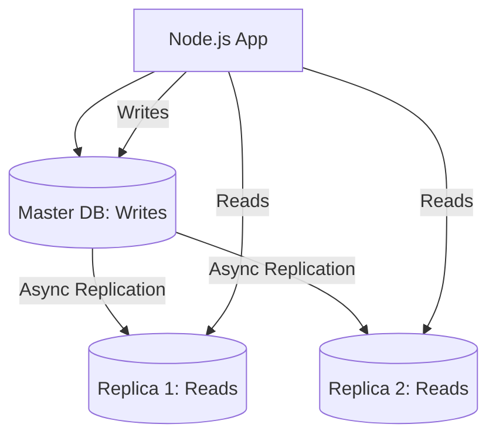

# 🗄️ Database Optimization: Scaling the Storage
> **Objective:** Maximize query performance and minimize resource usage | **Language:** Hinglish | **Standard:** 2026 Expert Framework

---

## 🧭 1. Beginner-Friendly Hinglish Explanation
Database Optimization ka matlab hai: "Data ko is tarah rakhna aur nikalna ki server ko pasina na aaye".

- **The Problem:** Jab aapke paas 100 users hain, toh har query fast hoti hai. Jab 1 million users hote hain, toh ek simple `SELECT *` poore server ko jam kar sakta hai.
- **The Core Concept:**
  1. **Indexes:** Kitab ke piche wale "Index" ki tarah, taaki poori kitab na padhni pade.
  2. **Query Tuning:** Sahi sawal pucho (Don't use `SELECT *`).
  3. **Connection Pooling:** Bar-baar darwaza (Connection) mat kholo, use khula rakho.
- **Intuition:** DB optimization ek library ko manage karne jaisa hai. Agar sari kitabein farsh (floor) par padi hain, toh dhundhne mein ghanto lagenge. Agar shelves aur labels hain, toh seconds mein kaam ho jayega.

---

## 🧠 2. Deep Technical Explanation
### 1. Indexing Strategies:
- **B-Tree Indexes (Default):** Great for ranges and equality.
- **GIN/GiST Indexes:** For full-text search and JSONB.
- **Composite Indexes:** Indexing multiple columns (e.g., `last_name, first_name`). Order matters!

### 2. Connection Pooling:
Creating a DB connection takes time (TCP handshake, Auth). A "Pool" keeps $10-50$ connections alive and reuses them for different requests.

### 3. Read Replicas:
One database for Writing (Master) and multiple databases for Reading (Replicas). Since $90\%$ of traffic is usually Reads, this scales the app massively.

### 4. Sharding:
Splitting a giant table into smaller ones across different servers (e.g., Users A-M on Server 1, N-Z on Server 2).

---

## 🏗️ 3. Architecture Diagrams (Read/Write Splitting)


---

## 💻 4. Production-Ready Examples (Query Optimization)
```typescript
// 2026 Standard: Optimizing Prisma/SQL Queries

// ❌ BAD: N+1 Problem (1 query for users + 100 queries for posts)
const users = await prisma.user.findMany();
for (const user of users) {
  const posts = await prisma.post.findMany({ where: { userId: user.id } });
}

// ✅ GOOD: Eager Loading (1 query with Join)
const usersWithPosts = await prisma.user.findMany({
  include: { posts: true }
});

// ✅ EXCELLENT: Pagination (Don't fetch everything!)
const page1 = await prisma.post.findMany({
  skip: 0,
  take: 20,
  orderBy: { createdAt: 'desc' }
});

// 💡 Pro Tip: Use EXPLAIN ANALYZE to see how the DB executes your query.
// It will tell you if it's using an index or doing a 'Full Table Scan'.
```

---

## 🌍 5. Real-World Use Cases
- **E-commerce Search:** Using GIN indexes for fast product searches across titles and descriptions.
- **Analytics Dashboards:** Using "Materialized Views" to pre-calculate heavy reports.
- **Social Media:** Sharding user data by region (India, US, Europe) to reduce latency.

---

## ❌ 6. Failure Cases
- **Over-Indexing:** Adding an index to every single column. This slows down Writes (Inserts/Updates) because the DB has to update all indexes.
- **Missing Foreign Key Indexes:** Joining tables on columns that aren't indexed.
- **Unbounded Queries:** `SELECT * FROM Logs` where logs has 100 million rows. (App will crash with 'Out of Memory').

---

## 🛠️ 7. Debugging Section
| Command | Purpose | Tip |
| :--- | :--- | :--- |
| **`EXPLAIN ANALYZE`** | Query Plan | Look for "Seq Scan" (Bad) vs "Index Scan" (Good). |
| **`VACUUM`** (Postgres) | Cleanup | Reclaims space from deleted rows and updates statistics. |
| **`SHOW PROCESSLIST`** | Active Queries | See which query is currently hanging your database. |

---

## ⚖️ 8. Tradeoffs
- **Normalization vs Denormalization:** Normalization saves space; Denormalization (adding redundant data) makes Reads faster but Writes harder.

---

## 🛡️ 9. Security Concerns
- **SQL Injection:** Always use Parameterized Queries (ORMs handle this by default).
- **Least Privilege:** The app's DB user shouldn't be allowed to `DROP TABLE`.

---

## 📈 10. Scaling Challenges
- **Vertical scaling (Bigger RAM/CPU)** is easy but has a limit. **Horizontal scaling (Replicas/Sharding)** is harder but has no limit.

---

## 💸 11. Cost Considerations
- **Managed Databases (RDS/Cloud SQL):** More expensive than self-hosting, but saves thousands of dollars in "DBA" (Database Administrator) salaries.

---

## ✅ 12. Best Practices
- **Only select the columns you need.**
- **Use Pagination.**
- **Add Indexes for all `WHERE` and `JOIN` columns.**
- **Use a Connection Pooler (PgBouncer).**
- **Monitor Slow Queries.**

---

## ⚠️ 13. Common Mistakes
- **Using `UUID` as a primary key** without optimization (It's slower than `SERIAL` integers in some DBs).
- **Not testing your indexes** with realistic production-sized data.

---

## 📝 14. Interview Questions
1. "What is an index and how does it speed up queries?"
2. "Explain the N+1 query problem and how to solve it."
3. "When would you use Denormalization?"

---

## 🚀 15. Latest 2026 Production Patterns
- **Serverless Databases (Neon/PlanetScale):** Databases that automatically scale up/down based on traffic and pause when not in use.
- **Edge Data:** Replicating specific data fragments to the edge to serve users in $<20ms$.
- **Vector Databases (Pinecone/pgvector):** Optimized for AI/LLM similarity searches.
漫
