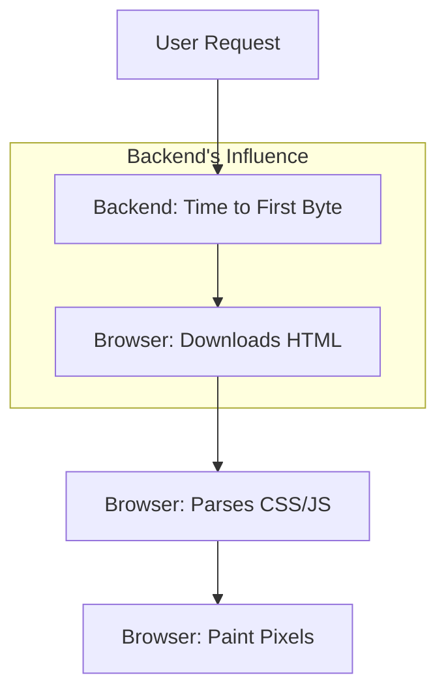

# 🎨 Frontend Performance for Backend Devs: The Full Stack Mindset
> **Objective:** Understand how backend decisions impact the end-user experience | **Language:** Hinglish | **Standard:** 2026 Expert Framework

---

## 🧭 1. Beginner-Friendly Hinglish Explanation
Backend developers aksar sochte hain: "Mera API 50ms mein data de raha hai, mera kaam khatam!". Par user ko site load hone mein 5 second lag rahe hain. Kyun?

- **The Problem:** Backend sirf data deta hai, par wo data *kaise* aur *kab* jata hai, isse frontend ki speed decide hoti hai.
- **The Concept:** Ek backend engineer ko samajhna chahiye ki unke JSON structure, images, aur headers ka frontend par kya asar padta hai.
- **The Goal:** Sirf "API Speed" nahi, "User Experience" (UX) optimize karna.

---

## 🧠 2. Deep Technical Explanation
### 1. Critical Rendering Path:
The sequence of steps the browser takes to convert HTML, CSS, and JS into pixels.
- **Backend Impact:** If your HTML delivery is slow (TTFB), everything else waits.

### 2. The N+1 JSON Problem:
If your API returns a list of 100 users, but not their profile pictures, the frontend has to make 100 extra calls.
- **Backend Fix:** Use **Data Fetching** patterns (Joins/Includes) to provide all necessary data in one go.

### 3. Image Optimization (The Silent Killer):
Sending a 5MB raw image to a mobile phone is a crime.
- **Backend Fix:** Use dynamic resizing (e.g., `image.com/pic.jpg?w=300`) to send only what's needed.

### 4. HTTP/2 and Prioritization:
Modern protocols allow sending multiple files at once. Backend must be configured to support this.

---

## 🏗️ 3. Architecture Diagrams (The Rendering Chain)


---

## 💻 4. Production-Ready Examples (Backend Optimization for Frontend)
```typescript
// 2026 Standard: Designing APIs for Frontend Speed

// ❌ BAD: Forces Frontend to make multiple calls
// GET /users -> [{id: 1, name: "A"}]
// Then Frontend calls GET /users/1/stats for each user...

// ✅ GOOD: Compound Documents (One call, all data)
app.get('/api/users', async (req, res) => {
  const users = await prisma.user.findMany({
    include: {
      stats: true,   // Include stats
      profilePic: { select: { url: true } } // Include only the URL
    }
  });
  res.json(users);
});

// ✅ EXCELLENT: Response Streaming (For LLM or large data)
app.get('/api/search', (req, res) => {
  const stream = getSearchStream();
  stream.on('data', (chunk) => res.write(chunk));
  stream.on('end', () => res.end());
});
```

---

## 🌍 5. Real-World Use Cases
- **Infinite Scroll:** Backend providing `next_cursor` so frontend can pre-fetch data before the user reaches the bottom.
- **Skeleton Screens:** Backend sending "Essential" data first and "Heavy" data in a separate call.
- **E-commerce:** Automatically generating WebP versions of product images for faster mobile loading.

---

## ❌ 6. Failure Cases
- **Giant JSON Payloads:** Sending 2MB of JSON when the frontend only needs 3 fields. (Solution: Use **GraphQL** or **Select** fields).
- **No Cache Headers:** Forcing the browser to re-download the same 500KB logo on every page.
- **Unoptimized Fonts:** Backend serving 500KB font files instead of optimized WOFF2.

---

## 🛠️ 7. Debugging Section
| Metric | Backend Role | Tool |
| :--- | :--- | :--- |
| **TTFB** (Time to First Byte) | API response time | Chrome Network Tab |
| **LCP** (Largest Contentful Paint) | Image/Text delivery | Lighthouse |
| **Network Payload** | Size of JSON/Images | PageSpeed Insights |

---

## ⚖️ 8. Tradeoffs
- **One Big API Call (Fastest)** vs **Multiple Small Calls (More maintainable).** Usually, fewer calls are better for mobile performance.

---

## 🛡️ 9. Security Concerns
- **Sensitive Data in Big JSONs:** In your attempt to provide "all data at once," don't accidentally include `hashed_password` or `user_email` in a public API response.

---

## 📈 10. Scaling Challenges
- **Serialization Overhead:** Converting 10,000 DB records into a giant JSON string can block the Node.js event loop. **Fix: Use Pagination.**

---

## 💸 11. Cost Considerations
- **Bandwidth:** Sending unnecessary data increases your AWS/Vercel egress bill.

---

## ✅ 12. Best Practices
- **Use Pagination by default.**
- **Compress everything.**
- **Optimize images on the backend.**
- **Set aggressive `Cache-Control` headers for static assets.**
- **Understand 'Resource Hinting' (Preload/Prefetch).**

---

## ⚠️ 13. Common Mistakes
- **Ignoring the TTFB.**
- **Sending data the frontend doesn't use.**
- **Not using a CDN for the API.**

---

## 📝 14. Interview Questions
1. "How can a backend developer improve the LCP (Largest Contentful Paint) of a website?"
2. "What is TTFB and why is it the most important metric for a backend dev?"
3. "Explain the N+1 problem in the context of API design."

---

## 🚀 15. Latest 2026 Production Patterns
- **Server-Driven UI:** Backend sending not just data, but instructions on *how* to render the UI (Used by Airbnb/Spotify).
- **HTTP/3 (QUIC):** Faster connection setup and better performance on unreliable mobile networks.
- **JSON:API Standard:** A strict specification for how JSON should be structured to allow for efficient frontend caching and fetching.
漫
