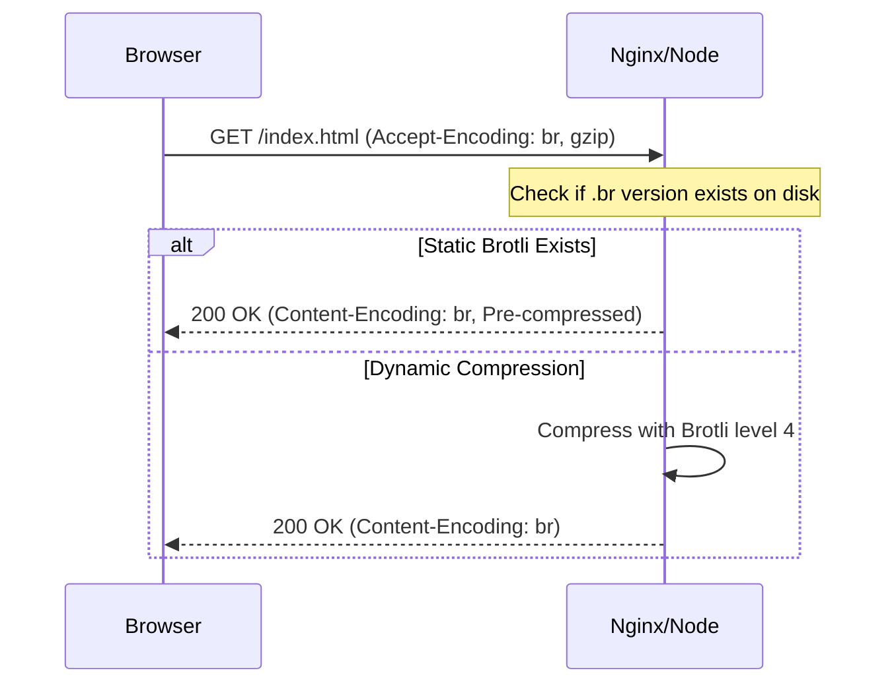

# 🗜️ Gzip and Brotli: Deep Dive into Compression
> **Objective:** Maximize data transfer efficiency with advanced compression settings | **Language:** Hinglish | **Standard:** 2026 Expert Framework

---

## 🧭 1. Beginner-Friendly Hinglish Explanation
Compression ka matlab hai data ko "pichkana".

- **Gzip:** Purana par bharosemand (Reliable). Sabhi browsers ise samajhte hain.
- **Brotli:** Naya aur zyada taqatwar. Google ne ise banaya hai aur ye Gzip se $20\%$ choti files bana sakta hai.
- **The Concept:** Server data bhejne se pehle use ek "Zip" format mein badalta hai. Browser use receive karke "Unzip" kar leta hai. Isse internet par kam data travel karta hai aur site fast load hoti hai.

---

## 🧠 2. Deep Technical Explanation
### 1. The Algorithms:
- **Gzip (DEFLATE):** Uses a combination of LZ77 and Huffman coding. It's extremely fast to compress and decompress.
- **Brotli (LZ77 + Huffman + 2nd order context modeling):** It uses a pre-defined dictionary of common web strings (HTML tags, common JS functions), which makes it much more efficient for web content.

### 2. Static vs Dynamic Compression:
- **Dynamic:** Compressing the response on-the-fly (Real-time). Good for APIs.
- **Static:** Pre-compressing files during the build step (e.g., `.js.br`, `.css.br`). Much better because the server doesn't waste CPU every time.

### 3. Compression Levels (1-11):
- **Level 1:** Fast, but low compression.
- **Level 11:** Slowest, but smallest file size.
- **Sweet Spot:** Level 4-6 for Gzip; Level 4 for Brotli (on-the-fly).

---

## 🏗️ 3. Architecture Diagrams (The Content-Encoding Flow)


---

## 💻 4. Production-Ready Examples (Advanced Nginx Config)
```nginx
# 2026 Standard: Optimal Nginx Compression Settings

# 1. Gzip Config
gzip on;
gzip_vary on;
gzip_proxied any;
gzip_comp_level 6;
gzip_types text/plain text/css application/json application/javascript text/xml application/xml+rss text/javascript;

# 2. Brotli Config (Requires google/ngx_brotli module)
brotli on;
brotli_comp_level 4; # Level for on-the-fly compression
brotli_static on;    # Enable serving pre-compressed .br files
brotli_types text/plain text/css application/json application/javascript text/xml;

# 💡 Pro Tip: Brotli only works over HTTPS!
```

---

## 🌍 5. Real-World Use Cases
- **High-Traffic Blogs:** Reducing 100KB HTML to 15KB with Brotli.
- **Heavy Dashboards:** Compressing 2MB JSON responses to 300KB.
- **Mobile Apps:** Saving user's data plans and improving app launch speed.

---

## ❌ 6. Failure Cases
- **CPU Overload:** Setting `brotli_comp_level 11` for dynamic content. The server will hang while trying to compress every request.
- **Incompatible Browsers:** Older browsers don't support Brotli. **Fix: Always keep Gzip as a fallback.**
- **Compressing Small Files:** Files under 1KB can actually become *larger* due to compression overhead. **Fix: Set `min_length 1024`.**

---

## 🛠️ 7. Debugging Section
| Header | Expected Value | Meaning |
| :--- | :--- | :--- |
| **`Content-Encoding`** | `br` or `gzip` | Confirms the server sent a compressed file. |
| **`Vary`** | `Accept-Encoding` | Tells the CDN to cache different versions for different browsers. |
| **`Content-Length`** | (Small number) | Shows the size after compression. |

---

## ⚖️ 8. Tradeoffs
- **Brotli (Smaller files, more CPU) vs Gzip (Larger files, less CPU).** For static files, ALWAYS use Brotli at max level during build.

---

## 🛡️ 9. Security Concerns
- **BREACH Attack:** If you use HTTP compression and secrets are in the page body, hackers can potentially guess the secrets. **Fix: Use CSRF tokens that change every time.**

---

## 📈 10. Scaling Challenges
- **Proxy Compression:** If you have multiple layers (Cloudflare -> Nginx -> Node), decide which layer should do the compression. **Fix: Let the layer closest to the user (CDN) handle it.**

---

## 💸 11. Cost Considerations
- **Bandwidth Billing:** You pay for every GB transferred. Brotli can save you up to $20\%$ on your egress bill compared to Gzip.

---

## ✅ 12. Best Practices
- **Pre-compress static assets** (JS/CSS) during build time.
- **Use Brotli for HTTPS** and fallback to Gzip.
- **Don't compress binary files** (Images, PDFs, Videos).
- **Set a reasonable threshold** (e.g., 1024 bytes).

---

## ⚠️ 13. Common Mistakes
- **Enabling compression in both Node.js AND Nginx.** (Wastes CPU, pick one).
- **Not using Brotli in 2026.** (It's free performance!).

---

## 📝 14. Interview Questions
1. "Why is Brotli better than Gzip for web content?"
2. "Explain the difference between static and dynamic compression."
3. "Which HTTP header is used by the browser to tell the server it supports Brotli?"

---

## 🚀 15. Latest 2026 Production Patterns
- **Edge Brotli:** CDNs automatically converting Gzip responses from your origin into Brotli for the user.
- **Zstandard (zstd):** Becoming more popular for internal service-to-service communication because it's faster than both Gzip and Brotli.
漫
