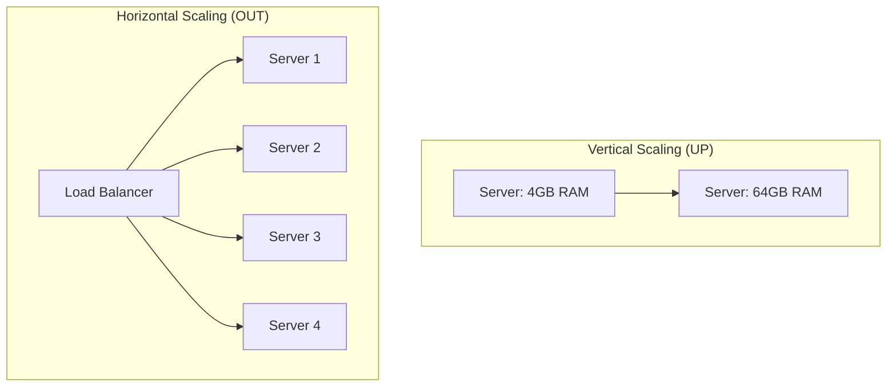

# 📈 Horizontal vs Vertical Scaling: Growing your App
> **Objective:** Choose the right growth path for your infrastructure | **Language:** Hinglish | **Standard:** 2026 Expert Framework

---

## 🧭 1. Beginner-Friendly Hinglish Explanation
Scaling ka matlab hai "Apne app ko zyaada load (users) handle karne ke layak banana".

- **Vertical Scaling (Scaling UP):**
  - **Concept:** Apne maujooda server ki taqat badhana (Zyaada RAM, Zyaada CPU).
  - **Intuition:** Ek cycle ko badal kar Motorcycle lena, phir Car lena, phir Truck lena.
- **Horizontal Scaling (Scaling OUT):**
  - **Concept:** Ek jaise bahut saare servers laga dena aur kaam ko baant dena.
  - **Intuition:** Ek truck ki jagah 10 chote tempo (mini-trucks) laga dena.

---

## 🧠 2. Deep Technical Explanation
### 1. Vertical Scaling (UP):
- **Pros:** Zero code changes, simple management, low latency (no network calls between servers).
- **Cons:** Hard limit (Max RAM on a single machine), single point of failure (Server down = App down), downtime during upgrades.

### 2. Horizontal Scaling (OUT):
- **Pros:** No upper limit (Add 1000 servers), High Availability (One server fails, others take over), cheaper (using many cheap machines instead of one super-expensive one).
- **Cons:** High complexity (Need Load Balancers), Requires **Stateless Architecture**, network latency.

### 3. The 2026 Choice:
Start with a decent-sized server (**Vertical**). Once you reach a certain scale or need 99.99% uptime, switch to **Horizontal**.

---

## 🏗️ 3. Architecture Diagrams (The Scaling Models)


---

## 💻 4. Production-Ready Examples (Stateless Requirement)
```typescript
// 2026 Standard: Preparing for Horizontal Scaling

// ❌ BAD: Stateful (Fails on Horizontal Scaling)
let loginAttempts = {}; // Stored in server memory
app.post('/login', (req, res) => {
  loginAttempts[req.ip] = (loginAttempts[req.ip] || 0) + 1;
  // If User hits Server 1, then Server 2, the count resets!
});

// ✅ GOOD: Stateless (Works on Horizontal Scaling)
const redis = require('redis');
app.post('/login', async (req, res) => {
  // Store attempts in a SHARED Redis cache
  const attempts = await redis.incr(`login:${req.ip}`);
});

// 💡 Pro Tip: Never save user images or files on the server's local disk. 
// Use S3 or Cloudinary so all server instances can access them.
```

---

## 🌍 5. Real-World Use Cases
- **Blogging Site:** Vertical scaling is enough for 100k monthly users.
- **Uber/Swiggy:** Horizontal scaling is mandatory to handle millions of real-time location updates.
- **Databases:** Often scaled vertically (Read Replicas) before sharding horizontally.

---

## ❌ 6. Failure Cases
- **The "Sticky Session" trap:** Trying to scale horizontally but forcing a user to stay on the same server. If that server dies, the user is logged out.
- **Database Bottleneck:** Scaling your API to 100 servers but keeping a tiny database. The DB will crash under the connection load.
- **Cost Explosion:** Adding servers automatically (Auto-scaling) without limits, leading to a massive cloud bill.

---

## 🛠️ 7. Debugging Section
| Metric | Purpose | Action |
| :--- | :--- | :--- |
| **CPU Usage > 80%** | Server is struggling | Scale UP or OUT. |
| **Request Latency** | Network/DB bottleneck | Optimize queries before scaling. |
| **502 Bad Gateway** | Server crashed | Check if Load Balancer has "Health Checks" enabled. |

---

## ⚖️ 8. Tradeoffs
- **Management vs Reliability:** Horizontal scaling is harder to manage but much more reliable.

---

## 🛡️ 9. Security Concerns
- **Shared Secrets:** Every horizontal instance must have the same `.env` secrets. Use a **Secret Manager**.

---

## 📈 10. Scaling Challenges
- **Data Consistency:** When Server A updates a record, Server B must see it immediately. Use a **Centralized DB**.

---

## 💸 11. Cost Considerations
- **Reserved Instances:** Buying a large server for a year (Vertical) is often cheaper than spinning up on-demand servers (Horizontal).

---

## ✅ 12. Best Practices
- **Build Stateless APIs from day one.**
- **Use a Load Balancer (Nginx/AWS ELB).**
- **Store sessions in Redis.**
- **Automate your deployments (CI/CD).**

---

## ⚠️ 13. Common Mistakes
- **Scaling to fix bad code.** (Optimizing code is $10x$ cheaper than adding servers).
- **Not testing your auto-scaling** before a big sale/event.

---

## 📝 14. Interview Questions
1. "What is the difference between Vertical and Horizontal scaling?"
2. "Why must an application be 'Stateless' to scale horizontally?"
3. "What is a single point of failure?"

---

## 🚀 15. Latest 2026 Production Patterns
- **Serverless (Auto-scaling to Zero):** Using AWS Lambda or Vercel where scaling is 100% handled by the provider.
- **Kubernetes (K8s):** The industry standard for managing horizontal scaling across thousands of containers.
- **Global Accelerator:** Using Anycast IP to route users to the nearest horizontal server cluster globally.
漫
