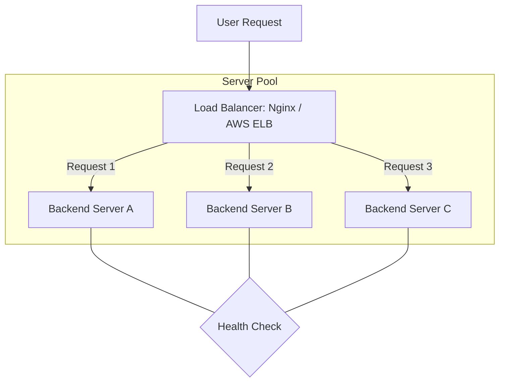

# ⚖️ Load Balancing: Distributing the Traffic
> **Objective:** Ensure high availability and reliability by spreading requests across multiple servers | **Language:** Hinglish | **Standard:** 2026 Expert Framework

---

## 🧭 1. Beginner-Friendly Hinglish Explanation
Load Balancer ek "Traffic Police" ki tarah hai.

- **The Problem:** Agar aapki site par 1 million log aa rahe hain aur sirf 1 server hai, toh wo server crash ho jayega. 
- **The Solution:** Hum 5 servers lagate hain aur unke aage ek "Load Balancer" (LB).
- **The Job:** LB har request ko dekhta hai aur use kisi "Khali" server par bhej deta hai.
- **The Bonus:** Agar ek server kharab ho jaye (Down), toh LB use bypass kar deta hai aur baki 4 par traffic bhejta hai. User ko pata bhi nahi chalta!

Intuition: Ek Bank mein jab bahut bheed hoti hai, toh ek person (Load Balancer) logon ko batata hai ki "Counter 1 khali hai, wahan jao".

---

## 🧠 2. Deep Technical Explanation
### 1. Algorithms:
- **Round Robin:** बारी-बारी (1, 2, 3, 1, 2, 3...). Simple but doesn't care about server load.
- **Least Connections:** Jis server par sabse kam log hain, wahan bhejo.
- **IP Hash:** Ek specific IP ko humesha ek hi server par bhejiyo (Useful for session consistency, though not recommended for stateless apps).

### 2. Health Checks:
The LB periodically "Pings" the servers (e.g., `GET /health`). If a server returns 500 or doesn't respond, the LB marks it as "Unhealthy" and stops sending traffic.

### 3. Layer 4 vs Layer 7:
- **Layer 4 (Transport):** Routes based on IP and Port. Very fast.
- **Layer 7 (Application):** Routes based on URL path, headers, or cookies. (e.g., `/api` goes to Server A, `/images` goes to Server B).

---

## 🏗️ 3. Architecture Diagrams (The Traffic Manager)


---

## 💻 4. Production-Ready Examples (Nginx Configuration)
```nginx
# 2026 Standard: Basic Load Balancing with Nginx

upstream my_backend_servers {
    # Algorithms: least_conn;
    server backend1.example.com;
    server backend2.example.com;
    server backend3.example.com backup; # Only used if others are down
}

server {
    listen 80;
    
    location / {
        proxy_pass http://my_backend_servers;
        proxy_set_header Host $host;
        proxy_set_header X-Real-IP $remote_addr;
    }
}
```

---

## 🌍 5. Real-World Use Cases
- **Global Apps:** Using Load Balancers to route users to the nearest Data Center (Asia, US, Europe).
- **Microservices:** Routing traffic to specific services based on the URL path.
- **Zero-Downtime Deploys:** Gradually switching traffic from Version 1 servers to Version 2.

---

## ❌ 6. Failure Cases
- **LB as Single Point of Failure:** If your Load Balancer itself goes down, the whole site is down. **Fix: Use High-Availability (HA) Load Balancers with a floating IP.**
- **Uneven Load:** One server getting 90% of traffic because its IP hash is too common.
- **Zombie Servers:** Servers that are "Up" (pingable) but their DB connection is dead. **Fix: Deep Health Checks.**

---

## 🛠️ 7. Debugging Section
| Tool | Purpose | Tip |
| :--- | :--- | :--- |
| **Nginx Logs** | Traffic Analysis | Check `access.log` to see which backend server handled the request. |
| **AWS CloudWatch** | Monitoring | Set an alarm if the "Healthy Host Count" drops. |
| **cURL** | Manual Check | `curl -I http://lb-url` to see if you're getting responses. |

---

## ⚖️ 8. Tradeoffs
- **Hardware (F5) vs Software (Nginx/HAProxy) vs Cloud (AWS ELB).** Software/Cloud is preferred in 2026 for flexibility and cost.

---

## 🛡️ 9. Security Concerns
- **SSL Termination:** The Load Balancer decrypts the HTTPS traffic, saving the backend servers from heavy CPU work.
- **DDOS Protection:** Load Balancers can block massive bursts of traffic before they hit your app servers.

---

## 📈 10. Scaling Challenges
- **Session Management:** If a user is logged into Server A, and the next request goes to Server B, they might be logged out. **Fix: Use Redis for Shared Sessions.**

---

## 💸 11. Cost Considerations
- **Cloud LB Pricing:** Usually charged per hour plus the amount of data processed.

---

## ✅ 12. Best Practices
- **Enable Health Checks.**
- **Use Stateless Backends.**
- **Implement SSL Termination at the LB level.**
- **Log the 'X-Forwarded-For' header** to see the real user's IP.

---

## ⚠️ 13. Common Mistakes
- **Hardcoding Server IPs** in the LB (Use DNS or Service Discovery).
- **Not setting timeouts** (The LB might wait forever for a dead server).

---

## 📝 14. Interview Questions
1. "What is a Load Balancer and why is it used?"
2. "Explain the 'Round Robin' algorithm."
3. "What happens if a Load Balancer detects an unhealthy server?"

---

## 🚀 15. Latest 2026 Production Patterns
- **Service Mesh (Envoy/Istio):** Complex load balancing *inside* your microservice network.
- **Global Server Load Balancing (GSLB):** Routing users across the world based on latency.
- **AI-Predicted Auto-scaling:** Scaling up servers *before* a traffic spike happens based on historical data.
漫
