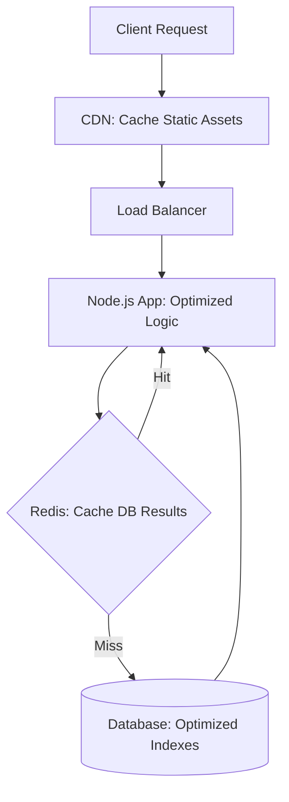

# 🚀 Performance Optimization Basics: The Need for Speed
> **Objective:** Master the core principles of building high-performance backends | **Language:** Hinglish | **Standard:** 2026 Expert Framework

---

## 🧭 1. Beginner-Friendly Hinglish Explanation
Performance ka matlab hai: "Aapka server kitni jaldi jawaab (Response) deta hai aur kitne users ko handle kar sakta hai".

- **The Problem:** Slow apps users ko gussa dilati hain. 1 second ka delay e-commerce sales mein $7\%$ ki girawat la sakta hai.
- **The Core Principles:**
  1. **Don't do what you don't need to:** Faltu ka data fetch mat karo.
  2. **Do it later:** Jo kaam turant zaroori nahi hai (e.g., Email bhejna), use background mein daal do.
  3. **Remember results:** Ek hi cheez baar-baar calculate mat karo (Caching).
- **The Goal:** Low Latency (Tezi) aur High Throughput (Zyaada Requests).

---

## 🧠 2. Deep Technical Explanation
### 1. Latency vs Throughput:
- **Latency:** Time taken for a single request (e.g., 50ms).
- **Throughput:** Number of requests handled per second (e.g., 1000 RPS).

### 2. The Golden Rule of Optimization: **"Measure First"**.
Never optimize based on a "Feeling". Use tools to find the actual bottleneck (CPU, Memory, or DB).

### 3. I/O Bound vs CPU Bound:
- **I/O Bound:** Waiting for DB, Disk, or Network. (Node.js is great at this).
- **CPU Bound:** Complex math, image processing, or encryption. (Node.js needs Worker Threads for this).

---

## 🏗️ 3. Architecture Diagrams (The Optimization Stack)


---

## 💻 4. Production-Ready Examples (Quick Wins)
```typescript
// 2026 Standard: Node.js Performance Tips

// ❌ BAD: Serial execution (Slow)
const user = await db.getUser(id); // takes 50ms
const posts = await db.getPosts(id); // takes 50ms
// Total: 100ms

// ✅ GOOD: Parallel execution (Fast)
const [user, posts] = await Promise.all([
  db.getUser(id),
  db.getPosts(id)
]);
// Total: 50ms (Runs at the speed of the slowest one)

// 💡 Pro Tip: Use 'Lean' in Mongoose or 'Select' in Prisma 
// to only fetch fields you need.
const userShort = await prisma.user.findUnique({
  where: { id },
  select: { name: true, email: true } // Don't fetch the 1MB bio!
});
```

---

## 🌍 5. Real-World Use Cases
- **Ticketing Systems:** Handling 10,000 users at the same second during a concert sale.
- **Search Engines:** Returning results in under 100ms for millions of queries.
- **Stock Trading:** Where even 1ms delay can cost millions of dollars.

---

## ❌ 6. Failure Cases
- **Premature Optimization:** Spending 3 days optimizing a function that is only called once a week.
- **Solving the wrong problem:** Adding more CPU to a server when the real bottleneck is a missing index in the Database.
- **Caching "Garbage":** Caching data that changes every second, making the cache useless and stale.

---

## 🛠️ 7. Debugging Section
| Tool | Purpose | Tip |
| :--- | :--- | :--- |
| **Node.js Profiler** | CPU/Memory check | Run `node --prof` to see which functions are taking the most time. |
| **Chrome DevTools** | Performance Tab | Connect to your Node process to see a visual "Flame Graph". |
| **New Relic / Datadog** | APM Monitoring | Real-time dashboard of your production performance. |

---

## ⚖️ 8. Tradeoffs
- **Complexity vs Speed:** Highly optimized code is often harder to read and maintain.
- **Memory vs CPU:** Caching uses more RAM to save CPU cycles.

---

## 🛡️ 9. Security Concerns
- **ReDoS (Regex DoS):** Complex regex can hang the CPU for minutes. Always use safe, simple regex for user inputs.

---

## 📈 10. Scaling Challenges
- **Vertical Limit:** You can only add so much RAM/CPU to a single server before it becomes too expensive or impossible. (Solution: **Horizontal Scaling**).

---

## 💸 11. Cost Considerations
- **Efficiency = Savings:** A server that handles 2x more requests costs 50% less in cloud bills.

---

## ✅ 12. Best Practices
- **Use `Promise.all` for independent tasks.**
- **Compress responses (Gzip/Brotli).**
- **Optimize your Database Indexes.**
- **Use Caching for frequently read data.**
- **Avoid blocking the Event Loop.**

---

## ⚠️ 13. Common Mistakes
- **Nested Loops over large arrays** ($O(n^2)$ complexity).
- **Not using a CDN for images and static files.**
- **Ignoring "Memory Leaks"** that eventually crash the server.

---

## 📝 14. Interview Questions
1. "What is the difference between Latency and Throughput?"
2. "How does Node.js handle I/O bound tasks efficiently?"
3. "What is a 'Flame Graph' and how do you use it for performance tuning?"

---

## 🚀 15. Latest 2026 Production Patterns
- **Edge Computing:** Moving logic to the CDN level to reduce latency to $<10ms$.
- **Bun/Deno:** Modern runtimes that are built for even higher performance than Node.js.
- **Rust for Hot Paths:** Writing specific, heavy-lifting modules in Rust and calling them from Node.js via N-API.
漫
