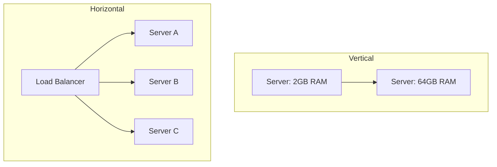

# 📈 Scalability Fundamentals: Future-Proofing your Backend
> **Objective:** Master the principles of handling growth without system failure | **Language:** Hinglish | **Standard:** 2026 Expert Framework

---

## 🧭 1. Beginner-Friendly Hinglish Explanation
Scalability ka matlab hai "Apne app ko zyaada logon ke liye taiyaar karna".

- **The Problem:** Agar aapka app 10 users ke liye sahi chal raha hai, toh kya wo 1 million users ke liye bhi chalega? Aksar nahi, kyunki system ke components (CPU, RAM, DB) ki ek limit hoti hai.
- **The Solution:** Humein system ko aise design karna hai ki hum asani se uski taqat (capacity) badha sakein.
- **Intuition:** Maan lijiye aapki ek "Tea Stall" hai. Jab bheed badhti hai, toh aap ya toh badi machine laate hain (Vertical) ya 2-3 aur stall khol dete hain (Horizontal).

---

## 🧠 2. Deep Technical Explanation
### 1. The Dimensions of Scalability:
- **Size Scalability:** Handling more requests/users.
- **Geographic Scalability:** Handling users from different parts of the world with low latency.
- **Administrative Scalability:** Managing 100 servers as easily as 1.

### 2. Vertical vs Horizontal:
- **Vertical (Scale UP):** Adding more power to the existing server (More RAM/CPU). Limit: You can't add infinite RAM.
- **Horizontal (Scale OUT):** Adding more servers of the same type. Limit: None, but adds complexity.

### 3. Statelessness:
To scale horizontally, your app MUST be stateless. No data (like sessions) should be stored in the server's memory. Use Redis or a DB instead.

---

## 🏗️ 3. Architecture Diagrams (Scalability Models)


---

## 💻 4. Production-Ready Examples (Stateless Check)
```typescript
// 2026 Standard: Transitioning from Stateful to Stateless

// ❌ BAD: Storing session in memory (Will fail on multiple servers)
let userSessions = {}; 
app.post('/login', (req, res) => {
  userSessions[req.body.id] = true; 
});

// ✅ GOOD: Storing session in Redis (Shared across all servers)
import { redis } from './config/redis';
app.post('/login', async (req, res) => {
  await redis.set(`session:${req.body.id}`, 'true', 'EX', 3600);
});
```

---

## 🌍 5. Real-World Use Cases
- **Flash Sales:** Handling 100x traffic for 1 hour (Amazon Prime Day).
- **Video Streaming:** Scaling bandwidth as millions watch a live cricket match.
- **Social Media:** Scaling database reads as a post goes viral.

---

## ❌ 6. Failure Cases
- **Single Point of Failure (SPOF):** Having 10 servers but only 1 database. If the DB fails, everything fails.
- **Sticky Sessions:** Forcing a user to stay on one server because the app isn't stateless.
- **Over-provisioning:** Paying for 100 servers when you only need 5.

---

## 🛠️ 7. Debugging Section
| Metric | Diagnostic | Solution |
| :--- | :--- | :--- |
| **High CPU Usage** | Processing bottleneck | Scale horizontally or optimize code. |
| **Out of Memory (OOM)** | Memory leaks | Vertical scaling is a temporary fix; find the leak. |
| **Slow DB Queries** | Database bottleneck | Implement **Read Replicas** or **Sharding**. |

---

## ⚖️ 8. Tradeoffs
- **Cost vs Reliability:** More servers cost more but ensure the site never goes down.
- **Complexity vs Scalability:** Horizontal scaling requires more DevOps work.

---

## 🛡️ 9. Security Concerns
- **DDoS Attacks:** Scalability helps absorb small attacks, but you need a WAF (Web Application Firewall) for big ones.

---

## 📈 10. Scaling Challenges
- **Database Consistency:** When multiple servers write to the same DB, maintaining the "Truth" becomes hard.

---

## 💸 11. Cost Considerations
- **Auto-scaling:** Automatically adding/removing servers to save money during low-traffic hours.

---

## ✅ 12. Best Practices
- **Design for failure.**
- **Build Stateless APIs.**
- **Monitor metrics 24/7.**
- **Use a Load Balancer.**

---

## ⚠️ 13. Common Mistakes
- **Hardcoding Server IPs.**
- **Ignoring the Database scaling** while scaling the API.

---

## 📝 14. Interview Questions
1. "What is the difference between Vertical and Horizontal scaling?"
2. "Why is 'Statelessness' important for scaling?"
3. "What is a 'Single Point of Failure'?"

---

## 🚀 15. Latest 2026 Production Patterns
- **Serverless (Lambda/Vercel):** "Infinite" scaling where you don't even manage the servers.
- **Kubernetes (K8s):** The industry standard for managing thousands of containers automatically.
漫
