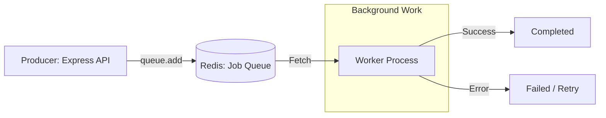

# 🐂 BullMQ and Queues: Managing Background Tasks
> **Objective:** Handle heavy processing asynchronously using the industry-standard Node.js queue | **Language:** Hinglish | **Standard:** 2026 Expert Framework

---

## 🧭 1. Beginner-Friendly Hinglish Explanation
Queues ka matlab hai "Line mein lagna".

- **The Problem:** Maan lijiye user ne "Sign Up" kiya. Aapko use email bhejna hai. Email server slow hai aur 5 second leta hai. Kya user ko 5 second wait karna chahiye? Nahi!
- **The Solution:** Hum email bhejnewala kaam ek "Queue" mein daal dete hain aur user ko turant "Success" bol dete hain. Ek "Worker" piche se araam se wo email bhejta rahega.
- **BullMQ:** Ye Node.js ki sabse powerful library hai jo Redis use karti hai jobs ko manage karne ke liye.
- **Intuition:** Ye ek "Fast Food" restaurant ki tarah hai. Aap order dete hain (Job), aapko bill mil jata hai (Success), aur piche kitchen mein khana ban raha hota hai (Worker).

---

## 🧠 2. Deep Technical Explanation
### 1. The Architecture:
- **Producer:** The app code that creates a job (`queue.add()`).
- **Redis:** The storage where jobs wait in line.
- **Worker:** A separate process (or the same app) that pulls jobs from Redis and executes them.

### 2. Job States:
- **Waiting:** Job is in the queue.
- **Active:** Worker is currently processing it.
- **Completed:** Success!
- **Failed:** Error occurred (Can be retried).
- **Delayed:** Job scheduled for the future.

### 3. Key Features of BullMQ:
- **Retries with Exponential Backoff:** If it fails, try again in 5s, then 20s, then 1min...
- **Priorities:** Important jobs (e.g., OTP) go to the front of the line.
- **Concurrency:** One worker can handle multiple jobs at once.

---

## 🏗️ 3. Architecture Diagrams (Queue Lifecycle)


---

## 💻 4. Production-Ready Examples (Implementing BullMQ)
```typescript
// 2026 Standard: Clean BullMQ Implementation

import { Queue, Worker } from 'bullmq';
import { redisConnection } from './config/redis';

// 1. Create the Queue (Producer side)
export const emailQueue = new Queue('email-queue', { connection: redisConnection });

export const sendEmailJob = async (email: string) => {
  await emailQueue.add('welcome-email', { email }, {
    attempts: 3, // Retry 3 times
    backoff: { type: 'exponential', delay: 5000 } // Wait longer each time
  });
};

// 2. Create the Worker (Consumer side)
const worker = new Worker('email-queue', async job => {
  console.log(`Processing email for: ${job.data.email}`);
  // Actual logic: await mailer.send(...)
}, { connection: redisConnection });

worker.on('completed', job => console.log(`Job ${job.id} done!`));
worker.on('failed', (job, err) => console.error(`Job ${job?.id} failed: ${err.message}`));
```

---

## 🌍 5. Real-World Use Cases
- **Image/Video Processing:** Resizing uploads in the background.
- **Reports Generation:** Generating a 100-page PDF of monthly analytics.
- **Webhook Processing:** Handling incoming events from Stripe or GitHub.
- **Mass Emails:** Sending a newsletter to 100k subscribers.

---

## ❌ 6. Failure Cases
- **Infinite Retries:** A job that will NEVER pass (e.g., sending email to an invalid address) keeps retrying and clogging the queue. **Fix: Set `maxAttempts`.**
- **Memory Leaks:** Storing massive objects in the job data. **Fix: Only store the ID, then fetch data in the worker.**
- **Worker Crashes:** The worker dies while processing. **Fix: BullMQ automatically puts 'stalled' jobs back in the queue.**

---

## 🛠️ 7. Debugging Section
| Tool | Purpose | Tip |
| :--- | :--- | :--- |
| **BullBoard** | UI Dashboard | A beautiful UI to see all your jobs, retries, and failures in real-time. |
| **Redis CLI** | Manual Check | `KEYS *bull:*` to see the raw data being stored. |

---

## ⚖️ 8. Tradeoffs
- **Real-time vs Consistency:** User doesn't see the result immediately, but the system is much more stable.

---

## 🛡️ 9. Security Concerns
- **Sensitive Data in Jobs:** Don't put user passwords or secrets in the job payload, as they are stored in plain text in Redis.

---

## 📈 10. Scaling Challenges
- **Scaling Workers:** You can run 10 different worker processes across 10 servers to handle a massive spike in jobs.

---

## 💸 11. Cost Considerations
- **Redis Memory:** If you have 1 million jobs waiting, Redis will need significant RAM. Clean up completed jobs frequently.

---

## ✅ 12. Best Practices
- **Idempotency:** Ensure that running the same job twice doesn't cause problems (e.g., charging a customer twice).
- **Keep Job Data Small.**
- **Use BullBoard for monitoring.**
- **Separate Workers from the main API process.**

---

## ⚠️ 13. Common Mistakes
- **Putting heavy logic inside the Express Request** instead of the queue.
- **Not handling the 'Failed' state.**

---

## 📝 14. Interview Questions
1. "Why do we use queues instead of just processing everything in the API?"
2. "How does BullMQ handle a job that keeps failing?"
3. "What is 'Idempotency' in the context of workers?"

---

## 🚀 15. Latest 2026 Production Patterns
- **Flows (Parent-Child Jobs):** Creating complex workflows where Job B only starts after Job A finishes.
- **Sandboxed Workers:** Running workers in a separate process/thread so if the job crashes, it doesn't take down the whole server.
漫
