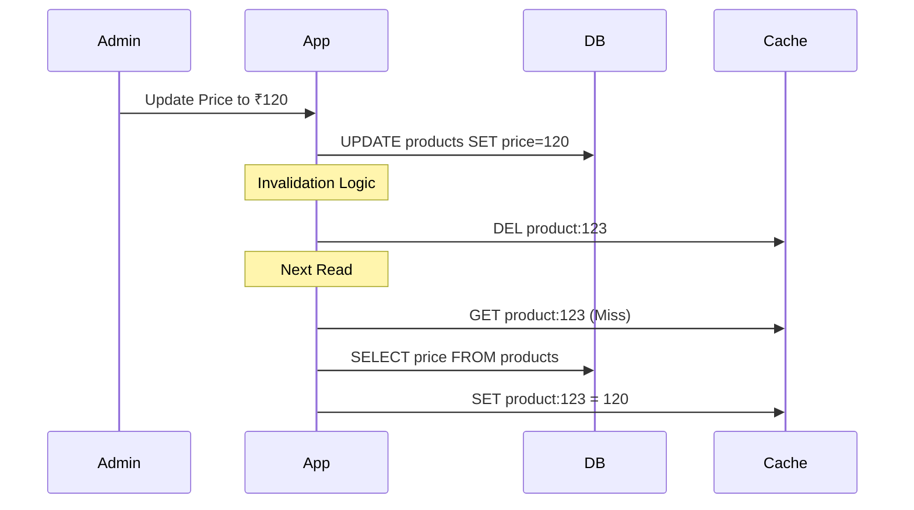

# 🧹 Cache Invalidation: The Hardest Problem
> **Objective:** Keep your cache consistent with your database | **Language:** Hinglish | **Standard:** 2026 Expert Framework

---

## 🧭 1. Beginner-Friendly Hinglish Explanation
Cache Invalidation ka matlab hai "Purana data phenkna aur naya laana".

- **The Problem:** Maan lijiye aapne product ka price cache kar liya ₹100. Ab database mein admin ne price ₹120 kar diya. Par cache toh abhi bhi ₹100 dikha raha hai! User ko galat price dikhega.
- **The Solution:** Humein batana padega ki "Bhai, database badal gaya hai, ab purane cache ko delete karo ya update karo".
- **Intuition:** Ye ek notice board ki tarah hai. Jab purana event khatam ho jaye, toh uska poster hatana padta hai taaki log purani info na padhein.

---

## 🧠 2. Deep Technical Explanation
### 1. The Challenge:
"There are two hard things in Computer Science: cache invalidation and naming things." — Phil Karlton.
The core issue is **Consistency**. How do we ensure the Cache is a true reflection of the DB?

### 2. Invalidation Strategies:
- **TTL (Time To Live):** Data automatically expires after $X$ seconds. (Simplest, but not instant).
- **Purge (Explicit Deletion):** When the DB updates, the code immediately runs `redis.del(key)`. (Instant, but requires more code).
- **Refresh Ahead:** The system predicts a key is about to expire and refreshes it in the background.

### 3. Write Strategies:
- **Write-Through:** Write to DB and Cache simultaneously.
- **Write-Back:** Write to Cache first, then DB later (Risky but fast).

---

## 🏗️ 3. Architecture Diagrams (The Invalidation Flow)


---

## 💻 4. Production-Ready Examples (Manual Purging)
```typescript
// 2026 Standard: Invalidation Pattern

const updateProduct = async (id: string, newData: any) => {
  // 1. Update the Source of Truth (DB)
  const product = await prisma.product.update({
    where: { id },
    data: newData
  });

  // 2. Invalidate the Cache (Purge)
  await redis.del(`product:${id}`);
  
  // 3. Optional: Broadcast invalidation to other services
  // pubsub.publish('INVALIDATE', `product:${id}`);

  return product;
};
```

---

## 🌍 5. Real-World Use Cases
- **E-commerce:** Changing stock levels or prices.
- **Social Media:** Deleting a post (It must disappear from all feeds instantly).
- **User Settings:** Changing a password (Old sessions must be invalidated).

---

## ❌ 6. Failure Cases
- **The "Stale" Gap:** The 1-2 seconds between a DB update and a Cache deletion where users see old data.
- **Invalidation Storms:** Deleting a very 'Hot' key (e.g., the homepage data) which causes thousands of requests to hit the DB at once. **Fix: Use 'Lease' or 'Locking'.**
- **Forgot to Invalidate:** Admin panel updates the DB directly, bypassing the app code that handles invalidation.

---

## 🛠️ 7. Debugging Section
| Problem | Diagnostic | Solution |
| :--- | :--- | :--- |
| **Data is old** | Check TTL | Ensure TTL is set. If manually purging, check the `DEL` command success. |
| **DB is crashing** | Cache Stampede | Use **Soft Expiry** or **Mutex Locks** during invalidation. |

---

## ⚖️ 8. Tradeoffs
- **High TTL:** Low DB load but stale data.
- **Low TTL / Manual Purge:** Perfect data but high DB load and complex code.

---

## 🛡️ 9. Security Concerns
- **Sensitive Invalidation:** If an account is banned, the cache must be cleared IMMEDIATELY across all regions to prevent the user from continuing their session.

---

## 📈 10. Scaling Challenges
- **Regional Caches:** If you have caches in US and India, how do you invalidate both at the same time? **Fix: Use Global Pub/Sub.**

---

## 💸 11. Cost Considerations
- **Bandwidth:** Frequent invalidations and re-fetches increase bandwidth costs between App and Cache.

---

## ✅ 12. Best Practices
- **Always use a TTL as a safety net.**
- **Prefer Deleting over Updating** (Updating the cache is prone to race conditions).
- **Centralize your invalidation logic.**
- **Version your keys** (e.g., `v2:product:123`).

---

## ⚠️ 13. Common Mistakes
- **Updating the Cache before the DB.** (If DB update fails, cache is wrong).
- **Infinite TTL** (The 'Time Bomb' - data stays forever until manual fix).

---

## 📝 14. Interview Questions
1. "Why is cache invalidation considered one of the hardest problems?"
2. "What is the difference between Write-Through and Write-Back?"
3. "How do you prevent a 'Cache Stampede' during invalidation?"

---

## 🚀 15. Latest 2026 Production Patterns
- **Tag-based Invalidation:** Grouping keys by tags (e.g., 'all-sneakers'). When a sneaker is updated, you invalidate the whole tag.
- **CDC (Change Data Capture):** The Database itself sends a signal to Redis to invalidate a key whenever a row changes (Using tools like Debezium).
漫
