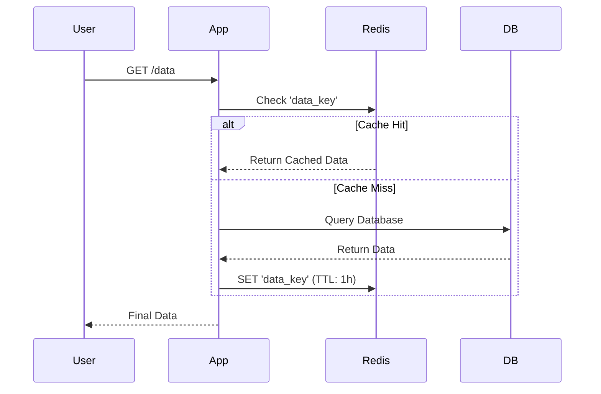

# ⚡ Caching Strategies: The Ultimate Speed Hack
> **Objective:** Reduce database load and latency using multi-level caching | **Language:** Hinglish | **Standard:** 2026 Expert Framework

---

## 🧭 1. Beginner-Friendly Hinglish Explanation
Caching ka matlab hai "Yaad rakhna". 

- **The Problem:** Har baar jab koi user `GET /products` karta hai, aapka server Database se 10,000 items mangwata hai. Isme time lagta hai aur DB par load padta hai.
- **The Solution:** Pehli baar DB se data lao, aur use ek "Fast Memory" (Redis) mein save karlo. Agli baar jab wahi request aaye, toh DB ke paas mat jao, Redis se turant data de do.
- **The Rule:** Data fetch karne se pehle humesha pucho: "Kya ye mere paas pehle se hai?".
- **Intuition:** DB ek "Library" hai (Badi par slow), aur Cache aapki "Jeb" (Pocket) hai (Choti par fast).

---

## 🧠 2. Deep Technical Explanation
### 1. Caching Levels:
- **Client Cache (Browser):** Using `Cache-Control` headers.
- **CDN Cache:** Caching static assets and even API responses globally.
- **App Cache (In-Memory):** Using an object or Map inside Node.js (Reset on restart).
- **Distributed Cache (Redis):** Shared across multiple server instances.

### 2. Common Strategies:
- **Cache-Aside (Most Popular):** 
  1. Check Cache. 
  2. If Miss, read from DB. 
  3. Write to Cache.
- **Write-Through:** Update Cache and DB at the same time. (Strong consistency).
- **Write-Behind:** Update Cache first, then update DB in the background. (Fastest writes).

### 3. Cache Invalidation:
"There are two hard things in Computer Science: cache invalidation and naming things."
- **TTL (Time To Live):** Automatically expire data after $X$ seconds.
- **Purge:** Manually delete a cache key when data changes.

---

## 🏗️ 3. Architecture Diagrams (The Cache-Aside Flow)


---

## 💻 4. Production-Ready Examples (Redis Cache Pattern)
```typescript
// 2026 Standard: Cache-Aside Implementation

import { createClient } from 'redis';
const redis = createClient();

async function getProduct(id: string) {
  const cacheKey = `product:${id}`;

  // 1. Try Cache
  const cached = await redis.get(cacheKey);
  if (cached) return JSON.parse(cached);

  // 2. Query DB
  const product = await db.product.findUnique({ where: { id } });

  // 3. Save to Cache with TTL
  if (product) {
    await redis.set(cacheKey, JSON.stringify(product), {
      EX: 3600 // 1 hour expiry
    });
  }

  return product;
}

// 4. Invalidation: Delete cache on update
async function updateProduct(id: string, data: any) {
  await db.product.update({ where: { id }, data });
  await redis.del(`product:${id}`); // Ensure next GET fetches fresh data
}
```

---

## 🌍 5. Real-World Use Cases
- **Banners/Configs:** Data that rarely changes but is needed on every page load.
- **Leaderboards:** High-traffic rankings that don't need to be 100% real-time (can lag by 1 minute).
- **User Sessions:** Keeping users logged in across multiple servers.

---

## ❌ 6. Failure Cases
- **Stale Data:** Showing an old price because you forgot to invalidate the cache after an update.
- **Cache Penetration:** Attackers querying for IDs that don't exist, bypassing the cache and hitting the DB every time. **Fix: Cache 'null' results too.**
- **Cache Avalanche:** All keys expiring at the exact same time, crashing the DB. **Fix: Use 'Jitter' (randomized TTL).**

---

## 🛠️ 7. Debugging Section
| Status | Meaning | Tip |
| :--- | :--- | :--- |
| **X-Cache: HIT** | Data from Cache | Your optimization is working! |
| **X-Cache: MISS** | Data from DB | Check if the TTL is too short or if the data is unique per user. |
| **Redis Memory Limit** | Cache is full | Check eviction policies (LRU is best). |

---

## ⚖️ 8. Tradeoffs
- **Complexity vs Speed:** Adding caching makes your code much harder to debug.
- **Consistency vs Availability:** Is it okay to show 1-minute old data if it means the app is 10x faster?

---

## 🛡️ 9. Security Concerns
- **Sensitive Data:** Never cache passwords or PII in a shared Redis without encryption.
- **Cache Poisoning:** An attacker manipulating the cache to serve malicious data to other users.

---

## 📈 10. Scaling Challenges
- **Redis Cluster:** When one Redis node is not enough to handle the traffic, you need to shard the cache across multiple nodes.

---

## 💸 11. Cost Considerations
- **RAM is expensive:** Don't cache everything. Cache only the "Hot" data that is frequently accessed.

---

## ✅ 12. Best Practices
- **Always set a TTL.**
- **Invalidate on Write.**
- **Use meaningful key names.**
- **Monitor your Cache Hit Ratio** (Target: $>80\%$).

---

## ⚠️ 13. Common Mistakes
- **Caching huge objects** (Serialization/Deserialization takes more time than the DB query!).
- **Not handling Redis downtime** (Your app should still work, just slower).

---

## 📝 14. Interview Questions
1. "What is the Cache-Aside pattern?"
2. "How do you solve the N+1 problem using Caching?"
3. "What is Cache Invalidation and why is it considered the hardest problem in CS?"

---

## 🚀 15. Latest 2026 Production Patterns
- **Edge Caching (Stale-While-Revalidate):** Serving old data from the cache while fetching fresh data in the background.
- **Tag-based Invalidation:** Grouping cache keys by tags (e.g., 'all-products') so you can clear thousands of keys with one command.
- **Global CDNs (Cloudflare Workers KV):** Caching data at the edge, literally 10ms away from the user.
漫
