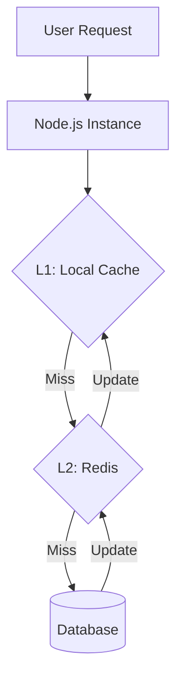

# 💎 Advanced Caching Patterns: Beyond the Basics
> **Objective:** Master complex caching strategies for mission-critical systems | **Language:** Hinglish | **Standard:** 2026 Expert Framework

---

## 🧭 1. Beginner-Friendly Hinglish Explanation
Basic caching (Cache-Aside) ke aage bhi ek duniya hai jahan hum "Consistency" aur "Reliability" par focus karte hain.

- **The Problem:** Maan lijiye aapke paas 100 servers hain aur sab ek hi Redis use kar rahe hain. Agar Redis down ho gaya toh? Agar sab servers ek saath DB par toot pade (Thundering Herd)?
- **The Solution:** Humein advanced patterns chahiye jaise "Multilevel Caching" ya "Stale-while-revalidate".
- **The Concept:** Cache sirf ek "Storage" nahi, ek "Strategy" honi chahiye.

---

## 🧠 2. Deep Technical Explanation
### 1. Multilevel Caching (L1/L2):
- **L1 (Local Memory):** High-speed, per-server memory (using a simple JS Map or `node-cache`).
- **L2 (Distributed):** Redis/Memcached shared across all servers.
- **Workflow:** Check L1 -> Check L2 -> Check DB. This reduces network calls to Redis for "Hot" keys.

### 2. Stale-While-Revalidate (SWR):
Serve the "Stale" (old) data from the cache immediately, but trigger a background refresh to update the cache.
- **Benefit:** Zero latency for the user, and the cache stays fresh.

### 3. Thundering Herd (Cache Stampede) Prevention:
When a hot key expires, multiple requests try to regenerate it at once. 
- **Solution:** Use **Locking**. Only the first request is allowed to fetch from DB; others wait for the result.

---

## 🏗️ 3. Architecture Diagrams (Multilevel Caching)


---

## 💻 4. Production-Ready Examples (Implementing SWR)
```typescript
// 2026 Standard: Stale-While-Revalidate with Redis

async function getCachedDataSWR(key: string) {
  const cached = await redis.get(key);
  const data = cached ? JSON.parse(cached) : null;

  if (data) {
    // If data is older than 5 mins, revalidate in background
    if (Date.now() - data.timestamp > 300000) {
      revalidateData(key); // Async background call
    }
    return data.payload; // Return stale data immediately
  }

  // Pure Cache Miss
  const fresh = await fetchDataFromDB();
  await redis.set(key, JSON.stringify({ payload: fresh, timestamp: Date.now() }));
  return fresh;
}
```

---

## 🌍 5. Real-World Use Cases
- **Stock Prices:** Showing 1-second old data while fetching the new one.
- **Global News:** Serving the homepage instantly to millions while background workers update the headlines.
- **API Configs:** Keeping system-wide settings in L1 cache for micro-second access.

---

## ❌ 6. Failure Cases
- **Inconsistency in L1:** Server A has an old L1 cache, but Server B has a new one. **Fix: Use Redis Pub/Sub to 'Invalidate' L1 caches across all servers.**
- **Lock Deadlocks:** A request gets a lock to update the cache but crashes before releasing it. **Fix: Set a TTL on the lock.**

---

## 🛠️ 7. Debugging Section
| Tool | Purpose | Tip |
| :--- | :--- | :--- |
| **Redis MONITOR** | Debugging | See every command hitting your Redis in real-time. |
| **`Object.keys(l1Cache).length`** | Memory Check | Monitor your local L1 cache size to avoid memory leaks. |

---

## ⚖️ 8. Tradeoffs
- **Latency vs Freshness:** SWR gives 0ms latency but users might see slightly old data.

---

## 🛡️ 9. Security Concerns
- **Cache Poisoning:** Ensuring that the background revalidation only accepts data from trusted sources.

---

## 📈 10. Scaling Challenges
- **Invalidation Storms:** When a global setting changes, trying to invalidate 1000 servers' L1 caches simultaneously.

---

## 💸 11. Cost Considerations
- **Compute Savings:** Multilevel caching significantly reduces Redis and DB costs by preventing millions of unnecessary network calls.

---

## ✅ 12. Best Practices
- **Use SWR for non-critical data.**
- **Implement Locking for 'Hot' keys.**
- **Sync L1 caches using Pub/Sub.**
- **Monitor Cache Misses.**

---

## ⚠️ 13. Common Mistakes
- **Infinite background refreshes** (SWR loop).
- **Not setting a Max Size for L1 cache.**

---

## 📝 14. Interview Questions
1. "What is a 'Thundering Herd' problem and how do you solve it?"
2. "Explain the difference between Cache-Aside and Stale-While-Revalidate."
3. "How do you keep local L1 caches in sync across multiple servers?"

---

## 🚀 15. Latest 2026 Production Patterns
- **Near-Cache (Hazelcast/Redis):** Commercial tools that automatically handle the L1/L2 sync for you.
- **AI-Driven TTL:** Using machine learning to predict when a key is likely to change and setting the TTL accordingly.
漫
