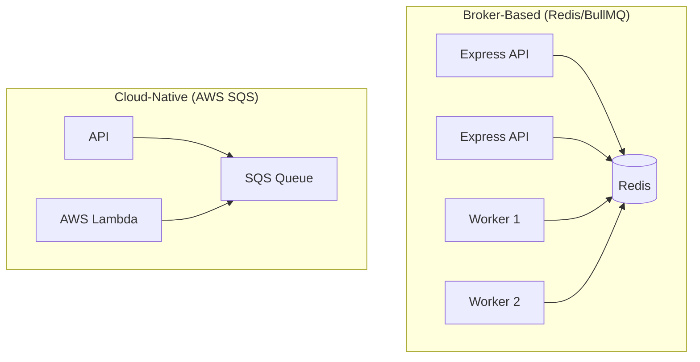

# 📬 Job Queues: The Asynchronous Backbone
> **Objective:** Understand different types of queue architectures for scalable systems | **Language:** Hinglish | **Standard:** 2026 Expert Framework

---

## 🧭 1. Beginner-Friendly Hinglish Explanation
Job Queues ka matlab hai "Kaam ko baantna aur baad mein karna".

- **The Problem:** Har kaam "Real-time" nahi hona chahiye. Agar server ek saath 100 heavy kaam (like video compression) karne ki koshish karega, toh wo crash ho jayega.
- **The Solution:** Humein ek system chahiye jo kaamon ki "List" banaye aur unhe ek-ek karke ya parallelly handle kare.
- **Intuition:** Ye ek "Post Office" ki tarah hai. Aap apna letter box mein daal dete hain (Queue). Postman (Worker) aata hai aur use delivery ke liye le jata hai. Aapko postman ke aane ka intezar nahi karna padta.

---

## 🧠 2. Deep Technical Explanation
### 1. Types of Queues:
- **In-Memory Queues:** Stored in the app's RAM (using an array or `setImmediate`). **Risk:** If the server restarts, all jobs are lost.
- **Broker-Based Queues:** Using a middleware like **Redis (BullMQ)** or **RabbitMQ**. Jobs are persistent and shared across servers.
- **Cloud-Native Queues:** Managed services like **AWS SQS** or **Google Pub/Sub**. Highly scalable, no management needed.

### 2. Message Persistence:
Ensuring that even if the queue crashes, the jobs are not lost. This is done by writing jobs to a disk (AOF in Redis) or a database.

### 3. Acknowledgements (ACK):
A worker must tell the queue "I have finished the job" before the queue deletes it. If the worker dies mid-job, the queue waits for a timeout and then gives the job to another worker.

---

## 🏗️ 3. Architecture Diagrams (Broker vs Cloud)


---

## 💻 4. Production-Ready Examples (Comparison)
```typescript
// 2026 Standard: Choosing the right tool

// 1. For Small/Medium Apps (Node.js) -> BullMQ (Redis)
// Fast, powerful features (retries, delay).

// 2. For Enterprise/Inter-service (Microservices) -> RabbitMQ
// Complex routing, many languages (Java, Python, JS).

// 3. For Serverless/Infinite Scale -> AWS SQS
// Pay per use, zero maintenance.

// 4. For High-Throughput Logs/Streaming -> Kafka
// Millions of messages per second.
```

---

## 🌍 5. Real-World Use Cases
- **Push Notifications:** Sending millions of alerts without blocking the API.
- **Data Synchronization:** Syncing data between a primary DB and an ElasticSearch index.
- **Inventory Updates:** Processing orders in a peak shopping window.

---

## ❌ 6. Failure Cases
- **Poison Pill:** A message that is corrupted and causes every worker that tries to read it to crash. **Fix: Use 'Dead Letter Queues' (DLQ) after X fails.**
- **Queue Backup:** Jobs being added faster than they can be processed. **Fix: Auto-scale workers.**
- **Network Partition:** Workers can't reach the queue broker.

---

## 🛠️ 7. Debugging Section
| Problem | Diagnostic | Solution |
| :--- | :--- | :--- |
| **High Latency** | Queue Depth | Check how many jobs are waiting. If > 10,000, add more workers. |
| **Silent Failures** | No Logging | Ensure workers log both `start` and `finish` of every job. |

---

## ⚖️ 8. Tradeoffs
- **Self-Managed (Redis) vs Managed (SQS):** Redis is faster and cheaper at low volumes; SQS is more reliable and easier at massive scales.

---

## 🛡️ 9. Security Concerns
- **Queue Injection:** An attacker sending malicious jobs to your worker. **Fix: Validate job data inside the worker.**

---

## 📈 10. Scaling Challenges
- **Backpressure:** Implementing a limit so the producer doesn't overwhelm the queue if the workers are slow.

---

## 💸 11. Cost Considerations
- **Managed Queues:** AWS SQS charges $0.40$ per million requests. Cheap, but adds up at scale.

---

## ✅ 12. Best Practices
- **Use a Dead Letter Queue (DLQ)** for unprocessable jobs.
- **Make jobs idempotent.**
- **Monitor Queue Depth.**
- **Implement 'Visibility Timeout'** correctly.

---

## ⚠️ 13. Common Mistakes
- **Using a database table as a queue.** (Slow and doesn't scale).
- **Not handling the 'Stalled' job case.**

---

## 📝 14. Interview Questions
1. "What is a Dead Letter Queue?"
2. "How do you ensure a job is only processed once?"
3. "Compare Redis-based queues and AWS SQS."

---

## 🚀 15. Latest 2026 Production Patterns
- **Event-Driven Autoscaling (KEDA):** Automatically spinning up Kubernetes pods based on the number of messages in the queue.
- **Pull vs Push Queues:** Understanding when to have workers 'Pull' (SQS) vs the queue 'Push' (Pub/Sub).
漫
