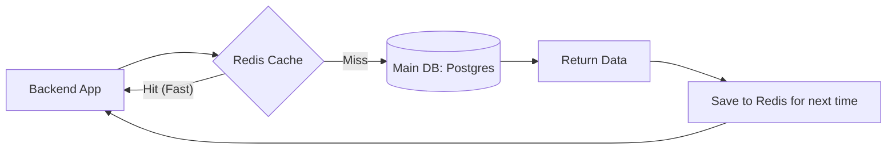

# 🏎️ Redis Complete Guide: The Speed of RAM
> **Objective:** Master in-memory data structures for caching and high performance | **Language:** Hinglish | **Standard:** 2026 Expert Framework

---

## 🧭 1. Beginner-Friendly Hinglish Explanation
Redis (Remote Dictionary Server) ek "In-memory" database hai. 

- **The Problem:** Disk-based databases (Postgres/Mongo) slow hote hain kyunki unhe data disk se read karna padta hai.
- **The Solution:** Redis data ko RAM mein store karta hai. RAM disk se hazaron guna fast hoti hai.
- **The Use Case:**
  - **Caching:** Agar kisi query ko 1 second lag raha hai, toh use Redis mein save karlo. Agli baar wo $2ms$ mein mil jayegi.
  - **Temporary Data:** OTPs, user sessions, ya live scores jo kuch der baad expire ho sakte hain.
- **Intuition:** Redis ek "Quick access drawer" ki tarah hai, jabki Postgres ek "Badi Almirah" hai.

---

## 🧠 2. Deep Technical Explanation
Redis is a **Key-Value Store** supporting rich data structures.

### 1. Data Structures:
- **Strings:** The most basic (Binary safe, can store images or serialized JSON).
- **Lists:** Ordered sequences of strings (Good for simple queues).
- **Sets:** Unordered collection of unique strings.
- **Sorted Sets (ZSets):** Unique strings ordered by a "Score" (Perfect for Leaderboards).
- **Hashes:** Maps between string fields and string values (Good for representing Objects).

### 2. Persistence:
Even though it's in RAM, Redis can save data to disk using:
- **RDB (Redis Database):** Periodic snapshots.
- **AOF (Append Only File):** Logging every write operation.

### 3. Eviction Policies:
When RAM is full, Redis must delete old data. Common policy: **LRU (Least Recently Used)**.

---

## 🏗️ 3. Architecture Diagrams (The Caching Flow)


---

## 💻 4. Production-Ready Examples (Redis + Node.js)
```typescript
// 2026 Standard: Implementing a Cache-Aside Pattern

import { createClient } from 'redis';
const redis = createClient();

async function getCachedUser(userId: string) {
  const cacheKey = `user:${userId}`;

  // 1. Try to get from Redis
  const cachedUser = await redis.get(cacheKey);
  if (cachedUser) {
    console.log("🚀 Cache Hit!");
    return JSON.parse(cachedUser);
  }

  // 2. If not in Redis, get from DB
  console.log("🐢 Cache Miss. Querying DB...");
  const user = await db.user.findUnique({ where: { id: userId } });

  // 3. Save to Redis with Expiry (TTL)
  if (user) {
    await redis.set(cacheKey, JSON.stringify(user), {
      EX: 3600 // Expire in 1 hour
    });
  }

  return user;
}
```

---

## 🌍 5. Real-World Use Cases
- **Leaderboards:** Using Sorted Sets for real-time ranking in games.
- **Rate Limiting:** Tracking the number of requests per IP.
- **Session Management:** Keeping users logged in across multiple servers.
- **Pub/Sub:** Real-time messaging and notification systems.

---

## ❌ 6. Failure Cases
- **Cache Stampede:** When a popular key expires and 10,000 users all hit the DB at once. (Solution: Use **Locking** or **Jitter**).
- **Big Keys:** Storing a 100MB object in a single key, causing Redis to hang during serialization.
- **Data Loss:** Relying on Redis for permanent data without proper AOF/RDB configuration.

---

## 🛠️ 7. Debugging Section
| Command | Purpose | Tip |
| :--- | :--- | :--- |
| **`MONITOR`** | Real-time stream | See every command hitting Redis (Don't use in high-traffic prod!). |
| **`INFO MEMORY`** | Resource check | See how much RAM is being used. |
| **`KEYS *`** | Listing keys | **NEVER** run this in production. Use `SCAN` instead. |

---

## ⚖️ 8. Tradeoffs
- **Speed vs Durability:** Fast RAM storage vs potential data loss if the server crashes before saving to disk.
- **In-Memory vs Disk:** 100x faster but 100x more expensive per GB.

---

## 🛡️ 9. Security Concerns
- **No Password:** By default, Redis doesn't have a password. Always set a strong password (`requirepass`).
- **Command Renaming:** Disable dangerous commands like `FLUSHALL` or `CONFIG` in production.

---

## 📈 10. Scaling Challenges
- **Redis Cluster:** Sharding data across multiple Redis nodes when one node's RAM is not enough.
- **Replication Lag:** When the "Slave" node is slightly behind the "Master".

---

## 💸 11. Cost Considerations
- **Managed Redis (ElastiCache/Upstash):** Upstash is great for serverless as it charges per request. ElastiCache is better for steady high-traffic.

---

## ✅ 12. Best Practices
- **Always set a TTL (Time To Live).** Don't let keys live forever unless necessary.
- **Use meaningful key names** with colons (`user:123:profile`).
- **Use Pipelining** to send multiple commands in one go and save network round-trips.

---

## ⚠️ 13. Common Mistakes
- **Storing sensitive data in plaintext.**
- **Using Redis as a Primary Database** (unless you really know what you're doing).
- **Not monitoring memory usage.**

---

## 📝 14. Interview Questions
1. "What is the difference between RDB and AOF persistence in Redis?"
2. "How would you implement a distributed lock using Redis?"
3. "Explain the 'Least Recently Used' (LRU) eviction policy."

---

## 🚀 15. Latest 2026 Production Patterns
- **Redis JSON:** Native support for JSON documents (alternative to MongoDB for small data).
- **Redis Streams:** A powerful alternative to Kafka for light-weight message streaming.
- **Serverless Redis (Upstash/Momento):** Zero-config Redis that scales automatically.
漫
